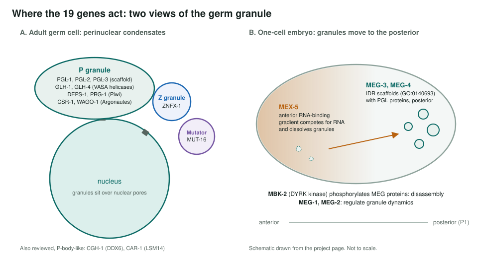
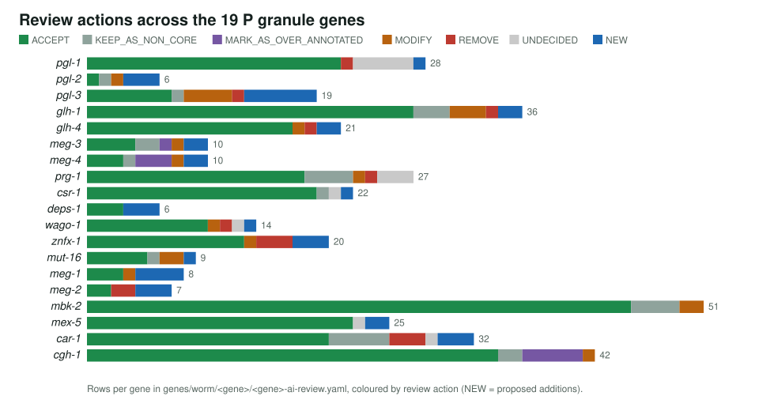

<!-- _class: lead -->

# *C. elegans* P granules

Reviewing GO annotations for 19 genes of a germline RNA-protein condensate

AI Gene Review · projects/CAEEL_P_GRANULES · 2026

---

<!-- _class: bluf -->

## Bottom line

- P granules are **liquid-like germline condensates** built on PGL and MEG scaffolds and GLH helicases, loaded with Piwi/Argonaute small-RNA machinery.
- We reviewed **every GO annotation on 19 genes**: **393 rows**, 274 ACCEPT, 20 MODIFY, 14 REMOVE, **39 NEW**.
- Existing annotation is sparse, so the review mostly **adds**: condensate scaffold activity, P granule assembly, Z granule. Removals target propagated nuclear and catalytic rows.

---

## Why P granules

- Among the first cellular condensates shown to behave as **liquids** (Brangwynne et al. 2009).
- Essential for **fertility** and for **transgenerational** small-RNA silencing.
- Most components are **worm-specific**, so there is little to propagate from other species.
- Test: can GO describe **phase-separation scaffolds** and condensate membership without falling back on `protein binding`?

---

## Where the 19 genes act

---

## Actions per gene

---

## What was added

| Term | Genes (NEW) |
|---|---|
| GO:0140693 molecular condensate scaffold activity | meg-3, meg-4 (IDA), meg-2 (IGI), deps-1 (NAS), pgl-2 (IC) |
| GO:1903863 P granule assembly | glh-1, glh-4, deps-1 (IMP); meg-1, meg-2 (IGI); pgl-3 (IDA) |
| GO:0060293 germ plasm | meg-3, meg-4 (IDA) |
| GO:0120279 Z granule; GO:0043186 P granule | znfx-1 (IDA) |
| GO:0010526 transposable element silencing | wago-1, mut-16 (IMP) |

---

## What was removed

| Gene | Term | Evidence | Why |
|---|---|---|---|
| wago-1 | RNA endonuclease activity | IBA | WAGO Argonautes lack the catalytic tetrad |
| znfx-1 | nucleus; chromosome; nuclear RdRP complex | IEA/IBA | Z granule is cytoplasmic, perinuclear |
| glh-1 | nucleus | IBA | perinuclear granule, not nuclear |
| glh-4 | maturation of SSU-rRNA | IBA | propagated from DEAD-box relatives |
| car-1 | spliceosomal complex; RNA splicing | IEA | atypical Sm domain; acts in mRNA regulation |

Reasons paraphrased from review.reason in genes/worm/&lt;gene&gt;/&lt;gene&gt;-ai-review.yaml.

---

## Status and next steps

- ✅ 19/19 gene reviews complete.
- ✅ csr-1 re-fetched under its correct accession (H2KZD5) in 2026; the page's older "wrong gene" note is out of date.
- ⬜ Fold in reviews that exist outside the project: glh-2, mex-6, rde-2, wago-4.
- ⬜ Not yet reviewed: prg-2, npp-10, par-1, pab-1.

**Read more:** `projects/CAEEL_P_GRANULES.md` · `genes/worm/<gene>/`
