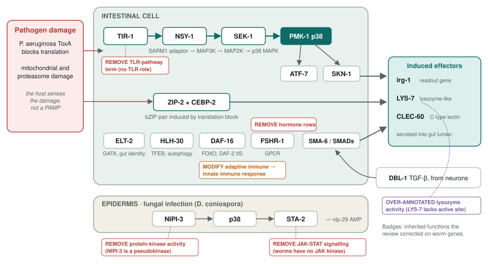
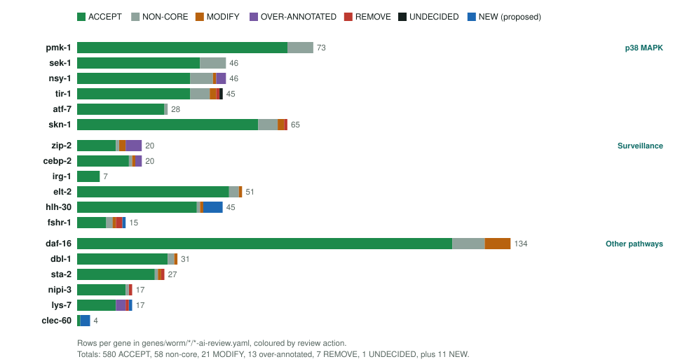
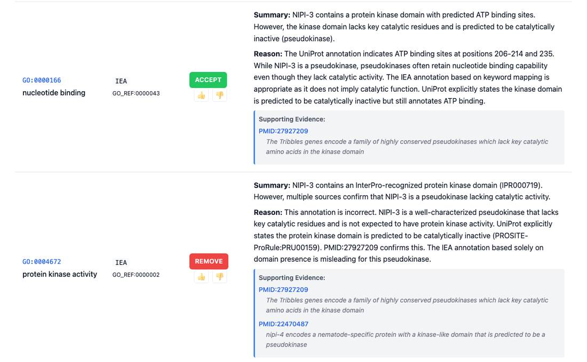

<!-- _class: lead -->

# *C. elegans* surveillance immunity

Reviewing GO annotations for 18 genes of a nematode immune system

AI Gene Review · projects/CAEEL_SURVEILLANCE_IMMUNITY · 2025–2026

---

<!-- _class: bluf -->

## Bottom line

- Worms have **no NF-kB, inflammasome or adaptive immunity**; they detect infection by sensing **damage to their own translation, mitochondria and proteasome**.
- We reviewed **every GO annotation on 18 genes** (p38 MAPK cascade, ZIP-2/CEBP-2, DAF-16, DBL-1, epidermal STA-2/NIPI-3, effectors): **680 GOA rows + 11 NEW**.
- **85% accepted.** The errors that remained were **mammalian biology transferred to the worm**: adaptive immunity, JAK-STAT, TLR, hormone receptor, and catalysis by a pseudokinase.

---

## Why this system

- **Surveillance immunity**: the host asks "what is wrong with my cell?" rather than "what is the pathogen?"
- *P. aeruginosa* exotoxin A blocks translation → **ZIP-2** protein accumulates → ZIP-2 + **CEBP-2** induce **irg-1**.
- The **NSY-1 → SEK-1 → PMK-1** p38 cascade is the central hub; ATF-7 and SKN-1 are its transcriptional outputs.
- A pathway **without pattern recognition** is where annotations inherited from mammalian orthologs are most likely to be wrong.

---

## The pathways, and what the review corrected

---

## Scope: three tiers, 18 genes

| Tier | Genes | GOA rows |
|---|---|---|
| p38 MAPK core | pmk-1, sek-1, nsy-1, tir-1, atf-7, skn-1 | 303 |
| Surveillance | zip-2, cebp-2, irg-1, elt-2, hlh-30, fshr-1 | 151 |
| Other pathways | daf-16, dbl-1, sta-2, nipi-3, lys-7, clec-60 | 226 |

Counts are non-NEW rows in <code>genes/worm/&lt;gene&gt;/&lt;gene&gt;-ai-review.yaml</code>. The project page's "549+" predates the final reviews.

---

## Decisions per gene

---

## A pseudokinase is not a kinase

NIPI-3 review: ATP binding is kept (pseudokinases often retain it); <code>protein kinase activity</code> (GO:0004672, IEA from the InterPro kinase domain) is removed.

---

## Findings

1. **Ortholog transfer**: STA-2 *JAK-STAT signalling* REMOVE (no JAKs in worms); TIR-1 TLR-pathway term REMOVE; FSHR-1 hormone rows REMOVE; DAF-16 *adaptive immune response* → innate (MODIFY).
2. **Inactive enzymes**: NIPI-3 *protein kinase activity* REMOVE; LYS-7 *lysozyme activity* over-annotated (no active site).
3. **`protein binding`**: ZIP-2, CEBP-2, DAF-16, SKN-1, TIR-1, STA-2 rows → specific MF (e.g. GO:0046983 dimerization).
4. **Gaps filled**: 3 NEW rows on CLEC-60 (1 GOA row), 6 on HLH-30.

---

## The six satellite documents

- **Priority 2** (zip-2 … fshr-1): gene-by-gene review + line-level edit list.
- **Priority 3** (daf-16 … clec-60): detailed analysis, executive findings, checklist.
- **All 18**: consolidated recommendations by action.
- Written 2025-12-29, before the YAML was finalised. **Only part was adopted**: ELT-2 and HLH-30 generic transcription terms stayed ACCEPT; the pseudoenzyme, JAK-STAT and CLEC-60 calls were adopted.

---

## Status and next steps

- ✅ 18/18 reviews written and rendered; pathway summary in `projects/CAEEL_SURVEILLANCE_IMMUNITY/`.
- ⬜ Reconcile the pathway summary with the reviews (it still calls LYS-7 an active lysozyme and NIPI-3 a Ser/Thr kinase).
- ⬜ Decide the open satellite calls (ELT-2/HLH-30 generic terms, TIR-1 NADase UNDECIDED).
- ⬜ Refresh stale counts and UniProt IDs on the project page.

**Read more:** `projects/CAEEL_SURVEILLANCE_IMMUNITY.md` · `genes/worm/<gene>/`
