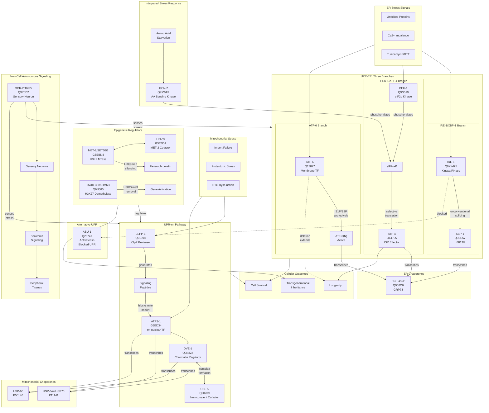

# C. elegans UPR and Stress Integration Pathway Summary

## Pathway Architecture

## Priority 1: UPR-ER Sensors (6 genes)

### IRE-1/XBP-1 Branch
| Gene | UniProt | Core Function | Key Annotations |
|------|---------|---------------|-----------------|
| **ire-1** | Q9XWR5 | Dual kinase/RNase sensor | RNA endonuclease activity (xbp-1 splicing), serine/threonine kinase activity, unfolded protein binding |
| **xbp-1** | Q9BLS7 | bZIP transcription factor | DNA-binding transcription activator, IRE1-mediated UPR, activated by unconventional splicing |

**Mechanism**: IRE-1 senses unfolded proteins via its luminal domain, oligomerizes, and performs unconventional cytoplasmic splicing of xbp-1 mRNA. The spliced XBP-1(s) activates transcription of ER chaperones and ERAD components.

### PEK-1/ATF-4 Branch
| Gene | UniProt | Core Function | Key Annotations |
|------|---------|---------------|-----------------|
| **pek-1** | Q9N519 | eIF2α kinase | Protein serine/threonine kinase activity, translation attenuation, PERK-mediated UPR |
| **atf-4** | O44705 | ISR effector TF | Transcription activator, H2S biosynthesis regulation, lifespan determination |

**Mechanism**: PEK-1 phosphorylates eIF2α, attenuating global translation while selectively enhancing ATF-4 translation. ATF-4 regulates amino acid metabolism, redox homeostasis, and H2S-dependent longevity pathways.

### ATF-6 Branch
| Gene | UniProt | Core Function | Key Annotations |
|------|---------|---------------|-----------------|
| **atf-6** | Q17827 | Membrane-bound TF | DNA-binding transcription factor, ATF6-mediated UPR, ER-mitochondrial calcium signaling |

**Key Discovery**: ATF-6 deletion extends lifespan 43-57% by reducing ER-to-mitochondria calcium transfer, protecting mitochondria from calcium overload. This reveals an unexpected negative role for this UPR branch in longevity.

### ER Chaperone
| Gene | UniProt | Core Function | Key Annotations |
|------|---------|---------------|-----------------|
| **hsp-4** | Q966C6 | BiP/GRP78 chaperone | ATP hydrolysis activity, protein folding, unfolded protein binding |

**Usage**: hsp-4::GFP is the standard reporter for UPR-ER activation in C. elegans. HSP-4 is transcriptionally upregulated by all three UPR-ER branches.

## Priority 2: UPR-mt Pathway (5 genes)

### Core UPR-mt Regulators
| Gene | UniProt | Core Function | Key Annotations |
|------|---------|---------------|-----------------|
| **atfs-1** | G5ED34 | mt-nuclear TF | Transcription factor, mitochondrial protein import, UPR-mt activation |
| **dve-1** | Q9N3Z4 | Chromatin regulator | DNA-binding transcription factor, chromatin remodeling, works with UBL-5 |
| **ubl-5** | Q20209 | Non-covalent cofactor | Splicing factor binding, transcription coactivator (NOT protein tag!) |
| **clpp-1** | Q21898 | ClpP protease | ATP-dependent serine endopeptidase, generates signaling peptides |

**Critical Correction**: UBL-5/Hub1 was incorrectly annotated with "protein tag activity" (GO:0031386). UBL-5 lacks the C-terminal di-glycine motif required for covalent conjugation. Instead, it functions through non-covalent protein-protein interactions as a splicing factor cofactor and DVE-1 transcriptional coactivator.

### Mitochondrial Chaperones
| Gene | UniProt | Core Function | Key Annotations |
|------|---------|---------------|-----------------|
| **hsp-6** | P11141 | mtHSP70 | ATP-dependent protein folding, mitochondrial protein import motor |
| **hsp-60** | P50140 | HSP60 chaperonin | GroEL-type protein folding, ATP hydrolysis |

**Error Corrected**: HSP-60 annotation GO:0061629 (RNA polymerase II TF binding) was removed. The cited paper (PMID:30057120) described DVE-1 binding the hsp-60 promoter, not HSP-60 protein binding to transcription factors.

**Usage**: hsp-6::GFP and hsp-60p::GFP are standard reporters for UPR-mt activation.

## Priority 3: Regulators and Integration (6 genes)

### Integrated Stress Response
| Gene | UniProt | Core Function | Key Annotations |
|------|---------|---------------|-----------------|
| **gcn-2** | Q9XWF4 | GCN2 kinase | eIF2α kinase activity, amino acid sensing, mitochondrial stress response |

**Function**: GCN-2 senses amino acid starvation (via uncharged tRNAs) and mitochondrial stress, phosphorylating eIF2α to activate the integrated stress response (ISR). Converges with PEK-1 on the same substrate.

### Alternative UPR
| Gene | UniProt | Core Function | Key Annotations |
|------|---------|---------------|-----------------|
| **abu-1** | Q20747 | Alternative UPR | ER membrane protein, activated when canonical IRE-1/XBP-1 blocked |

**Discovery**: ABU proteins were discovered in C. elegans when researchers found that blocking the canonical UPR activated an alternative protective pathway. ABU-1 shows sequence similarity to scavenger receptors.

### Epigenetic Regulators
| Gene | UniProt | Core Function | Key Annotations |
|------|---------|---------------|-----------------|
| **met-2** | G5EBN4 | SETDB1 H3K9 MTase | H3K9 mono/dimethyltransferase, heterochromatin formation, transgenerational inheritance |
| **lin-65** | G5ED51 | MET-2 cofactor | Nuclear co-factor, UPR-mt chromatin regulation, heterochromatin assembly |
| **jmjd-3.1** | Q9N585 | KDM6B demethylase | H3K27me2/me3 demethylase, stress-responsive gene activation |

**Correction**: JMJD-3.1 annotation GO:0000978 (sequence-specific DNA binding) was removed - JmjC domain proteins lack intrinsic DNA-binding activity and are recruited to chromatin via protein-protein interactions.

**Key Mechanism**: MET-2/LIN-65 establishes H3K9me2 marks at stress response genes, while JMJD-3.1 removes H3K27me3 to allow gene activation. This epigenetic regulation enables transgenerational inheritance of UPR-mt.

### Non-Cell Autonomous Signaling
| Gene | UniProt | Core Function | Key Annotations |
|------|---------|---------------|-----------------|
| **ocr-2** | Q9Y0D2 | TRPV channel | Temperature-gated cation channel, calcium channel activity, sensory neuron function |

**Discovery**: OCR-2 in sensory neurons enables non-cell autonomous UPR signaling. Neurons sense stress and communicate to peripheral tissues via serotonin signaling, coordinating organismal stress responses.

## Key Mechanistic Insights

### 1. Three-Branch Redundancy with Synthetic Lethality
- Individual UPR-ER branches are dispensable
- ire-1/xbp-1 deletion is synthetic lethal with atf-6 or pek-1
- Reveals parallel pathway requirements for survival

### 2. ATF-6 as Longevity Antagonist
- ATF-6 deletion extends lifespan 43-57%
- Mechanism: Reduced ER-mitochondrial calcium transfer
- Challenges assumption that UPR activation is purely protective

### 3. UBL-5: Non-Covalent Ubiquitin-Like Protein
- Lacks C-terminal di-Gly motif for covalent conjugation
- Functions via non-covalent interactions
- Dual roles: spliceosome and DVE-1 coactivator
- Distinct from UBL-3 which does have di-Gly motif

### 4. Epigenetic Transgenerational Inheritance
- MET-2/LIN-65 establishes H3K9me2 silencing marks
- JMJD-3.1 removes H3K27me3 for activation
- Enables transgenerational memory of mitochondrial stress
- Affects offspring longevity

### 5. Non-Cell Autonomous UPR Coordination
- OCR-2/TRPV channels in sensory neurons
- Serotonin signaling to peripheral tissues
- Enables organismal coordination of stress responses
- Neurons as stress sensors

### 6. ISR Integration
- Multiple kinases (PEK-1, GCN-2) converge on eIF2α
- ATF-4 as common downstream effector
- Integrates ER stress, amino acid starvation, mitochondrial dysfunction

### 7. HSP-4/HSP-6 as Pathway Markers
- hsp-4::GFP: UPR-ER reporter
- hsp-6::GFP/hsp-60p::GFP: UPR-mt reporters
- Standard tools for pathway dissection in C. elegans

## Cross-Reference Table

| Gene | Human Ortholog | Pathway | Annotation Count | Key Actions |
|------|----------------|---------|------------------|-------------|
| ire-1 | ERN1 | UPR-ER | 40 | 33 ACCEPT, 6 KEEP_AS_NON_CORE, 1 MARK_AS_OVER_ANNOTATED |
| xbp-1 | XBP1 | UPR-ER | - | Complete review |
| pek-1 | EIF2AK3/PERK | UPR-ER | 30 | 27 ACCEPT, 3 KEEP_AS_NON_CORE |
| atf-6 | ATF6 | UPR-ER | 20 | 19 ACCEPT, 1 MODIFY, 2 NEW |
| hsp-4 | HSPA5/BiP | UPR-ER | 25 | Complete review |
| atf-4 | ATF4 | ISR | 17 | 13 ACCEPT, 2 MODIFY, 2 NEW |
| atfs-1 | ATF5 | UPR-mt | - | Reviewed in MITOPHAGY project |
| dve-1 | SATB1 | UPR-mt | 31 | 28 ACCEPT, 1 MARK_AS_OVER_ANNOTATED, 1 UNDECIDED |
| ubl-5 | UBL5 | UPR-mt | 11 | 10 ACCEPT, **1 REMOVE** (critical fix) |
| hsp-6 | HSPA9 | UPR-mt | 19 | 13 ACCEPT, 3 KEEP_AS_NON_CORE, 1 MODIFY, 2 NEW |
| hsp-60 | HSPD1 | UPR-mt | 21 | 14 ACCEPT, 3 KEEP_AS_NON_CORE, 2 MODIFY, **1 REMOVE** |
| clpp-1 | CLPP | UPR-mt | 16 | ALL ACCEPT |
| gcn-2 | EIF2AK4 | ISR | 26 | 25 ACCEPT, 1 MARK_AS_OVER_ANNOTATED |
| met-2 | SETDB1 | Epigenetic | 32 | 19 ACCEPT, 5 KEEP_AS_NON_CORE, 4 MODIFY, 1 REMOVE |
| jmjd-3.1 | KDM6B | Epigenetic | - | Multiple REMOVE/MODIFY, added NEW stress annotations |
| ocr-2 | TRPV4 | Non-cell autonomous | 21 | 19 ACCEPT, 2 NEW |
| abu-1 | - | Alternative UPR | 6 | ALL ACCEPT |
| lin-65 | - | Epigenetic | 6 | ALL ACCEPT, 1 NEW |

## Disease Relevance

| Disease | Relevant Genes | Mechanism |
|---------|----------------|-----------|
| **Diabetes** | pek-1, atf-4, ire-1 | ER stress in pancreatic beta cells |
| **Neurodegeneration** | All UPR genes | Chronic UPR activation, protein aggregation |
| **Cancer** | atf-6, xbp-1, atfs-1 | Tumor adaptation to hypoxic/nutrient stress |
| **Aging** | atf-6, atf-4, met-2 | UPR capacity declines with age; atf-6 deletion extends lifespan |
| **Mitochondrial disease** | atfs-1, hsp-6, hsp-60, clpp-1 | UPR-mt activation in mtDNA disorders |

## Key References

1. Calfon M et al. (2002) Nature - XBP-1 unconventional splicing mechanism
2. Nargund AM et al. (2012) Science - ATFS-1 dual localization mechanism
3. Taylor RC & Bharat T (2014) Cell - Non-cell autonomous UPR signaling
4. Xu D et al. (2024) G3 - UPR-ER protects against DNA damage
5. Shpilka T & Bharat T (2024) Cell Reports - Germline-soma UPR-mt regulation
6. Merkwirth C et al. (2016) Cell - UPR-mt transgenerational inheritance
7. Tian Y et al. (2016) Cell - MET-2/LIN-65 in UPR-mt epigenetic memory

---
*Generated: 2025-12-28*
*Project: CAEEL_UPR_STRESS*
*Status: COMPLETE (17 genes reviewed)*
