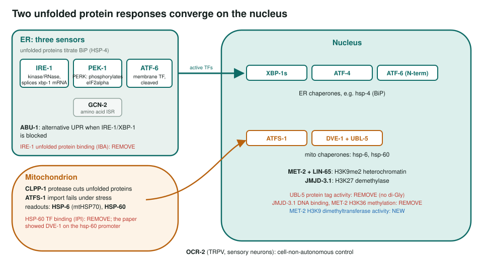
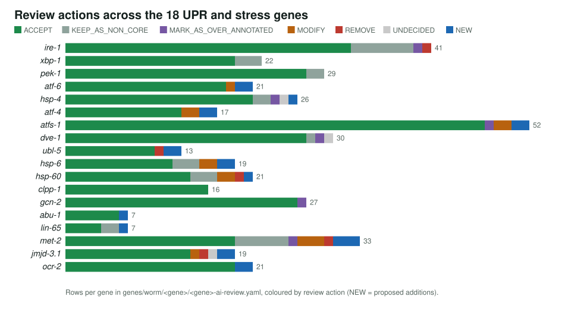

<!-- _class: lead -->

# Unfolded protein responses in *C. elegans*

Reviewing GO annotations for 18 genes of the ER and mitochondrial stress responses

AI Gene Review · projects/CAEEL_UPR_STRESS · 2026

---

<!-- _class: bluf -->

## Bottom line

- ER stress is sensed by **IRE-1, PEK-1 and ATF-6**; mitochondrial stress by **ATFS-1** with DVE-1, UBL-5 and chromatin regulators.
- We reviewed **every GO annotation on 18 genes**: **421 rows**, 344 ACCEPT, 13 MODIFY, 5 REMOVE, 21 NEW.
- The five removals each fix a **specific error**, e.g. protein tag activity on UBL-5, which cannot be conjugated.

---

## Why the worm

- Non-cell-autonomous UPR was found here: neurons can switch on stress responses in the intestine.
- hsp-4::GFP and hsp-6::GFP are standard in vivo reporters.
- ATF-6 deletion extends lifespan through ER-mitochondrial calcium signalling.
- Test: does GO keep **sensors**, **transcription factors** and **reporter chaperones** apart?

---

## The two responses and the 18 genes

---

## Actions per gene

---

## The five removals

| Gene | Term | Evidence | Why |
|---|---|---|---|
| ubl-5 | protein tag activity | IBA | no C-terminal di-Gly; acts non-covalently |
| hsp-60 | RNA Pol II TF binding | IPI | paper showed DVE-1 on the *hsp-60* promoter |
| jmjd-3.1 | RNA Pol II cis-regulatory DNA binding | IBA | no intrinsic DNA-binding domain |
| met-2 | histone H3K36 methyltransferase activity | IMP | SETDB1-family enzymes are H3K9-specific |
| ire-1 | unfolded protein binding | IBA | obsolete term; sensing is not chaperone binding |

From review.reason in genes/worm/&lt;gene&gt;/&lt;gene&gt;-ai-review.yaml.

---

## What was added

- **MET-2**: histone H3K9 dimethyltransferase activity, constitutive heterochromatin formation, transposable element silencing (IMP).
- **UBL-5**: splicing factor binding and transcription coactivator activity (IDA).
- **ATF-4**: integrated stress response signalling (IMP); **ATF-6**: ER calcium ion homeostasis (IMP).
- **HSP-6**: mitochondrial matrix (IDA), protein import into the matrix (ISS).

---

## Status and next steps

- ✅ 18/18 gene reviews and the pathway summary; atfs-1 and hsp-4 shared with CAEEL_MITOPHAGY and CAEEL_PROTEOSTASIS.
- ⬜ Listed but not reviewed: atf-5, abu-8, abu-11, jmjd-1.2 (hsp-3 has a review outside this project).

**Read more:** `projects/CAEEL_UPR_STRESS.md` · `projects/CAEEL_UPR_STRESS/CAEEL_UPR_STRESS-pathway.md` · `genes/worm/<gene>/`
