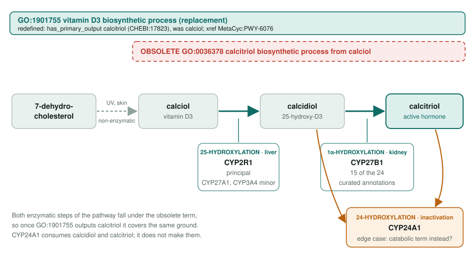
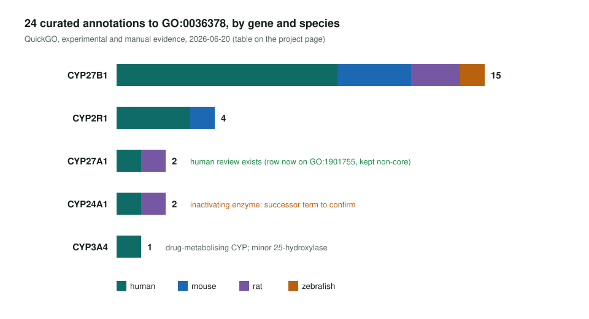

<!-- _class: lead -->

# Calcitriol biosynthesis from calciol is going

GO:0036378 is replaced by a redefined GO:1901755 vitamin D3 biosynthetic process

AI Gene Review · projects/CALCITRIOL_BIOSYNTHESIS_OBSOLETION · 2026

---

<!-- _class: bluf -->

## Bottom line

- GO is obsoleting **GO:0036378** and pointing it at **GO:1901755**, once that term's primary output is changed from calciol to **calcitriol**.
- **24 curated annotations** on **5 CYP enzymes** move. Four enzymes catalyse an activation step; **CYP24A1** inactivates, so its successor term needs a check.
- **Scoped, not started.** Only human **CYP27A1** has a review here, and its row already sits on GO:1901755.

---

## The pathway and the two terms

---

## Why a clean `replaced_by` works

- The two hydroxylations are the **only enzymatic steps** in MetaCyc PWY-6076; the first step is photochemical.
- Upstream already added the PWY-6076 xref and changed `has_primary_output` to **CHEBI:17823 calcitriol**.
- So GO:1901755 now covers exactly what GO:0036378 covered.
- **No mappings** (InterPro2GO, UniRule, keywords) point at GO:0036378, so there is no electronic fallout to triage.

---

## Who carries the annotations

---

## Status and next steps

1. **Wait** for the `replaced_by` step in go-ontology#32077; go-annotation#6449 shows BHF-UCL and UniProt done.
2. **Review CYP27B1** first (`just fetch-gene human CYP27B1`), then **CYP2R1**.
3. Treat **CYP3A4** (minor 25-hydroxylase) and **CYP24A1** (inactivator) as edge cases; report CYP24A1 upstream if a catabolic term fits better.

Existing review: `genes/human/CYP27A1/CYP27A1-ai-review.yaml` (GO:1901755 row KEEP_AS_NON_CORE)

**Read more:** `projects/CALCITRIOL_BIOSYNTHESIS_OBSOLETION.md`
