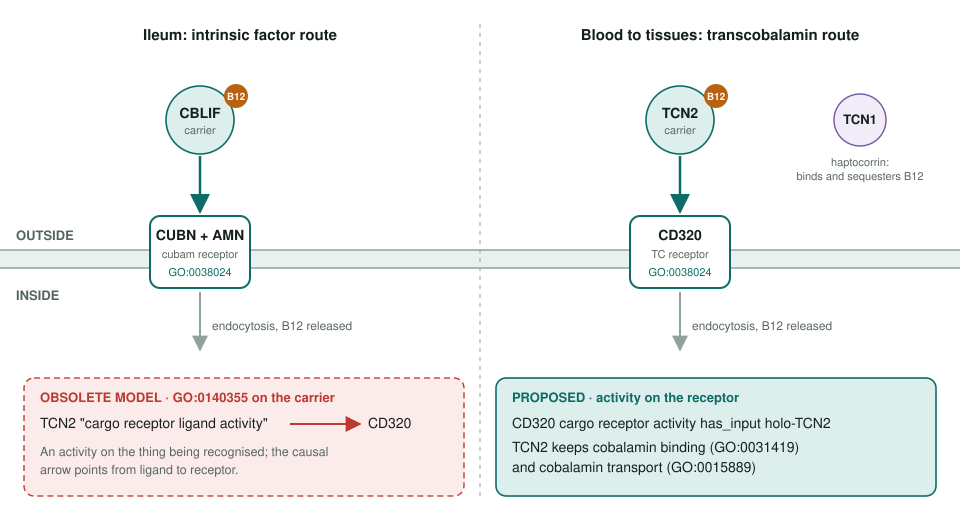
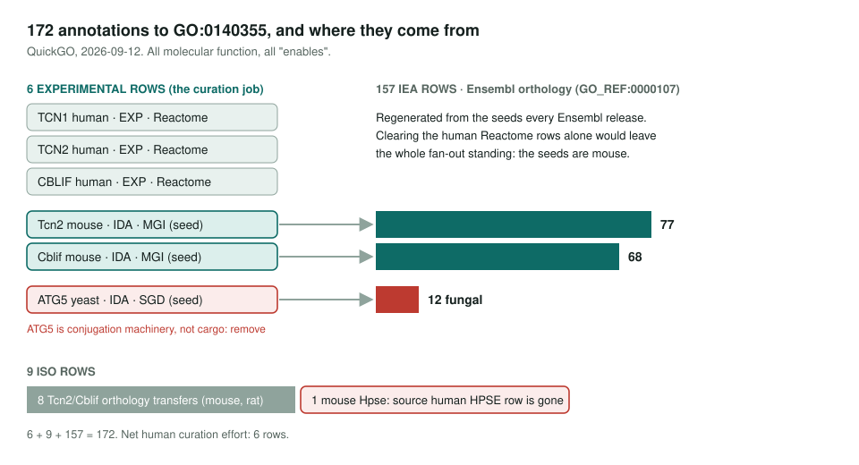

<!-- _class: lead -->

# Cargo receptor ligand activity is going

GO:0140355 is obsoleted with no replacement term

AI Gene Review · projects/CARGO_RECEPTOR_LIGAND_ACTIVITY_OBSOLETION · 2026

---

<!-- _class: bluf -->

## Bottom line

- Being recognised by a receptor is not an activity. The **receptor** gets `GO:0038024 cargo receptor activity` with the ligand as **has_input**.
- **172** annotations, but **157** are Ensembl projections from **3 seeds**. The real job is **6 experimental rows**.
- Here, **TCN2** and **CBLIF** list the obsolete term in `core_functions`; **TCN1** still carries a non-core row.

---

## The B12 uptake system

---

## Why GO is dropping the term

- Definition: "interacts with a cargo receptor and **initiates endocytosis**", which describes what happens to the protein.
- It is `is_a protein binding` with **no logical link** to `GO:0038024`.
- The resemblance to "receptor ligand" terms is nominal: those sit in the **signaling** receptor branch, which is disjoint from cargo receptors.
- Minted in 2019 for ApoB as the LDLR ligand; **no apolipoprotein carries it today**.

---

## The footprint

---

## Impact on this repo

| Review | Row action | core_functions | Tier |
|---|---|---|---|
| human TCN2 | ACCEPT (EXP) | GO:0140355 MF | 1: breaks validation |
| human CBLIF | ACCEPT (EXP) | GO:0140355 MF | 1: breaks validation |
| human TCN1 | KEEP_AS_NON_CORE (EXP) | none | 2: re-term row |
| human HSPA12A | prose only | none | 3: reword |
| CD320, CUBN, AMN | carry GO:0038024 | receptor side | 4: check lossless |

TCN2 also marks its protein-binding row over-annotated because GO:0140355 is "the informative MF"; that reasoning needs rewriting.

---

## Status and next steps

1. **go-ontology#32466 closed**; go-annotation#6533 remains open for Reactome + SGD cleanup.
2. Fix **TCN2** and **CBLIF** together: `REMOVE` the rows, re-point `core_functions` to `GO:0031419` and possibly `GO:0140104`.
3. Decide GO:0140104 once and apply the B12-carrier pattern to **TCN1** too.
4. Flag upstream: yeast **ATG5** IDA and orphaned mouse **Hpse** ISO.

**Read more:** `projects/CARGO_RECEPTOR_LIGAND_ACTIVITY_OBSOLETION.md`
