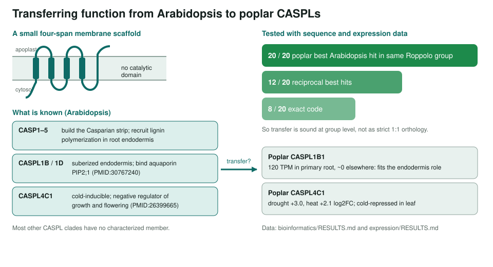
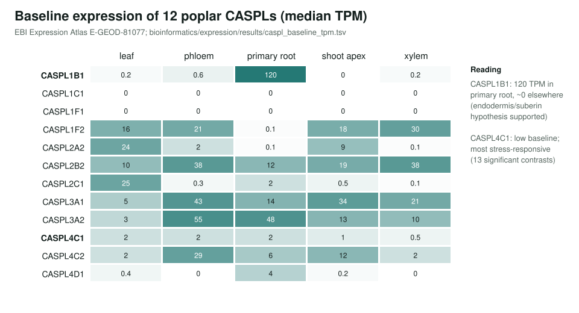

<!-- _class: lead -->

# The CASP-like (CASPL) family

Poplar and Arabidopsis reviews, PANTHER families, and orthology evidence

AI Gene Review · projects/CASPL_FAMILY · 2026

---

<!-- _class: bluf -->

## Bottom line

- CASPLs are small **four-span membrane scaffolds**; the true CASPs build the **Casparian strip**, but most CASPLs are uncharacterized.
- We reviewed **21 poplar** and **5 Arabidopsis** CASPLs, described **2 PANTHER families**, and ran orthology and expression analyses.
- Function transfers **at group level**: 20/20 poplar CASPLs hit the same Roppolo group; root-specific **CASPL1B1** and stress-induced **CASPL4C1** fit their Arabidopsis orthologs.

---

## Can function move from Arabidopsis to poplar?

---

## Why this family

- A **dark family**: dozens of members per plant genome, a handful characterized.
- Poplar reviews borrow hypotheses from Arabidopsis orthologs; that only works if the **orthology is real**.
- A family-wide view also fixes the PANTHER descriptions that every member inherits.

---

## Expression backs the transfer

---

## What the annotations show

| Set | Genes | Rows | Outcome |
|---|---|---|---|
| Poplar CASPLs | 21 | 21 | one IEA *plasma membrane* row each, all ACCEPT |
| Arabidopsis orthologs | 5 | 21 | 13 ACCEPT, 1 non-core, **2 REMOVE**, **5 UNDECIDED** |

- **REMOVE**: ISM *extracellular region* (CASPL1B1) and *nucleus* (CASPL1D2).
- **UNDECIDED**: five HDA Golgi / endosome / TGN rows on CASPL1D1.
- **NEW** proposed: CASPL1D1 *defense response to bacterium* (IMP).
- PANTHER: PTHR33573 description now separates CASP1–5 from the CASPL bulk; PTHR36488 (IPR044173) described.

---

## Status and next steps

- ✅ 21 poplar + 5 Arabidopsis reviews; 2 PANTHER families; orthology + expression analyses.
- ⬜ Peanut and watermelon CASPLs are TrEMBL only, so out of scope.
- ⬜ Optional extension: rice (29) and maize (23) reviewed CASPL entries.
- ⬜ CASPL2A1 (poplar) is reviewed but absent from the orthology analysis.

**Read more:** `projects/CASPL_FAMILY.md` · `projects/CASPL_FAMILY/bioinformatics/RESULTS.md` · `genes/POPTR/CASPL*/`
