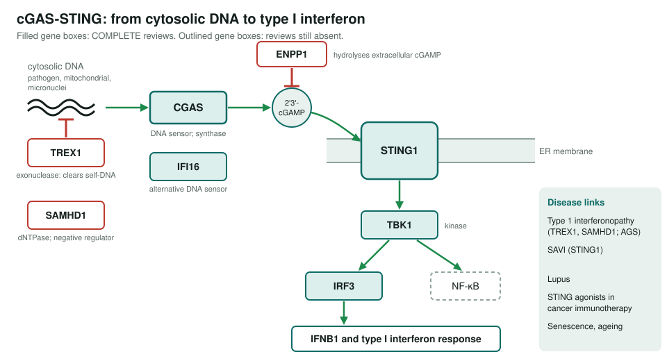
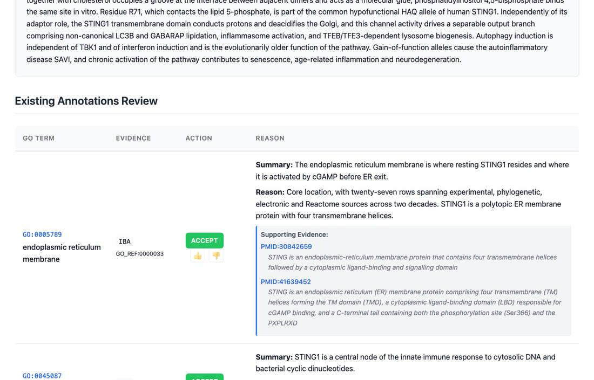

<!-- _class: lead -->

# cGAS-STING cytosolic DNA sensing

A scoped project: ten candidate genes, five already reviewed

AI Gene Review · projects/CGAS_STING_PATHWAY · 2026

---

<!-- _class: bluf -->

## Bottom line

- **cGAS** senses cytosolic DNA and makes **2'3'-cGAMP**; **STING1** then recruits **TBK1** to activate **IRF3** and type I interferon.
- **Scoped, not yet started**: no project-specific review work has been done.
- **5 of 10** candidates already have complete reviews from other projects (CGAS, STING1, TBK1, IRF3, IFI16; 917 annotations).
- **TREX1**, **ENPP1**, **SAMHD1**, **IRF7** and **IFNB1** still have no review folder.

---

## The pathway and what is covered

---

## Why this pathway

- Links innate immunity to **type 1 interferonopathies** (AGS, SAVI), **lupus**, **cancer immunotherapy** (STING agonists) and **senescence**.
- Many regulators were described **after 2020** (STING trafficking and degradation, intercellular cGAMP transfer), so GO annotation may lag the literature.
- A bounded set of about ten genes with a clear sensor → messenger → adaptor → kinase → transcription factor order.

---

## An existing review: STING1

STING1 (251 annotations, COMPLETE): 165 ACCEPT, 31 MODIFY, 26 REMOVE (25 of them generic <code>protein binding</code>).

---

## Status and next steps

| Gene | State |
|---|---|
| CGAS, STING1, TBK1, IRF3, IFI16 | Reviewed (COMPLETE), from other projects |
| TREX1, ENPP1, SAMHD1, IRF7, IFNB1 | No gene folder |

- ⬜ `just fetch-gene human <GENE>` for the five missing genes.
- ⬜ Review, then consider a cytosolic DNA sensing module.

**Read more:** `projects/CGAS_STING_PATHWAY.md`
