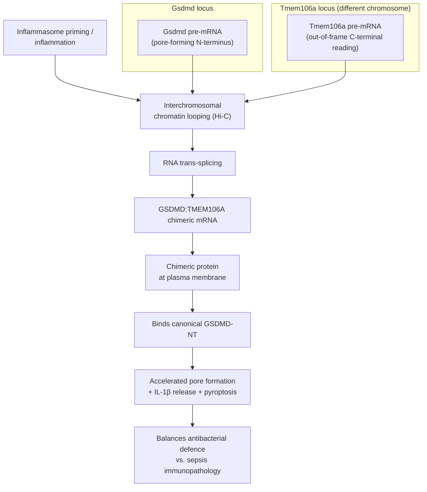

# Chimeric mRNA Trans-Fusions in Immunity

> A **chimeric trans-fusion** transcript joins exons from **two separate genes** — often on
> **different chromosomes** — into a single mRNA via **RNA-level trans-splicing**, without any
> underlying DNA rearrangement. When such a transcript is translated it can produce a **hybrid
> protein with its own function**, distinct from either parent. This project tracks the
> curation questions these raise for gene-function review, using the immune effector
> **GSDMD:TMEM106A** as the anchoring example.

## Why this matters for gene-function curation

GO annotation, and the reviews in this repository, are organized around **one gene → one
(set of) gene product(s)**. Chimeric trans-fusions break that assumption: a functional
protein can arise from **two loci at once**, and — as in the flagship case below — the
contribution of one parent can come from an **alternative (out-of-frame) reading** of its
mRNA rather than its canonical protein. This creates three concrete curation problems:

1. **Attribution.** A chimera's function is *not* an annotation of either parent gene. It
   should not be added to `existing_annotations` or `core_functions` of GSDMD or TMEM106A;
   it belongs in `knowledge_gaps` / notes as adjacent biology (this is how the two reviews
   here handle it).
2. **The "wrong-frame" trap.** The TMEM106A portion of GSDMD:TMEM106A is a cryptic peptide,
   so naïvely transferring canonical TMEM106A function to the chimera (or vice versa) would
   be wrong.
3. **Ortholog scope.** The effector was characterized in **mouse**; whether a human
   orthologous chimera exists and is functional is an open question, so human GSDMD/TMEM106A
   reviews must flag it as unresolved rather than assert it.

## Flagship example: GSDMD:TMEM106A (Gsdmd-Tmem106a)

A 2026 study established that regulated transcript fusion produces functional proteins during
inflammation, with a trans-spliced **GSDMD:TMEM106A** chimera as the worked example
[PMID:42686912].

- **What it is.** "we identify a protein-coding chimeric mRNA representing a fusion between
  the pore-forming protein gasdermin D (GSDMD) ... and a C-terminal domain translated out of
  frame from Tmem106a (Gsdmd-Tmem106a) in mice" [PMID:42686912]. The GSDMD contribution is
  its pore-forming portion; the TMEM106A contribution is an **out-of-frame** peptide, i.e.
  not the canonical TMEM106A protein.
- **How it forms — literally "trans".** The two parent genes sit at **distinct, non-adjacent
  loci** and the fusion is made at the RNA level by **trans-splicing**, not by a DNA
  translocation or a cis read-through: "Chromatin conformation capture studies reveal that
  inflammation induces **interchromosomal** DNA interactions, positioning parent genes
  proximally to facilitate the formation of chimeric mRNA" [PMID:42686912]. The
  characterized chimera is the **mouse** *Gsdmd*/*Tmem106a* pair; we have not verified the
  mouse chromosome assignments, and the abstract does not state the splice-site chemistry,
  so no more specific mechanism is asserted here.
- **When/where.** Inflammasome priming upregulates the chimera in myeloid cells; the protein
  localizes to the plasma membrane [PMID:42686912].
- **Function.** After inflammasome activation, "GSDMD-TMEM106A directly interacts with
  canonical GSDMD N termini to accelerate and enhance pore formation and IL-1β release"
  [PMID:42686912] — i.e. it is a **membrane cofactor that speeds up canonical GSDMD-NT pore
  assembly and pyroptosis**.
- **In vivo.** "GSDMD-TMEM106A balances host defence and immunopathology in vivo: its loss
  protects against lethal sepsis but compromises antibacterial defence, whereas
  overexpression enhances host protection while increasing sepsis lethality" [PMID:42686912].
- **Scale.** The study runs a discovery pipeline — "long-read direct RNA sequencing with
  non-targeted and targeted validation to identify chimeric transcripts in macrophages"
  [PMID:42686912] — so GSDMD:TMEM106A is the worked example out of a larger catalogue. The
  cached record for PMID:42686912 is **abstract-only** (`full_text_available: false`) and the
  abstract gives no catalogue size, so no figure is quoted here. (An earlier draft of this
  page asserted ">30,000 chimeric mRNAs"; that number is not in any source we hold and has
  been removed.)

## Distinguishing chimeric trans-fusions from look-alikes

| Phenomenon | DNA change? | Parent loci | Mechanism | Example |
|---|---|---|---|---|
| **Trans-spliced chimera** | No | Often different chromosomes | RNA trans-splicing | GSDMD:TMEM106A [PMID:42686912] |
| **cis read-through / conjoined gene** | No | Adjacent, same strand | Transcription past the stop of gene 1 into gene 2 | *(examples uncited — see note)* |
| **DNA fusion gene** | Yes (translocation) | Any | Genomic rearrangement | *(examples uncited — see note)* |

> **Note on the examples.** Only the GSDMD:TMEM106A row is sourced here. An earlier draft
> listed **CLEC12A-MIR223HG** in the trans-spliced row; PR review flagged that the two loci
> are neighbours on 12p13.31, which would make a **cis read-through** the more likely
> reading. Since the entry carried no citation either way, it has been removed rather than
> reclassified on an unsourced argument. The other illustrative pairs were likewise uncited
> and have been dropped; the table now states the *criteria* that distinguish the three
> phenomena, which is what it is for. Re-add examples only with a citation that establishes
> the mechanism, not just the fusion.

The GSDMD:TMEM106A case is notable for being a **physiologically functional immune effector**,
whereas many catalogued chimeras are cancer-associated or of unproven function.

## Genes reviewed here

- **GSDMD** — pyroptosis executioner; the pore-forming parent. See its review's
  `knowledge_gaps` for the cofactor / human-chimera question.
- **TMEM106A** — plasma-membrane macrophage-activation regulator; the parent whose locus
  contributes the out-of-frame peptide. Its review flags both its own dark molecular function
  and the human-chimera question.

## Open questions

- Does a **human** GSDMD:TMEM106A chimera exist and function as in mouse?
- What sequence/chromatin features specify which transcript pairs are trans-spliced during
  inflammation, and how is the process regulated?
- How many of the catalogued chimeras are translated and functional, and by what
  criteria should any be curated as distinct gene products for GO?
- Do other pyroptosis/inflammasome components participate in functional chimeras?

## References

- **PMID:42686912** — Venezia O, Kane H, et al. (senior author R. Jackson). *Functional
  chimeric mRNAs encode proteins in mammalian immunity.* Nature, 2 Sep 2026.
  DOI: 10.1038/s41586-026-10982-x. (Primary source; PubMed-verified.)
