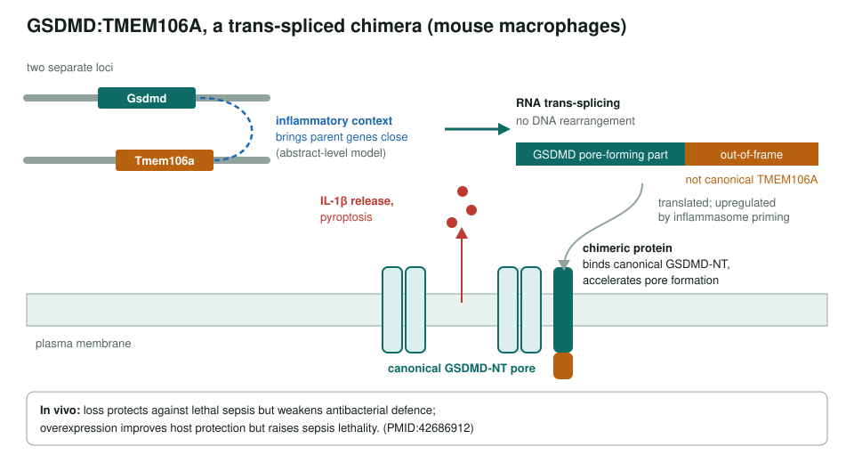
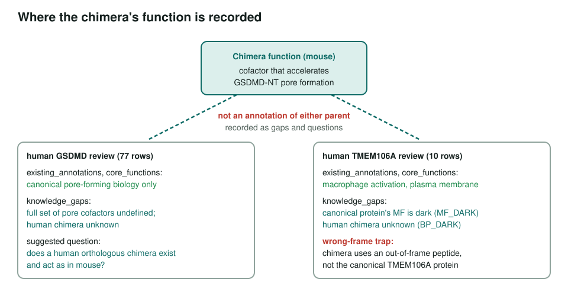

<!-- _class: lead -->

# Chimeric mRNA trans-fusions in immunity

One protein, two genes: what GSDMD:TMEM106A means for gene-function curation

AI Gene Review · projects/CHIMERIC_MRNA_IMMUNITY · 2026

---

<!-- _class: bluf -->

## Bottom line

- Inflamed mouse macrophages make a **trans-spliced GSDMD:TMEM106A** chimera that **speeds GSDMD pore formation and IL-1β release** (PMID:42686912).
- We reviewed both human parents, **GSDMD** (77 rows) and **TMEM106A** (10 rows), and recorded the chimera as a **knowledge gap**, not as an annotation of either.
- No human chimera has been shown; the remaining work is a set of **open questions**.

---

## How the chimera forms and acts

---

## Why it matters for curation

1. **Attribution.** GO assumes one gene → one set of products. A chimera's function is not an annotation of either parent.
2. **The wrong-frame trap.** The TMEM106A part is an out-of-frame peptide, so canonical TMEM106A function does not transfer.
3. **Ortholog scope.** Characterized in mouse only; human reviews must flag it as unresolved.

| Phenomenon | DNA change? | Parent loci | Mechanism |
|---|---|---|---|
| Trans-spliced chimera | No | often different chromosomes | RNA trans-splicing |
| cis read-through | No | adjacent, same strand | transcription past gene 1 |
| DNA fusion gene | Yes | any | translocation |

---

## Where the function is recorded

---

## Status and open questions

- ✅ GSDMD and TMEM106A reviews COMPLETE (54 ACCEPT, 18 non-core, 15 over-annotated across 87 rows).
- ⬜ Does a **human** GSDMD:TMEM106A chimera exist and function?
- ⬜ What specifies which transcript pairs are trans-spliced during inflammation?
- ⬜ By what criteria should a chimera be curated as a distinct gene product for GO?
- Source is **abstract-only** in the cache; no catalogue size is quoted.

**Read more:** `projects/CHIMERIC_MRNA_IMMUNITY.md` · `genes/human/GSDMD/` · `genes/human/TMEM106A/`
