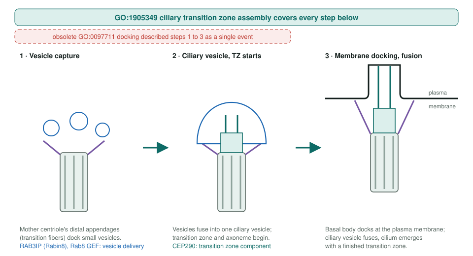
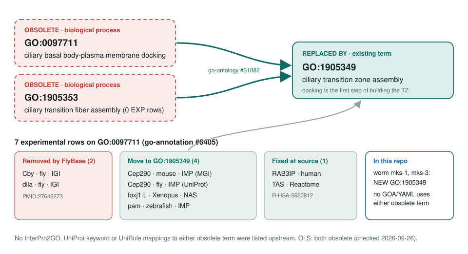

<!-- _class: lead -->

# Ciliary basal body docking obsoletion

GO:0097711 and GO:1905353 → GO:1905349 ciliary transition zone assembly

AI Gene Review · projects/CILIARY_BASAL_BODY_DOCKING_OBSOLETION · 2026

---

<!-- _class: bluf -->

## Bottom line

- GO **obsoleted** basal body-plasma membrane docking and transition fiber assembly; both merge into **GO:1905349** ciliary transition zone assembly.
- **7 experimental rows** were affected: FlyBase, MGI, Reactome, UniProt and Xenbase reported fixes; ZFIN remains for upstream error reports.
- **Scoped, not yet started:** no affected gene is reviewed here; **CEP290** and **RAB3IP** are queued.

---

## Why docking was retired

- Upstream (go-ontology #31882): the "docking" term described the **whole multi-step build** of the transition zone, not one docking event.
- The mother centriole first docks to vesicles; transition zone assembly **begins with that step** (PMID:27646273).
- GO:1905353 transition fiber assembly had **no experimental annotations** and sat inside the same process.
- Fix type: terminological. The biology is unchanged.

---

## One process, not a separate docking event

---

## Old terms → replacement, and where the rows go

---

## What this means for the repo

- `grep` over `genes/`: **no GOA or review YAML uses GO:0097711 / GO:1905353.**
- CEP290, RAB3IP, FOXJ1 and pam have **no review folders** yet.
- Worm `mks-1` and `mks-3` (from `CAEEL_CILIOPATHY`) already propose **NEW GO:1905349** for the MKS transition-zone module (IMP / IGI, PMID:21422230).
- The anticipated tether MF now exists: **GO:7770062** vesicle membrane tethering activity (sibling `VESICLE_TETHERING_OBSOLETION`).

---

## Status and next steps

1. Review **human CEP290** (O15078) as the anchor: most-annotated gene under the old term, multi-ciliopathy gene.
2. Review **RAB3IP** (Q96QF0), Rab8 GEF for ciliary vesicle delivery.
3. Defer FOXJ1, fly Cep290 and zebrafish pam.

**Upstream:** go-annotation#6405 · go-ontology#31882
**Siblings:** `VESICLE_DOCKING_OBSOLETION` (#6379) · `VESICLE_TETHERING_OBSOLETION` (#6375)
**Page:** `projects/CILIARY_BASAL_BODY_DOCKING_OBSOLETION.md`
