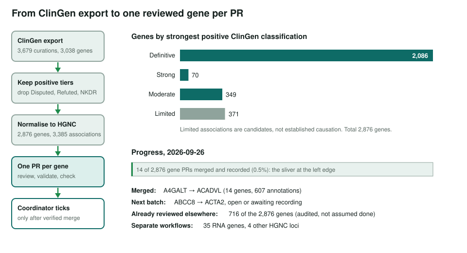
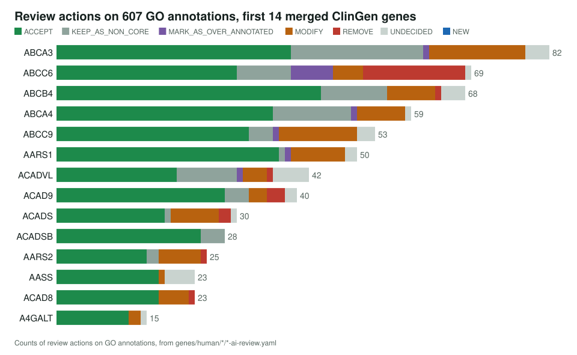
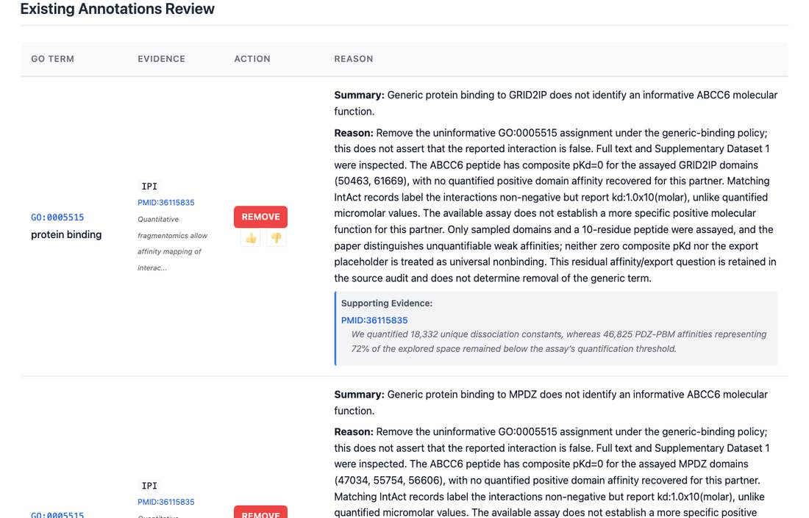

<!-- _class: lead -->

# ClinGen Mendelian disease genes

A one-gene-per-PR review campaign over 2,876 ClinGen-validated genes

AI Gene Review · projects/CLINGEN_MENDELIAN · 2026

---

<!-- _class: bluf -->

## Bottom line

- Seeded from the **2026-09-25 ClinGen Gene–Disease Validity** export: every gene with a Definitive, Strong, Moderate or Limited association, **2,876 genes**.
- Each gene gets its own PR reviewing its **molecular function and GO annotations**; a disease link alone does not establish a function.
- **14 gene PRs merged** by the 2026-09-26 progress log (A4GALT → ACADVL, 607 annotations), each ticked in the checklist.

---

## The campaign at a glance

---

## Why ClinGen

- ClinGen **grades the evidence** for each gene–disease link, so the seed set is explicit and reproducible (archived CSV, SHA-256, seed script).
- Limited associations are kept as candidates, not established causation; RNA genes and other loci get separate workflows.
- 747 of the 2,876 genes had a human review on 2026-09-27; the campaign **re-audits** them against current rules rather than assuming they are done.

---

## First fourteen genes: actions

All 26 REMOVEs are generic <code>protein binding</code> (17 on ABCC6). Justified UNDECIDED calls are kept where evidence is inaccessible, e.g. 5 on AASS and 6 on ACADVL.

---

## What a review looks like

ABCC6: each generic <code>protein binding</code> row from a fragmentomics screen is removed with a partner-specific reason, after inspecting the full text and supplementary data.

---

## Status and next steps

- ✅ Source archived and 2,876-gene inventory seeded (PR #3126).
- ✅ Merged and recorded: A4GALT #3127, AARS2 #3128, AARS1 #3129, ABCA4 #3132, AASS #3133, ABCA3 #3134, ABCB4 #3135, ABCC6 #3138, ABCC9 #3148, ACAD8 #3151, ACAD9 #3152, ACADSB #3154, ACADS #3155, ACADVL #3157.
- ⬜ Next batch (ABCC8 → ACTA2) is open or awaiting recording; see the progress log for live state.

**Read more:** `projects/CLINGEN_MENDELIAN.md` · `projects/CLINGEN_MENDELIAN/review-progress.md`
