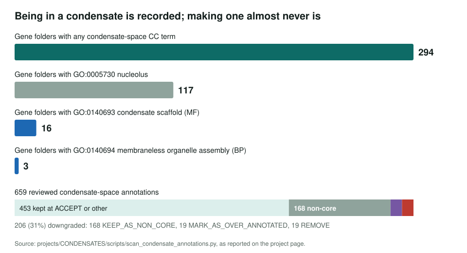
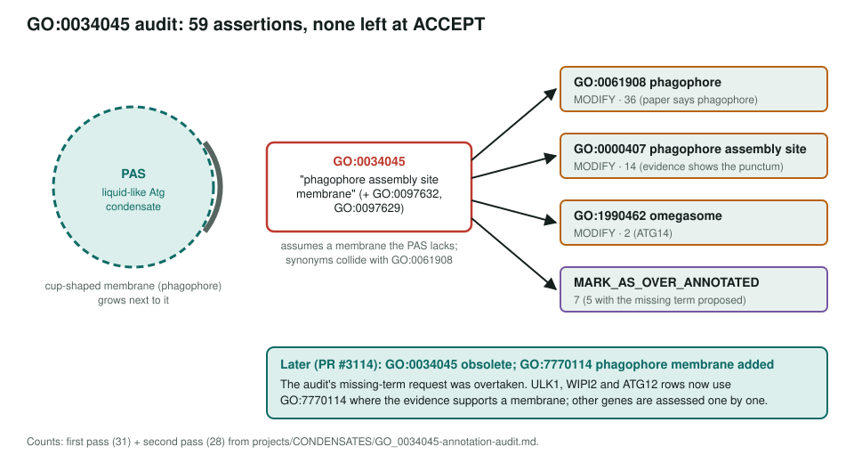

<!-- _class: lead -->

# Biomolecular condensates

A cross-cutting audit of how GO and this repository annotate membraneless compartments

AI Gene Review · projects/CONDENSATES · IN_PROGRESS · 2026

---

<!-- _class: bluf -->

## Bottom line

- **Being in a condensate is a location; making one is a function.** The corpus records the first in 238 gene folders and the scaffold function in 9.
- Reviewers already downgraded **146 of 399 (37%)** condensate-space annotations, with no shared rule.
- A full re-review of **59 `GO:0034045` PAS-membrane assertions** left none at ACCEPT; GO has since made the term obsolete.

---

## The asymmetry

---

## Three ontology problems

1. **No "biomolecular condensate" class.** `GO:0043228` membraneless organelle also contains the ribosome and the cytoskeleton.
2. **Condensates outside the grouping.** `GO:0000407` phagophore assembly site is a liquid-like condensate (PMID:32025038) but is not under membraneless organelle.
3. **Terms that assume a membrane.** `GO:0034045` PAS membrane shares its *phagophore* synonyms with `GO:0061908`.

---

## The GO:0034045 audit

---

## What the audit showed

- First pass (through the term): every previously reviewed assertion had been **ACCEPT**; all 31 across 14 genes moved (26 MODIFY, 5 over-annotated).
- Several prior justifications argued **pathway membership, not localization** (e.g. Rab7: "Consistent with the Rab7 role in autophagy").
- Second pass: 7 genes reviewed in full (496 annotations, 28 on GO:0034045).
- Fed into GO issue **#29437**; superseded in part by the new `GO:7770114` phagophore membrane.

---

## Working principles (drafts)

1. **Scaffold, client or regulator: say which** in `core_functions`.
2. Condensate CC alone is rarely a core function.
3. Prefer the material claim over the compartment claim.
4. Demand condensate-grade evidence (FRAP, hexanediol with controls, endogenous tags).
5. Model condensates as modules, as `modules/phagophore_assembly_site.yaml` does.

---

## Status and next steps

- ✅ Corpus audit script and tables: `projects/CONDENSATES/CONDENSATES-go-audit.md`
- ✅ GO:0034045 slice audit: `projects/CONDENSATES/GO_0034045-annotation-audit.md`
- ⬜ Run the **calibration batch** of scaffold genes (SQSTM1, NFE2L2, LGALS3, TP53 orthologs, Ccnt1, mid1, TARDBP) against the principles.
- ⬜ Decide whether to request a condensate grouping class and children of GO:0140693.

**Related:** `projects/STRESS_GRANULES.md` · `projects/CAEEL_P_GRANULES.md` · `projects/SL.md`
