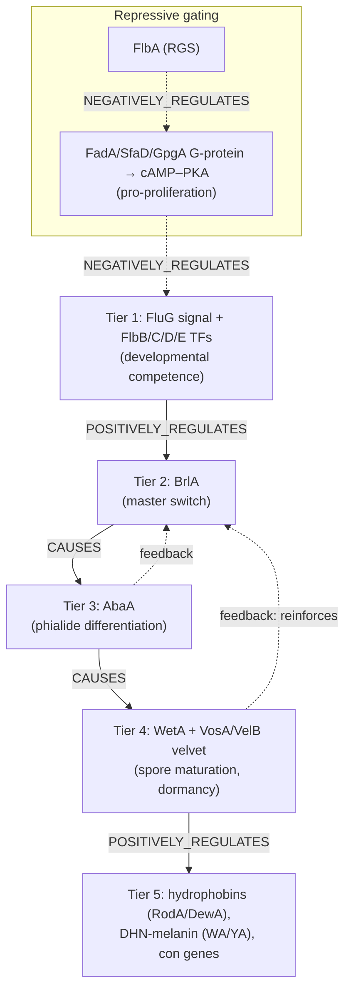

# Conidiation regulatory cascade — module design proposal

**Status:** design only. This page records *how* to build a `modules/*.yaml`
`ModuleReview` for conidium formation. No identifiers are grounded yet — every
UniProt accession, PANTHER `PTHR`/`PTN`, and GO id below is a **placeholder to
resolve** (via UniProt, the local `interpro/panther/` cache, and the OLS MCP)
during the build, per the module-curation rule *never guess identifiers*.

## 1. What the module is

Conidiation (conidiogenesis) is the developmental program that produces
**conidia** — asexual, mitotically-derived spores borne on specialized aerial
structures (conidiophores) in filamentous ascomycetes. It is one of the
best-dissected fungal developmental programs, worked out chiefly in *Aspergillus
nidulans* and *Neurospora crassa*.

The reusable, defensible module is the **central regulatory cascade** — the
transcription-factor relay that commits vegetative hyphae to sporulation and
drives spore maturation — together with the signaling that gates it and the
structural genes it ultimately switches on.

## 2. Module boundary

| Candidate scope | Decision | Rationale |
|---|---|---|
| **Conidiation regulatory cascade** (upstream activation → BrlA → AbaA → WetA/velvet → structural output) | **Core module** | Clean multi-tier regulatory chain; maps directly onto `parts` + typed `connections`; clears the ≥2-substantive-parts rule (6 tiers). |
| Conidiophore morphogenesis (stalk → vesicle → metulae → phialides → conidia) | Sibling module (later) | More morphological than molecular; would ground on the same regulators. |
| Conidial dispersal / dormancy physiology | Out of scope | Downstream physiology; touched only via velvet/dormancy node. |

**Type:** `module_type: DEVELOPMENTAL_PROCESS`.

The four confirmed inclusions beyond the BrlA→AbaA→WetA spine — **upstream
activation (FluG/Flb)**, **repressive gating (FlbA / G-protein–PKA)**, **velvet
maturation (VosA/VelB)**, and **structural output (hydrophobins / pigment)** —
are all modeled as first-class tiers rather than prose context.

## 3. Top-level grounding (to resolve)

- `module.concepts`: a GO biological-process term for conidiation. Candidate
  labels to resolve to ids via OLS: *conidium development*, *asexual
  sporulation resulting in formation of a cellular spore*, *conidiophore
  development*. **Pick the most specific term that still spans the whole
  cascade; keep narrower ones on the relevant tier.**
- `module.context`:
  - `taxa`: Pezizomycotina / Ascomycota (species-neutral at the top; species
    pinned inside `variant_sets`). Resolve NCBITaxon id.
  - `cellular_components`: nucleus (the TF relay), plasma membrane / hyphal tip
    (signal sensing), extracellular region (FluG signal, rodlet layer). Avoid
    asserting both a parent and child compartment without a recorded reason.

## 4. Part decomposition

Ordered `parts`, each a `ModuleNode` (`REGULATORY_STEP`, except the output tier)
holding leaf `annotons` for the member proteins.

| order | role (node) | key members (gene symbols) | node type |
|---|---|---|---|
| 1 | Developmental competence / upstream activation | FluG (signal synthesis), FlbB, FlbC, FlbD, FlbE | REGULATORY_STEP |
| 2 | Master-switch induction | BrlA (C2H2 TF) | REGULATORY_STEP |
| 3 | Phialide differentiation (mid-development) | AbaA (TEA/ATTS TF) | REGULATORY_STEP |
| 4 | Spore maturation & dormancy | WetA, VosA, VelB (velvet) | REGULATORY_STEP |
| 5 | Structural output | RodA/DewA (hydrophobins), WA/YA (DHN-melanin PKS/laccase), con genes | BIOLOGICAL_PROCESS |
| R | Repressive gating (modifies tier 1) | FlbA (RGS) ⊣ FadA (Gα)/SfaD/GpgA → cAMP–PKA | REGULATORY_STEP |

Molecular-function terms (TF activity, RGS/GTPase-regulator activity, PKS
activity, structural constituent) go on the **leaf annotons**, never on the
process module concept — the standard process-module modeling rule.

## 5. Cascade diagram

## 6. Connections (typed edges)

Using `ModuleConnectionTypeEnum`:

| source → target | connection_type | note |
|---|---|---|
| upstream_activation → brla_induction | POSITIVELY_REGULATES | FluG/Flb induce *brlA* |
| brla_induction → abaa_step | CAUSES | BrlA activates *abaA* |
| abaa_step → weta_maturation | CAUSES | AbaA activates *wetA* |
| weta_maturation → structural_output | POSITIVELY_REGULATES | velvet/WetA switch on spore-wall genes |
| flba_gating → g_protein_signaling | NEGATIVELY_REGULATES | FlbA-RGS damps FadA |
| g_protein_signaling → upstream_activation | NEGATIVELY_REGULATES | active PKA signaling blocks sporulation |

Regulatory/developmental edges take `chaining_status: NOT_APPLICABLE` if the
advisory reaction-continuity check ever flags them (this is not a metabolic
chain).

## 7. Species variation — `variant_sets`

The *Aspergillus* and *Neurospora* programs are alternative implementations of
the same developmental logic. Model tiers 1–4 with a `variant_set` on the
**taxon/lineage axis** (`EXACTLY_ONE`) so the module stays reusable:

- **Variant A — Aspergillus paradigm:** BrlA → AbaA → WetA, with FluG/FlbA–E
  upstream and velvet (VosA/VelB/VeA/LaeA) maturation.
- **Variant B — Neurospora macroconidiation:** FL (Gal4-type Zn₂Cys₆ TF),
  ACON-2/ACON-3, with White-Collar-Complex (WC-1/WC-2) + `frq` circadian
  gating; EAS hydrophobin and con-6/con-10 as structural output.

Ground each variant with its own `representative_members`; do **not** inflate the
member list to every species named in deep research.

## 8. Member roster & grounding TODO

Resolve each of these during the build (UniProt accession; PANTHER family/PTN
where the local cache has one; per-annoton GO MF/BP term). **Reference organism
dirs:** likely `EMENI` (*A. nidulans*) and `NEUCR` (*N. crassa*).

| Gene | Role | Grounding to fetch |
|---|---|---|
| BrlA | master switch, C2H2 TF | UniProtKB (EMENI), GO DNA-binding TF activity |
| AbaA | phialide TF (TEA/ATTS) | UniProtKB, PANTHER TEA-domain family |
| WetA | maturation regulator | UniProtKB |
| FluG | extracellular signal synthesis | UniProtKB; note GS-I-like domain |
| FlbA | RGS, damps FadA | UniProtKB; GO GTPase-regulator/RGS activity |
| FlbB/C/D/E | upstream TFs (bZIP/cMyb/C2H2) | UniProtKB each |
| VosA / VelB / VeA / LaeA | velvet complex | UniProtKB; PANTHER velvet family; GO-CAM if present |
| FadA / SfaD / GpgA | heterotrimeric G-protein | UniProtKB |
| RodA / DewA | rodlet hydrophobins | UniProtKB; GO structural constituent |
| WA / YA | DHN-melanin PKS / laccase | UniProtKB; Rhea/EC for PKS |
| FL, ACON-2/3, WC-1/2 | Neurospora variant | UniProtKB (NEUCR) |

## 9. Anti-patterns to avoid (from the module-curation skill)

- Putting a member's MF term on the process module concept instead of its leaf
  annoton.
- Letting the module collapse to a species-specific *A. nidulans* member list —
  keep it reusable via `variant_sets` + `representative_members`.
- Asserting parent+child compartments (e.g. cytoplasm and cytosol) without a
  recorded reason.
- Treating deep-research prose as an identifier source — every id resolved
  against UniProt / PANTHER / OLS / GO-CAM.

## 10. Build workflow (when approved)

1. `just fetch-gene EMENI brlA` (and each core member) → seeds gene reviews +
   UniProt/GOA; repeat for `NEUCR` variant members.
2. `just module-deep-research-perplexity conidiation_regulatory_cascade` →
   cited `modules/conidiation_regulatory_cascade-deep-research-*.md`.
3. Author `modules/conidiation_regulatory_cascade.yaml` per the skeleton above.
4. Validate + render:
   - `uv run linkml-validate -s src/ai_gene_review/schema/gene_review.yaml -C ModuleReview modules/conidiation_regulatory_cascade.yaml`
   - `uv run python -m ai_gene_review.validation.module_validator modules/conidiation_regulatory_cascade.yaml`
   - `just render-module modules/conidiation_regulatory_cascade.yaml`
5. If this project page is kept, add a `project-card` entry to
   `pages/projects/index.html` (the index is manually maintained).

## 11. Open questions

- **Single reusable module vs. two concrete instances?** Recommendation:
  one reusable module with taxon `variant_sets` (Aspergillus + Neurospora).
- **Which top GO term** best spans the whole cascade without over-narrowing?
  Resolve candidates in §3 against the ontology.
- **Structural output — in-core vs. sibling module?** Currently in-core as
  tier 5; could be spun out to a `conidial_wall_assembly` module if it grows.
- **GO-CAM coverage:** check `gocams/index.tsv` for any existing conidiation
  models to attach via `gocam_associations`.
