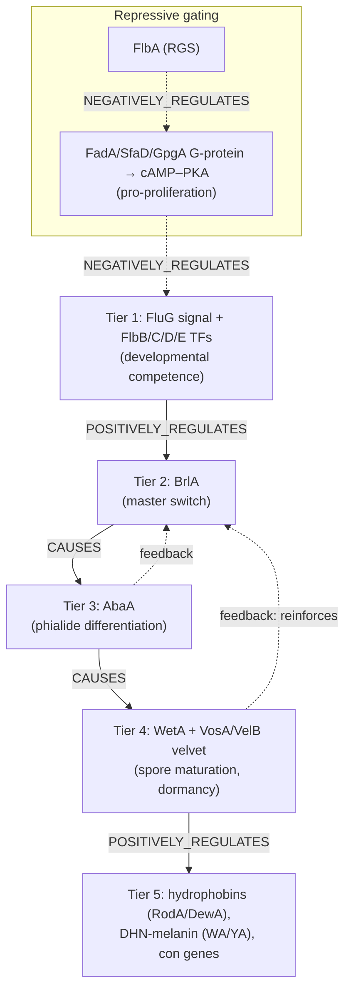

# Conidiation regulatory cascade — module design proposal

**Status:** first module implemented. A concrete *Aspergillus nidulans*
`ModuleReview` now exists at `modules/conidiation_regulatory_cascade.yaml`
(rendered: `pages/modules/conidiation_regulatory_cascade.html`), grounding all 21
participants in verified UniProtKB accessions and passing `linkml-validate` +
`module_validator`. This page remains the design rationale and the source for the
two-axis ontology analysis and the annotation-inconsistency caveat.

**Implemented so far:** the six-tier cascade (FluG/Flb → BrlA → AbaA →
WetA/velvet → structural output, plus G-protein/FlbA repressive gating), dual
top-level concepts GO:0048315 + GO:0070787, per-annoton molecular functions, and
typed connections.

**Member gene reviews — 7/21 complete** (`genes/EMENI/`):

| Gene | Acc | Ann. | Notable curation calls |
|---|---|---|---|
| brlA | P10069 | 26 | Core C2H2 master TF; GO:0045461 *sterigmatocystin biosynthetic process* flagged **over-annotation** (regulator, not biosynthetic); ST/autolysis/starvation kept non-core |
| abaA | P20945 | 21 | Core ATTS/TEA TF (binds CATTCY); all ACCEPT — clean phialide/conidiophore regulator |
| wetA | P22022 | 12 | Core late regulator (spore-wall assembly); GO:0046148 pigment non-core; **no MF asserted** (DNA binding not established) — module annoton corrected to match |
| vosA | Q5BBX1 | 12 | Velvet/NF-κB-like regulator of spore maturation, trehalose, β-glucan gene repression; core MF GO:0003700 **proposed** (not yet in GOA) |
| velB | C8VTS4 | 18 | Dual-complex velvet regulator; GO:0045461 flagged **over-annotation** → GO:0010914; promotes sexual sporulation, represses conidiation |
| veA | C8VTV4 | 17 | Founding velvet member; light-dependent nucleocytoplasmic localization (all EXP accepted); no MF asserted; reg-of-sulfur (IEA) non-core (unconfirmed) |
| laeA | C8VQG9 | 18 | SAM-dependent methyltransferase (automethylation, IDA) + global SM regulator; GO:0051701 host-interaction non-core (loose fit vs fungivory) |

**Module MF verification (from reviews):** the velvet structural paper
[PMID:24391470] confirms VosA/VelB carry an NF-κB-like DNA-binding domain, so the
module's `GO:0003700` on those annotons holds; WetA (not a velvet protein) had its
MF removed; LaeA's `GO:0008168` methyltransferase is confirmed by IDA.

**Tracked follow-ups:** remaining 14 member gene reviews (Flb factors, FluG,
G-protein gating, hydrophobin/pigment genes), module deep research, and the
*Neurospora* macroconidiation variant (would make the module ABSTRACT with taxon
`variant_sets`).

## 1. What the module is

Conidiation (conidiogenesis) is the developmental program that produces
**conidia** — asexual, mitotically-derived spores borne on specialized aerial
structures (conidiophores) in filamentous ascomycetes. It is one of the
best-dissected fungal developmental programs, worked out chiefly in *Aspergillus
nidulans* and *Neurospora crassa*.

The reusable, defensible module is the **central regulatory cascade** — the
transcription-factor relay that commits vegetative hyphae to sporulation and
drives spore maturation — together with the signaling that gates it and the
structural genes it ultimately switches on.

## 2. Module boundary

| Candidate scope | Decision | Rationale |
|---|---|---|
| **Conidiation regulatory cascade** (upstream activation → BrlA → AbaA → WetA/velvet → structural output) | **Core module** | Clean multi-tier regulatory chain; maps directly onto `parts` + typed `connections`; clears the ≥2-substantive-parts rule (6 tiers). |
| Conidiophore morphogenesis (stalk → vesicle → metulae → phialides → conidia) | **Second in-module concept / context** (see §3a) | A *distinct* GO branch — GO:0070787 *conidiophore development*, on the reproductive-structure axis, **not** under conidium formation. The cascade spans both axes (BrlA/AbaA build the conidiophore; WetA/velvet mature the spore), so it is not cleanly separable. |
| Conidial dispersal / dormancy physiology | Out of scope | Downstream physiology; touched only via velvet/dormancy node. |

**Type:** `module_type: DEVELOPMENTAL_PROCESS`.

The four confirmed inclusions beyond the BrlA→AbaA→WetA spine — **upstream
activation (FluG/Flb)**, **repressive gating (FlbA / G-protein–PKA)**, **velvet
maturation (VosA/VelB)**, and **structural output (hydrophobins / pigment)** —
are all modeled as first-class tiers rather than prose context.

## 3. Top-level grounding

**Resolved.** Give `module.concepts` **two** terms (see §3a for why): the
spore-cell axis **GO:0048315 "conidium formation"** (primary) and the structural
axis **GO:0070787 "conidiophore development"**. The cascade drives both.

> ⚠️ **Do not use `GO:0061794` "conidium development".** It is being obsoleted
> as an *unnecessary grouping term* (0 direct annotations, single child
> GO:0048315) — GO tracker
> [geneontology/go-ontology#32315](https://github.com/geneontology/go-ontology/issues/32315)
> (opened 2026-07-15, label `obsoletion`; still `isObsolete:false` in the
> released ontology as of this writing, i.e. an in-flight change). GO:0048315
> is the surviving specific term.

Related terms to use where appropriate rather than at the top:

- **GO:0048315** *conidium formation* — top-level module concept (the whole
  program, formation → mature spore).
- **GO:0075306** *regulation of conidium formation* — for the regulatory-cascade
  framing / the FluG–Flb–BrlA–AbaA–WetA relay as regulators.
- **GO:0030436** *asexual sporulation* — broader parent (context only).

Per-tier MF/BP terms (TF activity, RGS activity, PKS activity, etc.) still go on
the leaf annotons and are resolved via OLS during grounding.
- `module.context`:
  - `taxa`: Pezizomycotina / Ascomycota (species-neutral at the top; species
    pinned inside `variant_sets`). Resolve NCBITaxon id.
  - `cellular_components`: nucleus (the TF relay), plasma membrane / hyphal tip
    (signal sensing), extracellular region (FluG signal, rodlet layer). Avoid
    asserting both a parent and child compartment without a recorded reason.

## 3a. Ontology landscape (scouted) — two orthogonal axes

Conidiation splits into **two GO branches that are not parent/child**. Both
belong in the module — spore-cell formation as the primary concept, conidiophore
development as a co-equal structural concept/context.

| Axis | Term | Role in module | Ann. count* |
|---|---|---|---|
| **Spore-cell formation** (asexual sporulation → cell differentiation branch) | GO:0030436 asexual sporulation | broad parent / context | 9283 |
| | GO:0043936 …formation of a cellular spore | broad parent | 1133 |
| | **GO:0048315 conidium formation** | **primary module concept** | 551 |
| | GO:0075306 regulation of conidium formation (+ GO:0075307 pos / GO:0075308 neg) | regulatory-tier framing | 379 |
| **Conidiophore structure** (reproductive-structure development branch) | **GO:0070787 conidiophore development** | **second module concept** (BrlA/AbaA morphogenesis) | 19 |
| | GO:0070788 conidiophore stalk development | tier-specific (stalk) | 0 |
| | GO:0070793 regulation of conidiophore development (+ GO:0070795 pos / GO:0070794 neg) | regulatory framing | 1 |
| — | GO:0000905 sporocarp development involved in asexual reproduction | parallel structure term (rarely used) | 10 |
| ✗ | GO:0061794 conidium development | **do not use — being obsoleted (#32315)** | 0 |

\* Indicative QuickGO `goUsage=exact` counts — **not** a basis for term choice
(see caveat below).

**⚠️ Annotation is inconsistent — do not infer structure from GOA.** 9283
annotations sit on the vague grouping term *asexual sporulation* while the
precise *conidium formation* (551) and *conidiophore development* (19 / 0 / 1)
terms are sparsely populated. The same regulators (`brlA`, `abaA`, `wetA`, …)
are annotated to a scatter of broad and specific terms depending on the
MOD/curator. Consequences for the build:

- Choose each annoton's term **by biology**, not by copying where the gene
  currently sits in GOA.
- Expect many existing broad-term annotations (e.g. to GO:0030436) to be
  `MODIFY` candidates toward the specific conidium/conidiophore terms when the
  member gene reviews are done.
- Use regulation sub-terms (GO:0075306 / GO:0070793 and their pos/neg children)
  for the TF-cascade tiers where the biology is *regulatory*, and the formation/
  development terms where it is *executive*.

## 4. Part decomposition

Ordered `parts`, each a `ModuleNode` (`REGULATORY_STEP`, except the output tier)
holding leaf `annotons` for the member proteins.

| order | role (node) | key members (gene symbols) | node type |
|---|---|---|---|
| 1 | Developmental competence / upstream activation | FluG (signal synthesis), FlbB, FlbC, FlbD, FlbE | REGULATORY_STEP |
| 2 | Master-switch induction | BrlA (C2H2 TF) | REGULATORY_STEP |
| 3 | Phialide differentiation (mid-development) | AbaA (TEA/ATTS TF) | REGULATORY_STEP |
| 4 | Spore maturation & dormancy | WetA, VosA, VelB (velvet) | REGULATORY_STEP |
| 5 | Structural output | RodA/DewA (hydrophobins), WA/YA (DHN-melanin PKS/laccase), con genes | BIOLOGICAL_PROCESS |
| R | Repressive gating (modifies tier 1) | FlbA (RGS) ⊣ FadA (Gα)/SfaD/GpgA → cAMP–PKA | REGULATORY_STEP |

Molecular-function terms (TF activity, RGS/GTPase-regulator activity, PKS
activity, structural constituent) go on the **leaf annotons**, never on the
process module concept — the standard process-module modeling rule.

## 5. Cascade diagram

## 6. Connections (typed edges)

Using `ModuleConnectionTypeEnum`:

| source → target | connection_type | note |
|---|---|---|
| upstream_activation → brla_induction | POSITIVELY_REGULATES | FluG/Flb induce *brlA* |
| brla_induction → abaa_step | CAUSES | BrlA activates *abaA* |
| abaa_step → weta_maturation | CAUSES | AbaA activates *wetA* |
| weta_maturation → structural_output | POSITIVELY_REGULATES | velvet/WetA switch on spore-wall genes |
| flba_gating → g_protein_signaling | NEGATIVELY_REGULATES | FlbA-RGS damps FadA |
| g_protein_signaling → upstream_activation | NEGATIVELY_REGULATES | active PKA signaling blocks sporulation |

Regulatory/developmental edges take `chaining_status: NOT_APPLICABLE` if the
advisory reaction-continuity check ever flags them (this is not a metabolic
chain).

## 7. Species variation — `variant_sets`

The *Aspergillus* and *Neurospora* programs are alternative implementations of
the same developmental logic. Model tiers 1–4 with a `variant_set` on the
**taxon/lineage axis** (`EXACTLY_ONE`) so the module stays reusable:

- **Variant A — Aspergillus paradigm:** BrlA → AbaA → WetA, with FluG/FlbA–E
  upstream and velvet (VosA/VelB/VeA/LaeA) maturation.
- **Variant B — Neurospora macroconidiation:** FL (Gal4-type Zn₂Cys₆ TF),
  ACON-2/ACON-3, with White-Collar-Complex (WC-1/WC-2) + `frq` circadian
  gating; EAS hydrophobin and con-6/con-10 as structural output.

Ground each variant with its own `representative_members`; do **not** inflate the
member list to every species named in deep research.

## 8. Member roster & grounding TODO

Resolve each of these during the build (UniProt accession; PANTHER family/PTN
where the local cache has one; per-annoton GO MF/BP term). **Reference organism
dirs:** likely `EMENI` (*A. nidulans*) and `NEUCR` (*N. crassa*).

| Gene | Role | Grounding to fetch |
|---|---|---|
| BrlA | master switch, C2H2 TF | UniProtKB (EMENI), GO DNA-binding TF activity |
| AbaA | phialide TF (TEA/ATTS) | UniProtKB, PANTHER TEA-domain family |
| WetA | maturation regulator | UniProtKB |
| FluG | extracellular signal synthesis | UniProtKB; note GS-I-like domain |
| FlbA | RGS, damps FadA | UniProtKB; GO GTPase-regulator/RGS activity |
| FlbB/C/D/E | upstream TFs (bZIP/cMyb/C2H2) | UniProtKB each |
| VosA / VelB / VeA / LaeA | velvet complex | UniProtKB; PANTHER velvet family; GO-CAM if present |
| FadA / SfaD / GpgA | heterotrimeric G-protein | UniProtKB |
| RodA / DewA | rodlet hydrophobins | UniProtKB; GO structural constituent |
| WA / YA | DHN-melanin PKS / laccase | UniProtKB; Rhea/EC for PKS |
| FL, ACON-2/3, WC-1/2 | Neurospora variant | UniProtKB (NEUCR) |

## 9. Anti-patterns to avoid (from the module-curation skill)

- Putting a member's MF term on the process module concept instead of its leaf
  annoton.
- Letting the module collapse to a species-specific *A. nidulans* member list —
  keep it reusable via `variant_sets` + `representative_members`.
- Asserting parent+child compartments (e.g. cytoplasm and cytosol) without a
  recorded reason.
- Treating deep-research prose as an identifier source — every id resolved
  against UniProt / PANTHER / OLS / GO-CAM.

## 10. Build workflow (when approved)

1. `just fetch-gene EMENI brlA` (and each core member) → seeds gene reviews +
   UniProt/GOA; repeat for `NEUCR` variant members.
2. `just module-deep-research-perplexity conidiation_regulatory_cascade` →
   cited `modules/conidiation_regulatory_cascade-deep-research-*.md`.
3. Author `modules/conidiation_regulatory_cascade.yaml` per the skeleton above.
4. Validate + render:
   - `uv run linkml-validate -s src/ai_gene_review/schema/gene_review.yaml -C ModuleReview modules/conidiation_regulatory_cascade.yaml`
   - `uv run python -m ai_gene_review.validation.module_validator modules/conidiation_regulatory_cascade.yaml`
   - `just render-module modules/conidiation_regulatory_cascade.yaml`
5. If this project page is kept, add a `project-card` entry to
   `pages/projects/index.html` (the index is manually maintained).

## 11. Open questions

- **Single reusable module vs. two concrete instances?** Recommendation:
  one reusable module with taxon `variant_sets` (Aspergillus + Neurospora).
- ~~Which top GO term best spans the whole cascade?~~ **Resolved:**
  GO:0048315 *conidium formation* (see §3; GO:0061794 is being obsoleted).
- **Structural output — in-core vs. sibling module?** Currently in-core as
  tier 5; could be spun out to a `conidial_wall_assembly` module if it grows.
- **GO-CAM coverage:** check `gocams/index.tsv` for any existing conidiation
  models to attach via `gocam_associations`.
