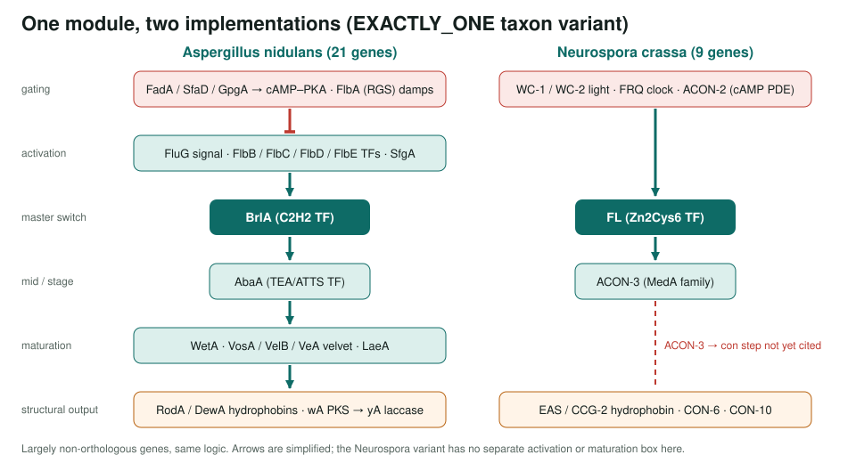
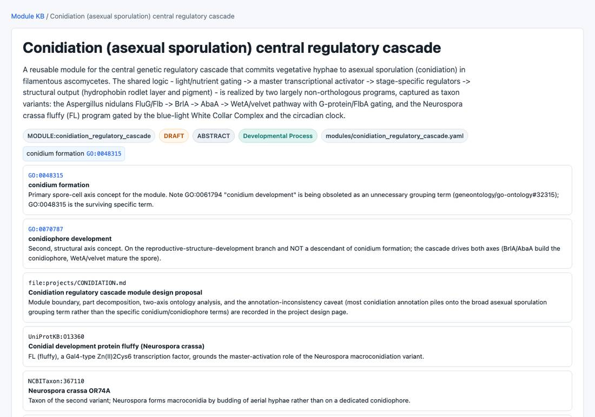
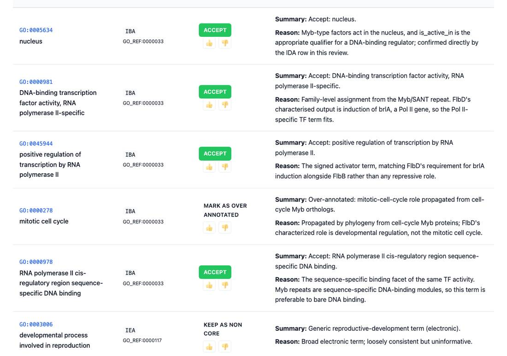

<!-- _class: lead -->

# The conidiation regulatory cascade

A reusable module for fungal asexual spore formation, with 30 reviewed genes

AI Gene Review · projects/CONIDIATION · 2026

---

<!-- _class: bluf -->

## Bottom line

- Fungi make conidia through a **TF relay**: FluG/Flb → **BrlA** → AbaA → WetA/velvet, held back by **G-protein/PKA** signalling that FlbA damps.
- We built an **ABSTRACT module** with two taxon variants (*Aspergillus*, *Neurospora*) and reviewed **all 30 member genes**.
- **382 annotations:** 288 accepted, 63 non-core, 25 over-annotated, 1 modified, **5 removed** (4 plant ARBA rows on FlbD, a mis-attributed laccase on wA).

---

## Same logic, different genes

---

## Why conidiation

- One of the **best-dissected** fungal developmental programs.
- *Aspergillus* and *Neurospora* reach the same outcome with **largely non-orthologous** regulators.
- Tests whether a module can hold one developmental logic with **taxon variants**, not a species gene list.
- Grounded in **GO:0048315** *conidium formation* and **GO:0070787** *conidiophore development* (GO:0061794 is being obsoleted).

---

## The module

modules/conidiation_regulatory_cascade.yaml (DRAFT): tiers, typed connections, per-annoton MFs, PANTHER PTN grounding.

---

## Notable curation calls

- **REMOVE** FlbD: 4 plant-specific ARBA IEA rows (stomatal patterning, water homeostasis, salt and water-deprivation responses).
- **REMOVE** wA *laccase activity*: the cited paper (PMID:7050088) assigns the laccase to **yA**; reference marked MISCITED.
- **Over-annotated**: *sterigmatocystin biosynthetic process* on regulators BrlA, VelB, FluG; biosynthesis terms on Gα FadA.
- **MODIFY** FadA *conidium formation* → *negative regulation of conidium formation* (GO:0075308).

---

## A review page

FlbD (Myb TF) review: family TF terms accepted; a propagated cell-cycle Myb row marked over-annotated.

---

## Status and next steps

- ✅ Module built; 30/30 member genes reviewed (21 EMENI, 9 NEUCR); module deep research cached and checkable.
- ⬜ Cite (or drop) the ACON-3 → *con* gene step in the Neurospora variant.
- ⬜ Track the GO:0061794 obsoletion (go-ontology #32315); check `gocams/index.tsv` for conidiation models.
- ⬜ Consider spinning out structural output as a `conidial_wall_assembly` module.

**Read more:** `projects/CONIDIATION.md` · `modules/conidiation_regulatory_cascade.yaml` · `genes/EMENI/`, `genes/NEUCR/`
