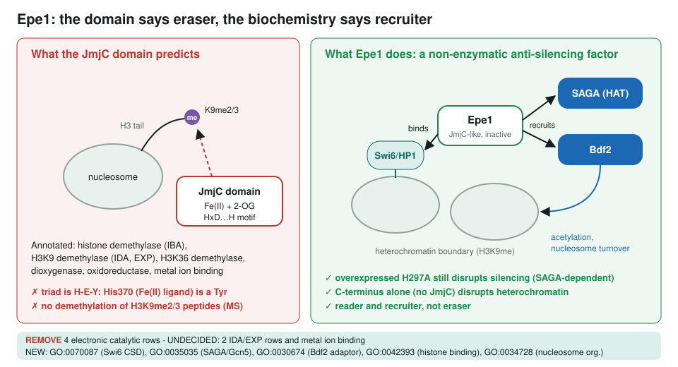
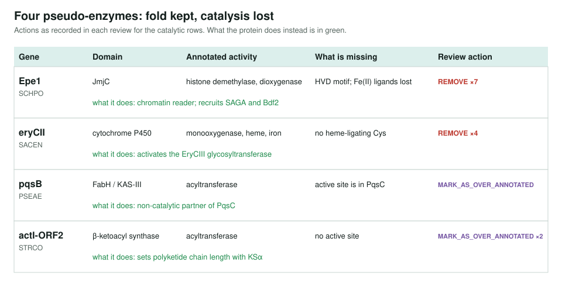

<!-- _class: lead -->

# Contested function

Proteins that keep an enzyme's fold but not its activity

AI Gene Review · projects/CONTESTED_FUNCTION · 2026

---

<!-- _class: bluf -->

## Bottom line

- **Pseudo-enzymes** keep a family's domain but have lost catalysis, so IBA, IEA and sometimes experimental rows give them an activity biochemistry contradicts.
- We reviewed four cases in depth: **Epe1** (fission yeast) and three biosynthetic-cluster proteins, **eryCII, pqsB, actI-ORF2**.
- Epe1's **7 catalytic and metal rows are REMOVE**, replaced by histone-binding terms. Finding **more candidates has not started**.

---

## Why these cases

- They need **several evidence types at once**: domain homology, activity assays, catalytic-site mutants, and the alternative mechanism.
- A wrong catalytic term on a pseudo-enzyme is **re-propagated** by IBA and domain IEA until something records the loss.
- The Epe1 case was presented at the **GO Consortium meeting, October 2025**.

---

## Epe1: eraser or recruiter?

---

## Evidence against demethylase activity

1. The JmjC iron triad is **H297-E299-Y370**, not the canonical **H-D-H**.
2. The distal **Fe(II)-binding** histidine is lost: **His370 is a Tyr**.
3. **Mass spectrometry** shows no demethylation of H3K9me2/me3 peptides.
4. The **H297A** catalytic mutant keeps full anti-silencing function.
5. The **C-terminus alone**, without JmjC, disrupts heterochromatin.

Sources named on the project page: Trewick 2007, Wang 2013, Bao 2019, Raiymbek 2020.

---

## Four pseudo-enzymes

---

## Contested claims inside a sound paper

- Some disputes are about **one finding**, not the whole reference.
- The schema's `finding_review` records these: `finding_status: DISPUTED` + `superseded_by`.
- Example, **eryCIII**: a 2004 claim that EryCIII is highly active on its own (PMID:15303858) is DISPUTED, superseded by the 2012 structure study (PMID:22056329) showing it is **inactive without EryCII**.

---

## Status and next steps

- ✅ Epe1, eryCII, pqsB, actI-ORF2 reviewed.
- ⬜ Identify suspected pseudo-enzymes (Priority 2): the **Top-Nots** pseudo-enzyme pattern already names PLD5, AKTIP, AIP, CG6051, CPT1C, Pld4.
- ⬜ Screen reviewed genes for over-annotated domain-based IBA/IEA rows (Priority 3).

**Read more:** `projects/CONTESTED_FUNCTION.md` · `genes/SCHPO/Epe1/` · `projects/TOP_NOTS.md`
