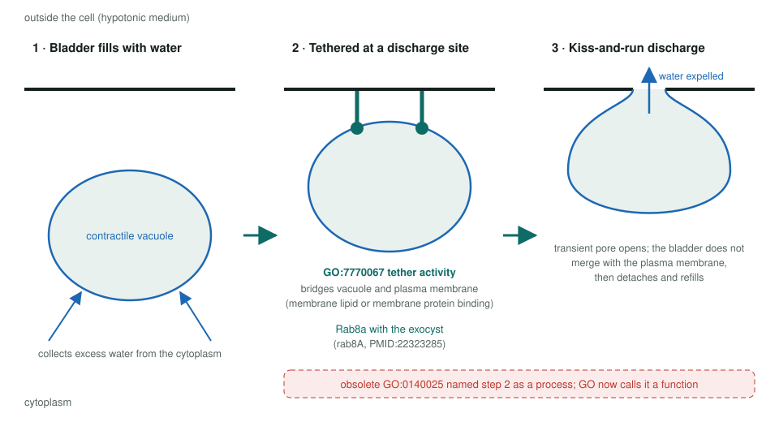
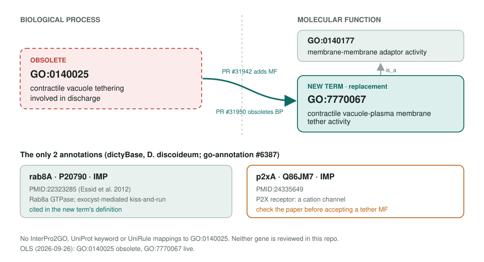

<!-- _class: lead -->

# Contractile vacuole tethering obsoletion

BP GO:0140025 → MF GO:7770067 contractile vacuole-plasma membrane tether activity

AI Gene Review · projects/CONTRACTILE_VACUOLE_TETHERING_OBSOLETION · 2026

---

<!-- _class: bluf -->

## Bottom line

- GO **obsoleted** the process GO:0140025 and replaced it with a **new molecular function**, GO:7770067 (is_a GO:0140177 membrane-membrane adaptor activity).
- Only **2 annotations** move, both *Dictyostelium* IMP: **rab8A** and **p2xA**.
- **Scoped, not yet started:** neither gene is reviewed here; p2xA needs a careful look.

---

## Why a process became a function

- Tethering is a **binding activity** that bridges two membranes, so GO models it as an MF.
- Same pattern as the sibling tether obsoletions: **ER-PM**, **mito-ER**, **vesicle tethering** (GO:7770062).
- Upstream: go-ontology #31870; new term PR #31942; obsoletion PR #31950.
- No InterPro2GO, UniProt keyword or UniRule mappings to redirect.

---

## What the tether does

---

## Old term → new term, and the two rows

---

## Review plan

- **rab8A** (P20790): anchor review. PMID:22323285 is the paper cited in the **new term's definition**; the new MF is the likely core function, with the exocyst link and contractile vacuole discharge (GO:0070177) as context.
- **p2xA** (Q86JM7): P2X receptors are **cation channels**. Check that PMID:24335649 shows tethering and not a channel-dependent regulatory role before accepting the MF.
- `genes/DICDI/` has 56 reviews; neither gene is among them.

---

## Status and next steps

1. Confirm dictyBase has migrated the two IMP rows to GO:7770067 (upstream said they "may be automatically transferred").
2. `just fetch-gene DICDI rab8A`, then `p2xA`.
3. These two reviews close the whole GO:0140025 migration.

**Upstream:** go-annotation#6387 · go-ontology#31870, #31942, #31950
**Siblings:** `ER_PM_TETHERING_OBSOLETION` · `MITO_ER_TETHERING_OBSOLETION` · `VESICLE_TETHERING_OBSOLETION`
**Page:** `projects/CONTRACTILE_VACUOLE_TETHERING_OBSOLETION.md`
