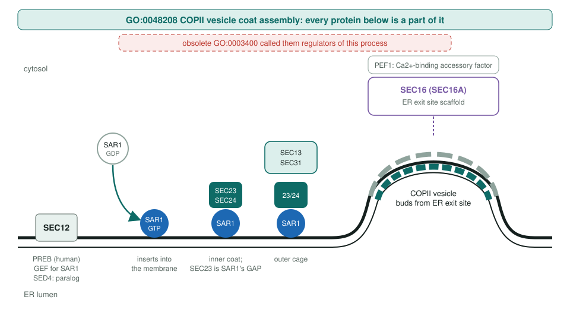
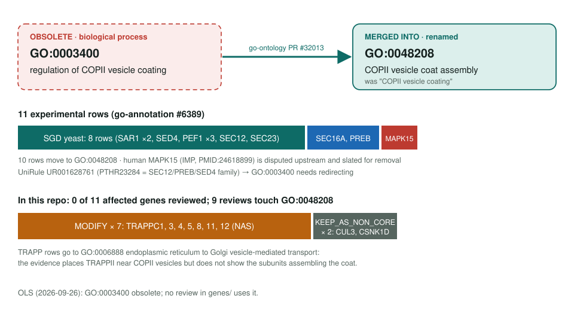

<!-- _class: lead -->

# Regulation of COPII vesicle coating obsoletion

GO:0003400 → GO:0048208 COPII vesicle coat assembly

AI Gene Review · projects/COPII_VESICLE_COATING_REGULATION_OBSOLETION · 2026

---

<!-- _class: bluf -->

## Bottom line

- GO **obsoleted** GO:0003400: its proteins are **parts of** COPII coat assembly, not regulators of it. Rows move to **GO:0048208**, renamed *COPII vesicle coat assembly*.
- **11 experimental rows**: 10 move, 1 disputed (human MAPK15) is to be removed; one UniRule needs redirecting.
- **Scoped, not yet started:** no affected gene is reviewed here; **SAR1A** and **SEC23A** are queued.

---

## Why "regulation of" was wrong

- Upstream (go-ontology #31945, closed; PR #32013): SAR1, SEC12, SEC23, SEC16, SED4, PEF1, PREB **act part_of** the coating pathway.
- GO:0048208 and its parent GO:0006901 were relabelled "coat assembly" in the same PR.
- Fix type: terminological. The replacement stays in the same BP branch, so parent classes are preserved.

---

## The proteins build the coat

---

## Old term → replacement, and the repo today

---

## Review plan

- **SAR1A** (Q9NR31): anchor. COPII GTPase; the yeast SAR1 rows describe the same biology.
- **SEC23A** (Q15436): inner coat and SAR1 GAP; pairs with SAR1A.
- **SEC16A** (O15027) and **PREB** (Q9HCU5): the human rows actually on the upstream list.
- Defer the yeast-only entries and MAPK15 (upstream removal stands on its own).

---

## Status and next steps

1. `just fetch-gene human SAR1A`, then SEC23A; use the live GO:0048208 id.
2. Keep the TRAPP MODIFY calls (to GO:0006888) consistent with any COPII core reviews.
3. Watch UniRule UR001628761 for the redirect.

**Upstream:** go-annotation#6389 · go-ontology#31945, PR #32013
**Siblings:** `VESICLE_TETHERING_OBSOLETION` (TRAPP rows) · `VESICLE_TARGETING_OBSOLETION` · `ER_EXIT_SITE_LOCALIZATION_OBSOLETION`
**Page:** `projects/COPII_VESICLE_COATING_REGULATION_OBSOLETION.md`
