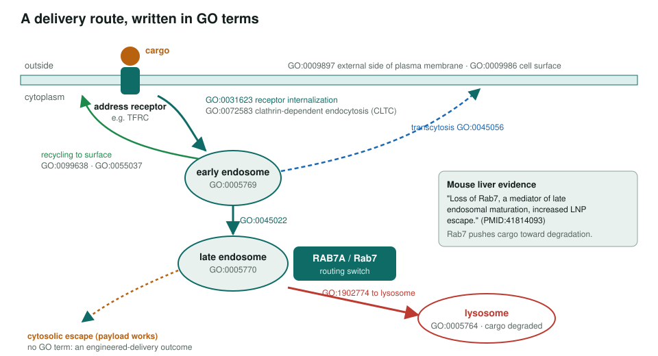
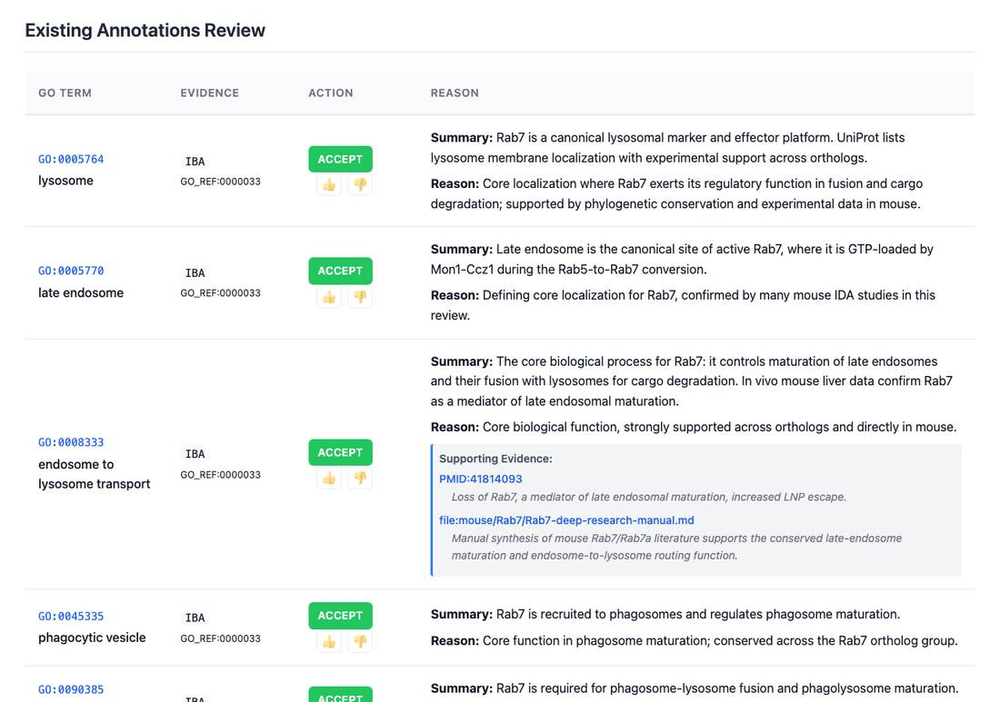

<!-- _class: lead -->

# Deliverome and GO

How GO can describe, and learn from, an atlas of therapeutic delivery addresses

AI Gene Review · projects/DELIVEROME · 2026

---

<!-- _class: bluf -->

## Bottom line

- The **Deliverome** atlas wants surface proteins that cargo can use as a **delivery address**: present, internalized, and routed somewhere useful.
- The first phase defined the term, mapped it to **17 GO anchor terms**, and compared **human RAB7A** with **mouse Rab7** as a worked post-uptake routing example.
- The two reviews **agree** on core Rab7 biology; mouse adds in vivo evidence that **Rab7 loss increases LNP escape**.

---

## A delivery route in GO terms

---

## Where GO annotation stops

| Deliverome evidence | Possible GO use | Caution |
|---|---|---|
| Surface proteomics, endogenous protein | cell surface / plasma membrane | needs cell-type context |
| Endogenous receptor uptake | receptor internalization | cargo uptake alone is a delivery phenotype |
| Receptor tracked to lysosome | routing annotations | not if only the payload was tracked |
| Perturbation screen hits | trafficking machinery review | separate direct from viability effects |
| Expected receptor fails to internalize | NOT, rarely | failed delivery is not enough |

Engineered-cargo outcomes (for example cytosolic escape) belong in GO-CAM-like Deliverome models, not canonical GO.

---

## Worked example: mouse Rab7

Mouse Rab7 review: 119 rows, 80 accepted. Endosome-to-lysosome transport is core, supported by the liver LNP study (PMID:41814093).

---

## Human RAB7A vs mouse Rab7

| | Human RAB7A | Mouse Rab7 |
|---|---|---|
| Annotations reviewed | 124 | 119 |
| ACCEPT / non-core / REMOVE | 70 / 24 / 26 | 80 / 29 / 8 |
| Best use | disease genetics (CMT2B) | in vivo delivery routing |

- Shared core: Rab GTPase activity, early-to-late endosome maturation, endosome-to-lysosome transport, retromer binding.
- Mouse SynGO rows (AMPA-receptor traffic, PMID:24217640) kept **non-core**: the paper centres on stargazin and AP-2/AP-3A.

---

## Status and next steps

- ✅ Delivery address defined; GO anchors; model-system stance (human primary, pombe for machinery, mouse for in vivo routing).
- ✅ RAB7A and Rab7 harmonized; SynGO rows revisited.
- ⬜ Build a GO-derived human surfaceome prior.
- ⬜ Pick a small address pilot set.
- ⬜ Draft a GO-CAM-like delivery-route template.

Issue #4062 tracks the remaining three tasks.

**Read more:** `projects/DELIVEROME.md` · `genes/human/RAB7A/` · `genes/mouse/Rab7/`
