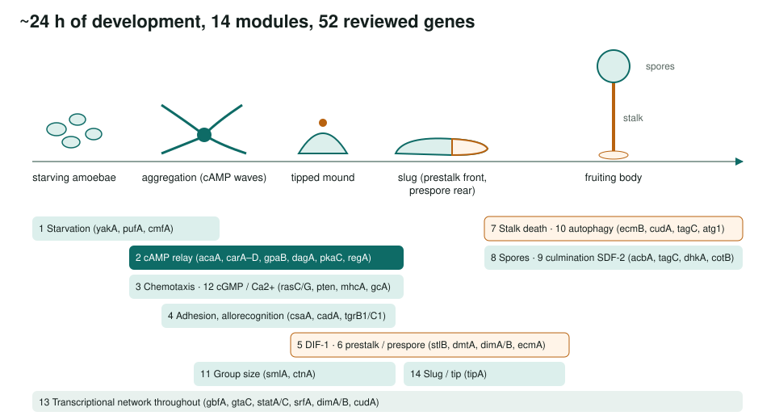
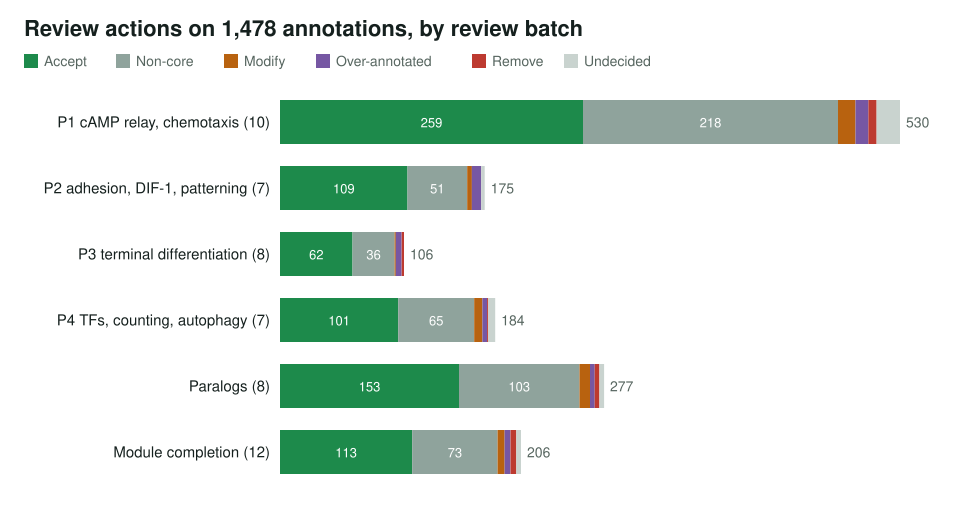
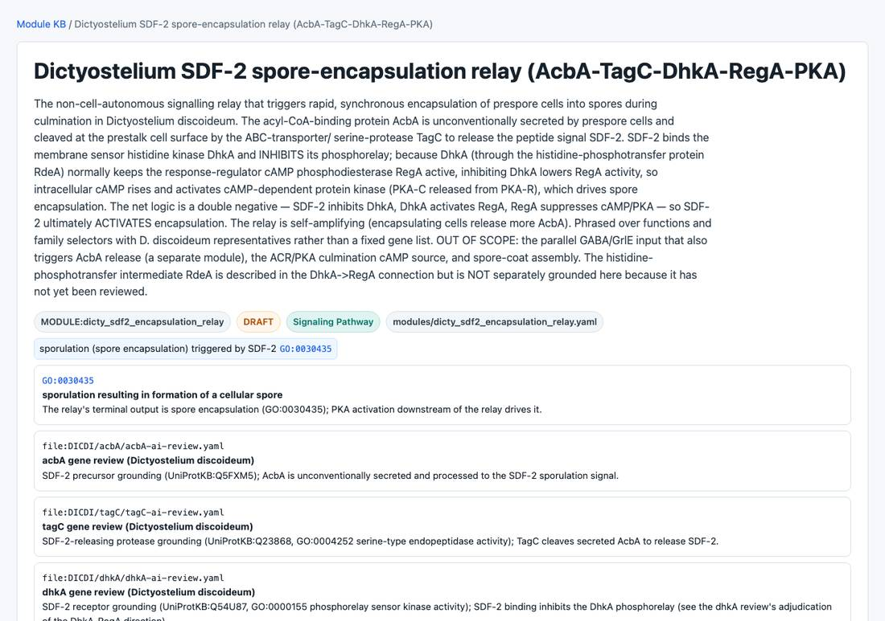

<!-- _class: lead -->

# Dictyostelium development

From single amoebae to a fruiting body: 14 modules and 54 development reviews

AI Gene Review · projects/DICTYOSTELIUM_DEVELOPMENT · 2026

---

<!-- _class: bluf -->

## Bottom line

- Starving *Dictyostelium* amoebae **aggregate by cAMP relay** and build a **stalk and spore** fruiting body in about a day.
- We split development into **14 modules**, completed a **52-gene review batch**, and folded in **mlcD + rdeA** to ground **8 DRAFT ModuleReviews**.
- **1,478 annotations:** 797 accepted, 546 non-core, 42 modified, 37 over-annotated, **19 removed**, 37 undecided.

---

## The program and its modules

---

## Why Dictyostelium

- The standard model for the step from **unicellular to multicellular** life.
- Development is driven by **cell–cell signalling** (cAMP, DIF-1, SDF-2), chemotaxis and a binary **prestalk / prespore** fate choice.
- Large **paralog families** (cAR1–4, three adenylyl cyclases, ~15 histidine kinases) test how IBA/IEA propagation behaves within a genome.

---

## Actions by review batch

---

## What the reviews found

- **Paralog propagation**: *adenylate cyclase activator activity* over-annotated on **cAR3**; purinergic-receptor IEA **removed** from cAR1–3; phosphorelay IEAs **removed** from ACR.
- **statC**: metazoan *JAK-STAT* signalling → *receptor signalling via STAT* (GO:0097696).
- Other removals include *mitotic cytokinesis* (IBA) on RasC, *fatty acid* and *flavonoid biosynthesis* on the DIF-1 polyketide synthase StlB, and *DNA binding* on spore-coat CotB.
- High non-core share (546) reflects many pleiotropic developmental and motility rows kept but not core.

---

## A Dictyostelium module

dicty_sdf2_encapsulation_relay: AcbA → TagC → SDF-2 ⊣ DhkA → RdeA → RegA ⊣ PKA; one of 8 DRAFT modules grounded in the gene reviews.

---

## Status and next steps

- ✅ 52-gene batch reviewed; mlcD + rdeA integrated; all 14 modules represented; 8 ModuleReviews.
- ⬜ Per-gene notes journals; expert second-pass QA.
- ⬜ Deeper paralogs: *tgr* locus, Ras/Rap, dhk/grl, ecm/cot, statB/statD.

**Read more:** `projects/DICTYOSTELIUM_DEVELOPMENT.md` · `modules/dicty_*.yaml` · `genes/DICDI/`
