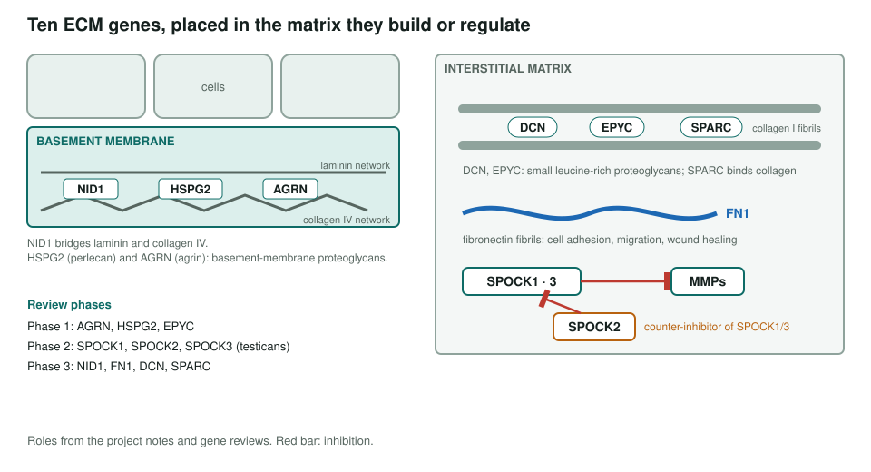
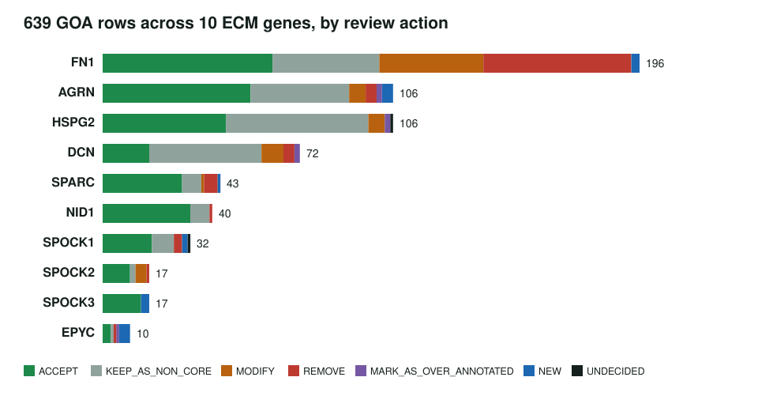
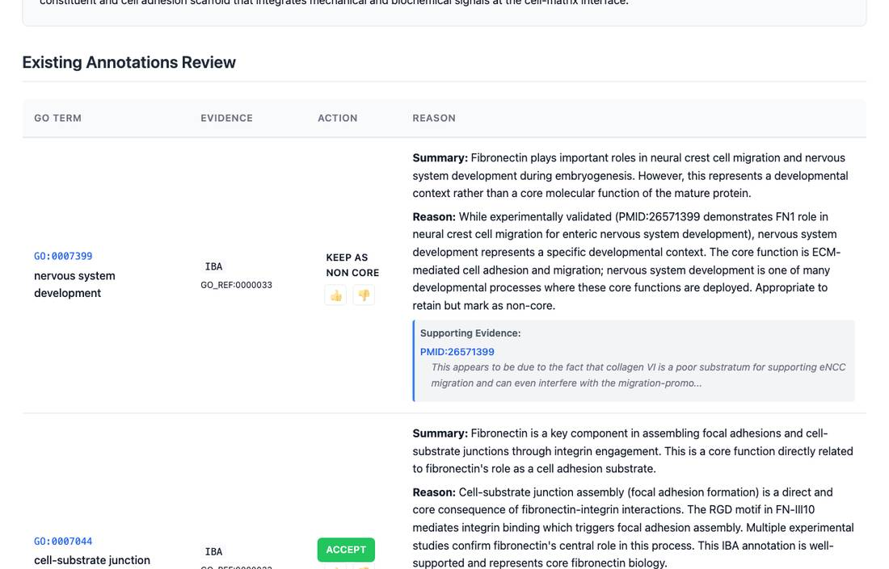

<!-- _class: lead -->

# The extracellular matrix

GO annotation review of ten human basement-membrane and interstitial matrix genes

AI Gene Review · projects/ECM · IN_PROGRESS · 2026

---

<!-- _class: bluf -->

## Bottom line

- **All 10 planned genes have actioned rows**; 8 are `COMPLETE`, with AGRN/NID1 still needing metadata closure.
- **635 review rows**: 284 ACCEPT, 193 non-core, 70 REMOVE, 63 MODIFY, 13 NEW, 5 over-annotated, 7 undecided.
- **FN1 carries most corrections**: 52 `protein binding` rows removed, 38 `extracellular region` rows sharpened to `extracellular matrix`.

---

## Where the genes sit

---

## Why the ECM

- ECM proteins are large, multi-domain and **heavily annotated from interaction screens**, so generic rows pile up.
- Their core role is **structural and extracellular**, while many rows describe downstream developmental outcomes.
- The testicans (SPOCK1-3) test whether a review can capture a **paralog with the opposite effect**.

---

## Results by gene

---

## What a review looks like

FN1 review page: nervous system development is kept as non-core; cell-substrate junction assembly is accepted as core.

---

## Key findings

1. **FN1**: 52 IPI `protein binding` rows REMOVE; 38 `extracellular region` rows MODIFY → `extracellular matrix`.
2. **SPOCK2**: metalloendopeptidase inhibitor rows MODIFY (→ endopeptidase regulator / negative regulation of endopeptidase activity), because SPOCK2 counter-inhibits SPOCK1/3.
3. **EPYC**: NEW `collagen binding`, `collagen fibril organization`, `extracellular matrix structural constituent`; TAS glycosaminoglycan binding REMOVE.
4. **SPOCK3**: NEW `collagen binding`, `extracellular matrix binding`, negative regulation of endopeptidase activity.

---

## Status and next steps

- ✅ 10/10 planned genes have every row actioned; 8/10 are `COMPLETE`.
- ⬜ Finalize `AGRN` and `NID1` review status.
- ⬜ Add **DCN** `core_functions`.
- ⬜ Draft the first ECM module: NID1/HSPG2/AGRN with laminin and collagen IV.
- ⬜ Issue #4070 tracks the remaining ECM closure work.

**Read more:** `projects/ECM.md` · `genes/human/FN1/` · `genes/human/SPOCK2/`
