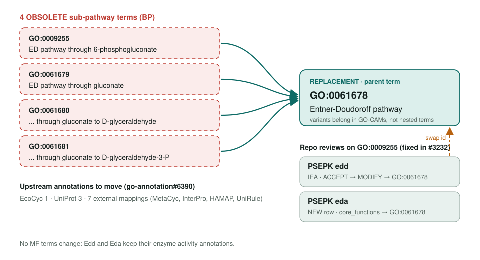
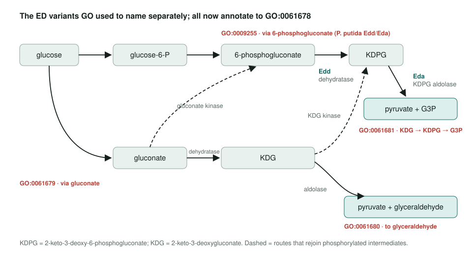
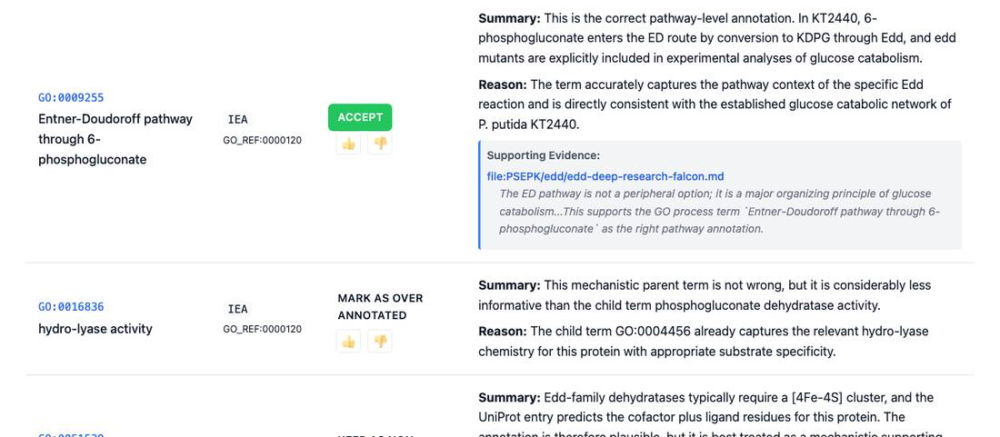

<!-- _class: lead -->

# Entner-Doudoroff sub-pathway obsoletion

Four variant terms → GO:0061678 Entner-Doudoroff pathway

AI Gene Review · projects/ENTNER_DOUDOROFF_OBSOLETION · 2026

---

<!-- _class: bluf -->

## Bottom line

- GO **obsoleted four ED sub-pathway terms** (GO:0009255, GO:0061679, GO:0061680, GO:0061681) and folded them into **GO:0061678**.
- Only **two repo reviews** use them: *P. putida* **edd** (accepted IEA) and **eda** (proposed NEW), both on GO:0009255.
- The obsoletion **has landed** (OLS marks GO:0009255 obsolete); both reviews **still carry the old id** and need a term swap.

---

## Old terms → replacement

---

## Why the variants went

- The four terms mirrored **MetaCyc variant pathways**: via 6-phosphogluconate, via gluconate, and two gluconate endpoints.
- GO's obsoletion comment: variants are **better captured as GO-CAMs** than as nested ontology terms.
- The parent GO:0061678 already covers **both intermediates** (gluconate or 6-phosphogluconate) and **both endpoints**.
- No molecular function terms change.

---

## What the variants described

---

## The edd row today

genes/PSEPK/edd/edd-ai-review.html: the ACCEPT on GO:0009255 stays an ACCEPT once lifted to GO:0061678.

---

## Repo impact

| Gene | Row on GO:0009255 | Action | Also in |
|---|---|---|---|
| PSEPK **edd** | IEA, GO_REF:0000120 | ACCEPT | `core_functions.directly_involved_in` |
| PSEPK **eda** | proposed, from UniProt pathway line | NEW | `core_functions.directly_involved_in` |

- No review uses GO:0061679, GO:0061680 or GO:0061681.
- No gene review yet uses the replacement GO:0061678; the ED **module** is already grounded in it.
- Sibling term GO:0061688 (obsoleted in the same GO release) is still proposed by PSEPK **glk**.
- Upstream: EcoCyc 1 and UniProt 3 annotations, plus 7 external mappings, to move.

---

## Next steps

1. Swap GO:0009255 → **GO:0061678** in `genes/PSEPK/edd/edd-ai-review.yaml` and `genes/PSEPK/eda/eda-ai-review.yaml` (rows and `core_functions`); update eda's summary wording.
2. Replace the obsolete GO:0061688 in `genes/PSEPK/glk/glk-ai-review.yaml`.
3. `just validate PSEPK edd`, `eda` and `glk`.
4. Later, as one batch: E. coli **edd** and **eda** (not yet in the repo), and a pass over gnd.

**Upstream:** go-annotation#6390 · go-ontology#31916
**Read more:** `projects/ENTNER_DOUDOROFF_OBSOLETION.md`
