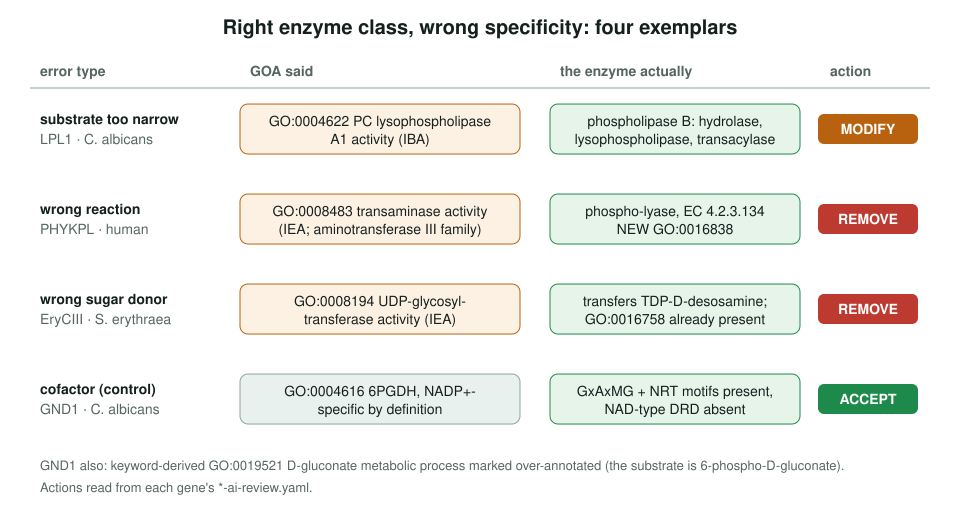
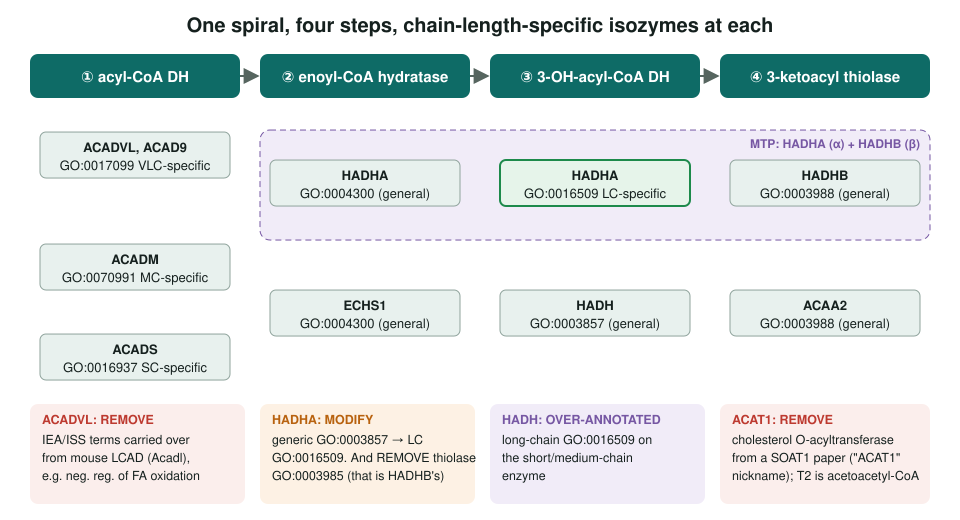
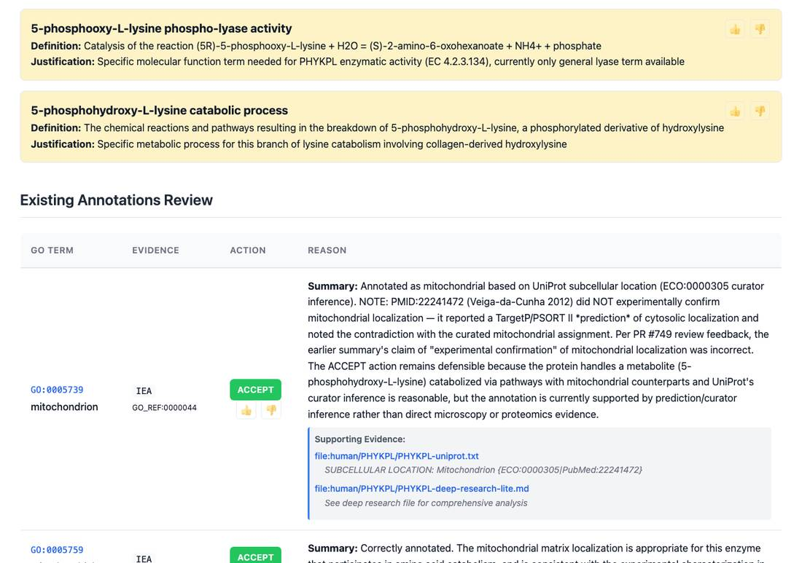

<!-- _class: lead -->

# Enzyme specificity

Right enzyme class, wrong substrate, cofactor, donor or reaction

AI Gene Review · projects/ENZYME_SPECIFICITY · 2026

---

<!-- _class: bluf -->

## Bottom line

- A GO MF term can name the right kind of enzyme and still get the **substrate, cofactor or reaction** wrong.
- We reviewed **14 genes**: four exemplars (LPL1, GND1, PHYKPL, EryCIII) and all **ten human β-oxidation enzymes**, where chain length decides the term.
- Errors caught: too-narrow substrate, wrong reaction, wrong donor, wrong chain length, wrong subunit, a nickname collision. GND1 was a **negative control**. Complete.

---

## Why specificity

- Specificity errors survive because the **fold and enzyme class are right**; nothing looks wrong until someone checks the substrate.
- They mislead **pathway reconstruction** and propagate by **IBA**.
- Four categories: substrate, reaction mechanism, cofactor, non-enzymatic homolog (e.g. Epe1).
- Principle: **use the specific term where one exists**, fall back to the general term where GO has none.

---

## Four exemplars

---

## β-oxidation: specificity inside a paralog set

---

## Proposing the missing terms

PHYKPL review: GO has no term for its reaction, so the review proposes <em>5-phosphooxy-L-lysine phospho-lyase activity</em> and a matching catabolic process, and adds the general GO:0016838 carbon-oxygen lyase activity, acting on phosphates, as NEW.

---

## Findings

1. **Family membership is the usual culprit**: PHYKPL (aminotransferase III), EryCIII (IEA UDP-GT), GND1 D-gluconate (UniProt keyword via ARBA rule).
2. **Wrong subunit or evidence-scope** errors cluster in complexes and families: HADHA thiolase, HADH long-chain, ACAD9 C16 assays.
3. **Name collisions** create errors no sequence check finds: "ACAT1" = SOAT1 vs mitochondrial T2.
4. A **GO → RHEA** gap: hydratase GO:0004300 maps to RHEA:20724 (3E), not the canonical (2E) RHEA:16105.

---

## Status and next steps

- ✅ 14/14 reviews complete; `MODULE:fatty_acid_beta_oxidation` built.
- ⬜ If extended: keyword-derived substrate terms on other PPP enzymes (ZWF1); NAD vs NADP dehydrogenase pairs.

**Read more:** `projects/ENZYME_SPECIFICITY.md` · `modules/fatty_acid_beta_oxidation.yaml` · `projects/RHEA/RHEA-EC-SPECIFICITY.md`
