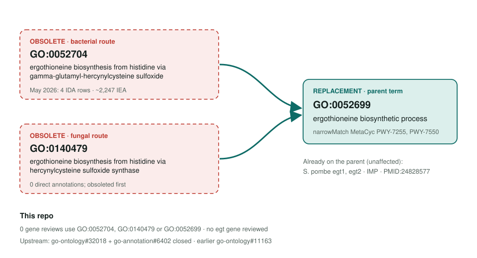
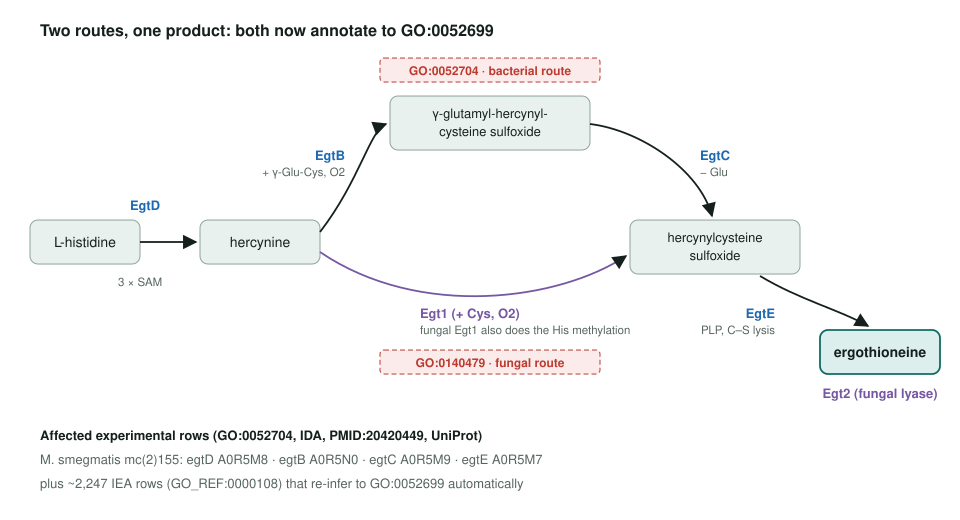

<!-- _class: lead -->

# Ergothioneine biosynthesis variant-term obsoletion

GO:0052704 and GO:0140479 → GO:0052699 ergothioneine biosynthetic process

AI Gene Review · projects/ERGOTHIONEINE_BIOSYNTHESIS_OBSOLETION · 2026

---

<!-- _class: bluf -->

## Bottom line

- GO **obsoleted both route-specific children** of GO:0052699: bacterial GO:0052704 and fungal GO:0140479.
- The only experimental rows are **4 IDA annotations** on the *M. smegmatis* **egtBCDE** operon (PMID:20420449); ~2,247 IEA rows re-infer automatically.
- **Scoped, not yet started:** no review here uses these terms and no *egt* gene is reviewed.

---

## Old terms → parent

---

## Two routes, one product

---

## Why the routes went

- The children named the **intermediate** a pathway passes through, not a different outcome.
- GO's obsoletion note: these terms "represent a GO-CAM model".
- The route detail survives as **narrowMatch** links to MetaCyc PWY-7255 (bacteria) and PWY-7550 (fungi).
- Each enzyme's own **molecular function** still says which step it does.

---

## Next steps

1. If wanted, review the operon as one batch: **egtD, egtB, egtC, egtE** (A0R5M8, A0R5N0, A0R5M9, A0R5M7), sharing PMID:20420449.
2. Anchor each on its catalytic MF; BP on **GO:0052699**.
3. Confirm the species folder first: the repo has `genes/MYCSM/`, while the page proposes `MYCS2` for strain mc(2)155.
4. S. pombe egt1/egt2 are unaffected and optional.

**Upstream:** go-annotation#6402 · go-ontology#32018 · go-ontology#11163
**Read more:** `projects/ERGOTHIONEINE_BIOSYNTHESIS_OBSOLETION.md`
