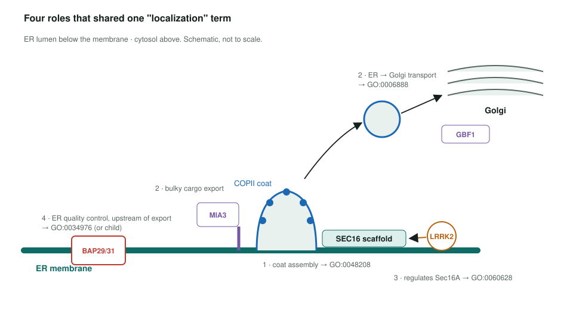
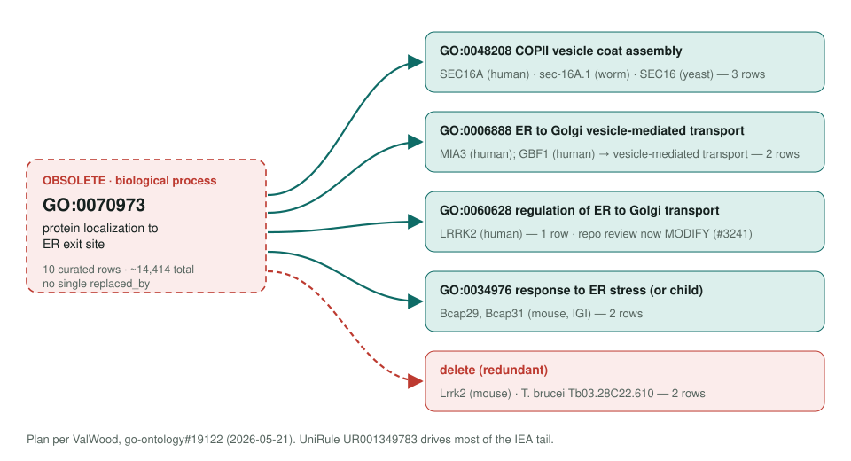

<!-- _class: lead -->

# Protein localization to ER exit site obsoletion

GO:0070973 → five destinations, chosen per annotation

AI Gene Review · projects/ER_EXIT_SITE_LOCALIZATION_OBSOLETION · 2026

---

<!-- _class: bluf -->

## Bottom line

- GO **obsoleted GO:0070973** because curators used it for four different roles; there is **no single replacement**.
- The **10 curated annotations** each get their own term: COPII coat assembly, ER→Golgi transport, its regulation, ER stress, or deletion.
- In this repo, **BCAP31 is already aligned** and yeast **YET2** only has the same IBA in its cached UniProt record; **LRRK2's two ACCEPT rows now MODIFY to GO:0060628**, fixed in #3241 (open).

---

## Why the term went

- The name says **where a protein ends up**, not what process it takes part in.
- It was applied to COPII scaffolds, cargo receptors, a kinase regulator and ER quality-control chaperones.
- OLS obsoletion note: replacements "depend on the specific biological context".
- One UniRule mapping (`UR001349783`) propagated it to **~14,414 annotations**, mostly IEA and IBA.

---

## Four roles at the ER exit site

---

## One term, five destinations

---

## Curated rows to move

| Gene | Organism | Evidence | Destination |
|---|---|---|---|
| SEC16A · sec-16A.1 · SEC16 | human · worm · yeast | IMP | GO:0048208 |
| MIA3 · GBF1 | human | IMP | GO:0006888 / vesicle transport |
| LRRK2 | human | IMP (PMID:25201882) | GO:0060628 |
| Bcap29 · Bcap31 | mouse | IGI | GO:0034976 or child |
| Lrrk2 · Tb03.28C22.610 | mouse · *T. brucei* | IMP | delete (redundant) |

From QuickGO (2026-05-29) and the go-ontology#19122 plan.

---

## Repo impact

| Review | GO:0070973 rows | Current action | Needed |
|---|---|---|---|
| `genes/human/LRRK2` | IEA (GO_REF:0000120), IMP (PMID:25201882) | ACCEPT → MODIFY ×2 | **→ GO:0060628**, fixed in #3241 (open) |
| `genes/human/BCAP31` | IBA (GO_REF:0000033) | MARK_AS_OVER_ANNOTATED | none |
| `genes/yeast/YET2` | IBA, cached UniProt record only (not in GOA file) | not reviewed | none; same PTN000294723 node |

- SEC16A, MIA3 and GBF1 have **no review** here yet.

---

## Next steps

1. Merge #3241 (open): both LRRK2 GO:0070973 rows already MODIFY to **GO:0060628**.
2. Optional: review **SEC16A**, **MIA3**, **GBF1** as clean cases for the three main replacement terms.
3. Flag UniRule **UR001349783** for retargeting so the IEA tail does not re-propagate.

**Upstream:** go-annotation#6434 · go-ontology#19122 · go-annotation#6172
**Read more:** `projects/ER_EXIT_SITE_LOCALIZATION_OBSOLETION.md`
