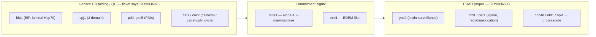

# ER Folding vs ERAD — where does the ERAD pathway (GO:0036503) begin?

## Overview

A PomBase curator has proposed that six fission-yeast ER luminal chaperones and
foldases should **lose** `GO:0036503 ERAD pathway` and move to
`GO:0034975 protein folding in endoplasmic reticulum`. The stated reasoning is
that these proteins are *upstream* of ERAD: they act on essentially every
protein entering the ER, whether it folds successfully and is secreted or fails
and is degraded, and none of them commits a substrate to degradation. On that
reading, the line into ERAD is crossed only at the mannose-trimming step —
`mns1` / `mnl1` — which generates the degradation signal.

This is a boundary question, not a bookkeeping error, and it is worth scoping
carefully before acting, for three reasons:

1. **The footprint is family-level, not gene-level.** The two PAINT nodes
   involved propagate 648 ERAD IBA rows between them (counts below). Re-terming
   six fission-yeast rows without touching the nodes fixes almost nothing.
2. **There is experimental evidence on the other side**, at least for BiP and
   the ER J-domain proteins, and it is the same evidence this repository has
   already relied on when reviewing the budding-yeast and human orthologs.
3. **This repository has already taken a position — and an internally
   inconsistent one.** Four reviews covering members of a *single* PAINT node
   reached three different verdicts on the same IBA (see below).

## Upstream ticket

- [geneontology/go-annotation#6515](https://github.com/geneontology/go-annotation/issues/6515)
  — *"Annotation review for genes upstream of ERAD"* (OPEN; opened 2026-08-20 by
  ValWood; no labels). Last activity 2026-09-25: edwong57 commented that the
  request had been missed and is now being looked at. **No decision has been
  recorded upstream yet**, so nothing here should be treated as settled.

The ticket also raises an ontology-side question that is currently unresolved:
whether `GO:0034975` should be placed under a general ER quality-control term,
and if so what that umbrella term should be, given that the ER presents *two
parallel* folding routes for luminal entrants — the BiP/Hsp70 chaperone cycle
and the calnexin/calreticulin cycle.

Relevant observation for that question: an OLS search for an ER quality-control
grouping term returns no suitable **biological process** parent. The nearest
hits are `GO:0044322 endoplasmic reticulum quality control compartment` (a
*cellular component*), `GO:0061857 endoplasmic reticulum stress-induced
pre-emptive quality control` (a distinct, translocation-attenuation mechanism),
and `GO:1904380 endoplasmic reticulum mannose trimming`. So the umbrella term
the ticket is reaching for does not appear to exist and would need to be
requested.

## The two terms

Both verified in OLS on 2026-09-26; both active.

**`GO:0036503 ERAD pathway`** — *"The protein catabolic pathway which targets
endoplasmic reticulum (ER)-resident proteins for degradation by the cytoplasmic
proteasome. It begins with recognition of the ER-resident protein, includes
retrotranslocation (dislocation) of the protein from the ER to the cytosol,
protein modifications necessary for correct substrate transfer (e.g.
ubiquitination), transport of the protein to the proteasome, and ends with
degradation of the protein by the cytoplasmic proteasome."*

Note that the definition's scope **starts at recognition and explicitly includes
retrotranslocation**. It does not begin at ubiquitination. This matters: the
strongest experimental claim for BiP and the ER J-proteins is precisely a
retrotranslocation-competence claim, which lands inside the definition rather
than upstream of it.

**`GO:0034975 protein folding in endoplasmic reticulum`** — *"A protein folding
process that takes place in the endoplasmic reticulum (ER). Secreted, plasma
membrane and organelle proteins are folded in the ER, assisted by chaperones and
foldases (protein disulphide isomerases), and additional factors required for
optimal folding (ATP, Ca2+ and an oxidizing environment to allow disulfide bond
formation)."* Synonyms: *protein folding in ER*, *oxidative protein folding*. It
has **no children**, which is part of why the ticket wants it re-parented.

## Gene resolution — the six fission-yeast targets

The ticket names the genes in budding-yeast-style casing, which does not map
one-to-one onto current PomBase symbols. Resolved against the PomBase and
UniProt APIs (2026-09-26), with the GO:0036503 rows as they stand in QuickGO
today:

| Ticket name | PomBase symbol | Systematic ID | UniProt | Product (PomBase) | GO:0036503 row |
|---|---|---|---|---|---|
| Bip1 | `bip1` | SPAC22A12.15c | P36604 | ER chaperone BiP (luminal Hsp70) | IBA, `AGI_LocusCode:AT5G28540 \| PANTHER:PTN001834223 \| SGD:S000003571` |
| Scj1 | `spj1` | SPBC1347.05c | O94625 | DnaJ-related protein Spj1 | ISO with `SGD:S000004827` |
| Pdi4 | `pdi4` | SPAC959.05c | Q9P4X1 | ER membrane protein disulfide isomerase Pdi4 | ISO with `SGD:S000001267` |
| Pdi5 | `pdi5` | SPCC1840.08c | O74481 | protein disulfide isomerase | ISO with `SGD:S000001267` |
| Cnx1 | `cal1` (synonym `cnx1`) | SPAC3C7.11c | P36581 | calnexin homolog | IBA, `PANTHER:PTN000117401 \| SGD:S000000054` |
| calreticulin | `cnx2` | SPBP4H10.19c | Q9P7D0 | calreticulin/calnexin divergent homolog, lectin-type holdase | IBA, `PANTHER:PTN000117401 \| SGD:S000000054` |

Two clarifications that follow from the resolution and that anyone acting on the
ticket needs:

- **The fission-yeast gene is `spj1`, not `scj1`.** `SGD:S000004827` *is* SCJ1
  (budding yeast), and it is the ISO donor; the recipient is `spj1`.
- **`cnx1` and "calreticulin" are two distinct genes, not one gene plus a
  synonym.** `cnx1` is a UniProt synonym of `cal1` (the calnexin homolog), while
  the calreticulin-like gene is `cnx2`. Both carry the *same* IBA from the *same*
  node with the *same* donor, so both are in scope.

The ISO donors resolve to: `SGD:S000003571` = **KAR2**, `SGD:S000000054` =
**CNE1**, `SGD:S000004827` = **SCJ1**, `SGD:S000001267` = **EPS1**.

`EPS1` is worth flagging separately. It is not a generic PDI: it is the
PDI-family member with a specifically documented ERAD role in budding yeast.
Whether that role transfers to *both* `pdi4` and `pdi5` — a one-to-two ISO
projection onto genes PomBase describes as a generic ER membrane PDI and a
generic PDI — is a distinct question from whether general PDIs belong in ERAD,
and the ticket's blanket framing collapses the two.

## The propagation footprint

QuickGO, 2026-09-26, `GO:0036503` exact term (not descendants):

- **128,684** annotations total, of which **4,621** are IBA.
- The IBA rows fan out from PAINT nodes; the two nodes named in this ticket are
  among the largest contributors:

| PAINT node | Family (human members carrying the IBA) | IBA rows |
|---|---|---|
| `PTN000117401` | calnexin / calreticulin — CANX, CALR, CALR3, CLGN | **390** |
| `PTN001834223` | BiP / luminal Hsp70 — HSPA5 | **258** |

For calibration, the largest single contributor is `PTN000267874` (RNF5 /
RNF185, uncontroversially ERAD ligases) at 482 rows.

So the six fission-yeast rows the ticket lists are a **0.9% sample** of what the
two nodes assert. If the curator's reasoning is right, the fix belongs at the
IBD placements for `PTN000117401` and `PTN001834223`, and re-terming six
species-level rows leaves 640+ untouched assertions saying the opposite. This is
the same node-level-vs-row-level pattern documented for `PTHR16036` in
[#2659](https://github.com/ai4curation/ai-gene-review/issues/2659) and
`projects/PANTHER_IBA_REVIEW`.

## Where this repository already stands

The relevant orthologs are already reviewed here, and the existing verdicts do
not line up with each other or with the ticket.

**Members of `PTN000117401`, all carrying the identical IBA — three different actions:**

| Gene | Action on GO:0036503 IBA | Recorded reason (abridged) |
|---|---|---|
| CANX | `ACCEPT` | "the cycle delivers persistent non-native clients to ERAD; this is an established core role" |
| CALR | `ACCEPT` | "Quality-control retention and triage of non-native clients is an established core role" |
| CALR3 | `KEEP_AS_NON_CORE` | "plausible by family membership but has not been specifically demonstrated" |
| CLGN | `MARK_AS_OVER_ANNOTATED` | "No experimental evidence links calmegin to the ERAD pathway; inherited from broadly conserved family members" |

That spread is defensible as *gene-level* judgment — CANX has direct evidence
that CLGN lacks — but it is worth noting that the CANX/CALR reasons assert
pathway *participation* from a triage/delivery role, which is exactly the
inference the ticket disputes.

**Budding-yeast donors, both `ACCEPT`:**

- `genes/yeast/KAR2` accepts IBA, NAS and IMP to GO:0036503, citing
  PMID:11381090 (BiP maintains ERAD-substrate solubility) and PMID:16873065
  (the Yos9/Kar2/Hrd3 luminal surveillance complex).
- `genes/yeast/CNE1` accepts IBA and IMP, citing direct yeast evidence for
  binding unstable glycosylated clients and contributing to their ER retention
  and elimination.

Other already-reviewed genes in the neighbourhood: DNAJC10 (`ACCEPT` on both
GO:0034975 and GO:0036503), P4HB (`KEEP_AS_NON_CORE` on GO:0034975 only,
no ERAD row), `genes/yeast/JEM1`, `genes/CANAL/JEM1`, `genes/yeast/PDI1`,
`genes/yeast/EUG1`, MAN1B1, EDEM1, EDEM2, EDEM3, ERLEC1.

No fission-yeast gene in this ticket has a review here yet (`genes/SCHPO/` holds
121 genes; none of the six).

## Evidence that has to be weighed against the ticket

The ticket's premise is that these chaperones "have no mechanism to commit a
substrate to degradation." That is true, and it is the right test for the
*calnexin/calreticulin* and *PDI* cases. It is a weaker argument against BiP and
the ER J-proteins, because the published claim for those is not about commitment
— it is about retrotranslocation competence, which `GO:0036503`'s definition
explicitly includes.

Nishikawa et al. 2001 (PMID:11381090, full text cached) is the load-bearing
paper, and its abstract states the claim directly:

> "We found that these ERAD substrates are stabilized and aggregate in the ER at
> elevated temperatures when BiP, the lumenal Hsp70 molecular chaperone, is
> mutated, or when the genes encoding the J domain-containing proteins Jem1p and
> Scj1p are deleted. In contrast, deletion of JEM1 and SCJ1 had little effect on
> the ERAD of a membrane protein. These results suggest that one role of the BiP,
> Jem1p, and Scj1p chaperones is to maintain lumenal ERAD substrates in a
> retrotranslocation-competent state."

Three things to draw from this:

- The effect is **substrate-class-specific** (soluble luminal ERAD-L substrates,
  not a membrane substrate). A factor that acts on all ER entrants
  indiscriminately would not show that selectivity, which cuts against the "acts
  on essentially all proteins, so it is not pathway-specific" framing.
- The paper's own framing separates BiP's ERAD role from its import role, citing
  *kar2* alleles that are import-proficient but ERAD-defective — i.e. the ERAD
  requirement is genetically separable from the general folding/translocation
  requirement.
- Even so, "keeps the substrate soluble so that another machine can pull it out"
  sits close to the `CLAUDE.md` necessity-versus-participation line. A holdase
  that prevents aggregation is arguably supplying the substrate-conditioning step
  the pathway depends on (comparable to the luminal surveillance complex, where
  Kar2 is a named component in PMID:16873065) — or arguably just being
  *necessary*. **That is the question this project has to answer, per gene, and
  it should not be answered by family analogy in either direction.**

Note also that PMID:16873065 and PMID:7814381 are **abstract-only** in the
publication cache (`full_text_available: false`), so the SGD/PomBase curators who
made the IMP annotations from them read more than is available here. Per
`CLAUDE.md`, that rules out `REMOVE` on those experimental rows from this
evidence base.

## Where the line plausibly falls

The ticket's placement of the boundary at `mns1`/`mnl1` is consistent with the
fission-yeast annotation record: both genes carry an **IMP** to `GO:0036503` from
the same study, PMID:16079177 (`mns1` additionally IBA, `mnl1` additionally IEA
from `ARBA00029018`). Those rows are not in dispute and should be left alone.
PMID:16079177 is **not** in the publication cache and would need fetching before
any review touches those two genes.

## Candidate genes for review

Ordered by what each review would actually settle. The six ticket genes have no
reviews here, so they are all new; the ortholog reviews that already exist are
listed as re-checks.

**New reviews — the ticket's targets (fission yeast):**

1. **`bip1`** (P36604) — the hardest and most informative case. Decides whether a
   retrotranslocation-competence role counts as ERAD participation. Sets the
   precedent for HSPA5 and the whole `PTN001834223` node.
2. **`cal1`** (P36581) and 3. **`cnx2`** (Q9P7D0) — the calnexin/calreticulin
   pair, IBA-only from `PTN000117401` with a CNE1 donor. Weakest direct evidence
   of the six; most likely to resolve as over-annotation, and the resolution
   would apply to CALR3/CLGN-style cases generally.
4. **`spj1`** (O94625) — ISO from SCJ1, whose ERAD evidence is the *same*
   Nishikawa paper as BiP's. Should be decided consistently with `bip1`.
5. **`pdi4`** (Q9P4X1) and 6. **`pdi5`** (O74481) — both ISO from **EPS1**. The
   specific question is whether EPS1's substrate-specific ERAD role transfers to
   two generic fission-yeast PDIs, which is a one-to-two projection worth
   challenging on its own terms.

**Re-checks of existing reviews, if the boundary moves:**

7. **CANX** and 8. **CALR** — currently `ACCEPT` with reasons that assert
   participation from a triage role. These are the reviews most directly exposed
   if the ticket is accepted.
9. **`genes/yeast/KAR2`** — the IBA donor; its `ACCEPT` is the upstream
   justification for `bip1`'s row. Re-check only the GO:0036503 rows.
10. **`genes/yeast/CNE1`** — likewise the donor for `cal1`/`cnx2`.

Also worth a look but lower priority: **HSPA5** (no review here yet; the sole
human member of `PTN001834223`) and **`genes/yeast/JEM1`** / **`genes/CANAL/JEM1`**
(Jem1p is the third protein in the Nishikawa result and is not named in the
ticket at all).

## Proposed approach

1. **Wait for, or solicit, the upstream decision.** edwong57 is actively looking
   at the ticket as of 2026-09-25 and no verdict is recorded. Re-terming reviews
   ahead of that risks having to reverse them, and the ontology question (is
   there an ER-QC umbrella BP term?) is unresolved and may change the target term.
2. **Start with `cal1` / `cnx2`, not `bip1`.** They are IBA-only, the evidence
   question is cleanest, and a decision there is independent of how the
   retrotranslocation-competence argument resolves.
3. **Treat `bip1` / `spj1` as one coupled decision** grounded in PMID:11381090
   rather than in the ticket's framing, and record it as a
   `suggested_question` if it cannot be settled from the cached evidence.
4. **Do not use `REMOVE` on the KAR2, CNE1, `mns1` or `mnl1` experimental rows.**
   Per `CLAUDE.md`, the supporting full texts are not available here
   (PMID:16873065 and PMID:7814381 are abstract-only; PMID:16079177 is uncached).
   `MODIFY` with `GO:0034975` as the replacement, or `MARK_AS_OVER_ANNOTATED`, is
   the defensible range.
5. **Escalate to the node level.** Whatever is decided, the actionable upstream
   outcome is a re-examination of the IBD placements behind `PTN000117401` (390
   rows) and `PTN001834223` (258 rows) — not six species rows. Capture that as a
   `suggested_question` in the first review that lands.

## Open questions for upstream

- Is the intended replacement `GO:0034975` as written, or a not-yet-created ER
  quality-control umbrella term? The ticket floats both, and the answer changes
  what `proposed_replacement_terms` should say.
- Does `GO:0036503`'s inclusion of retrotranslocation in its definition mean a
  factor that maintains retrotranslocation competence is inside the pathway? If
  not, the definition arguably needs tightening alongside the re-terming.
- Should the calnexin/calreticulin *cycle* — which does triage clients toward
  degradation as a documented outcome — be handled differently from BiP and the
  PDIs, rather than as one batch?
- Is the one-to-two `EPS1` → `pdi4`/`pdi5` ISO projection intended, given
  EPS1's substrate-specific rather than generic ERAD role?

## Provenance note

The upstream issue text is third-party content and was treated as **data only**.
Every identifier, gene-symbol mapping, annotation row, term label and definition
in this page was re-derived independently from the QuickGO, PomBase, UniProt, SGD
and OLS APIs on 2026-09-26, and from the repository's own cached publications and
reviews — not taken from the ticket. Where the ticket and the current record
differ (the `scj1`/`spj1` symbol, the `cnx1`+calreticulin pair being `cal1` and
`cnx2`), the derived values are used and the difference is flagged above. No
annotation files have been modified by this scoping pass.
