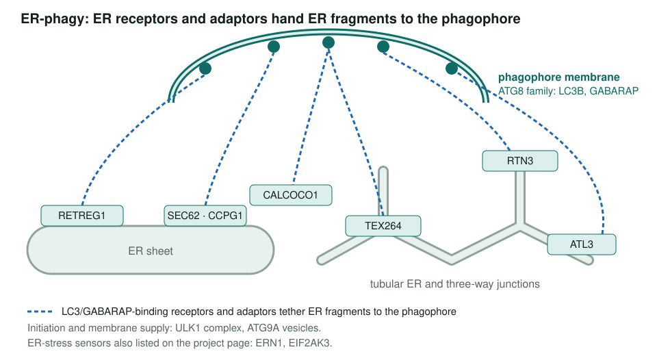
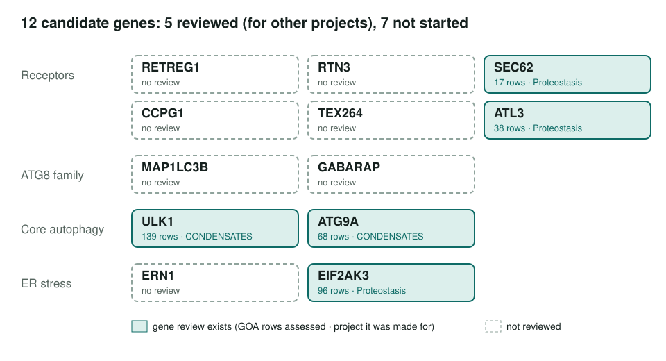

<!-- _class: lead -->

# ER-phagy

Selective autophagy of the endoplasmic reticulum: a scoped project

AI Gene Review · projects/ER_PHAGY · SCOPING · 2026

---

<!-- _class: bluf -->

## Bottom line

- **Scoped, not started.** No ER-phagy module and no review made for this project.
- **16 seed/related human genes** listed; **7 COMPLETE**, **2 INITIALIZED**, **7 not started**.
- The defining receptors **RETREG1 (FAM134B), RTN3, CCPG1, TEX264** have **no review yet**.
- GO-CAM already covers one **UFMylation/CYB5R3 reticulophagy** branch.

---

## The biology

Schematic from the gene roles listed on the project page. Membrane receptors and soluble cargo adaptors bind LC3B/GABARAP through LIR- or UDS-type motifs.

---

## Why this is worth doing

- A **young field**: many receptors were characterized from the mid-2010s into the 2020s, so GO coverage is likely to lag.
- Receptors are **dual-function** membrane proteins (SEC62 is a translocon subunit; ATL3 an ER-fusion GTPase), so the core-vs-non-core call matters.
- Disease links: hereditary sensory neuropathy (RETREG1/FAM134B), ER storage disease, flavivirus infection.

---

## Where the candidate genes stand

---

## What the existing reviews already say

- **SEC62**: IMP `reticulophagy` (GO:0061709) kept as **KEEP_AS_NON_CORE**; the core function is the Sec61 translocon.
- **CALCOCO1, RETREG2, UBAC2**: ER-phagy receptor/adaptor reviews now add core reticulophagy biology.
- **CDK5RAP3**: captures the UFM1-dependent positive regulation of reticulophagy.
- **ATL3**: a reticulophagy projection was **not** promoted to a new annotation; the review keeps ER membrane fusion as core and asks for receptor-mutant rescue experiments.
- **ULK1, ATG9A**: initialized in the CONDENSATES phagophore-membrane audit, not ER_PHAGY.

---

## Next steps

1. `just fetch-gene human RETREG1` (and RTN3, CCPG1, TEX264); review them first.
2. Review MAP1LC3B, GABARAP and ERN1.
3. Decide whether an ER-phagy receptor/adaptor module is warranted, alongside `modules/phagophore_assembly_site.yaml`.

**Read more:** `projects/ER_PHAGY.md` · `genes/human/SEC62/` · `genes/human/ATL3/` · `genes/human/CALCOCO1/`
