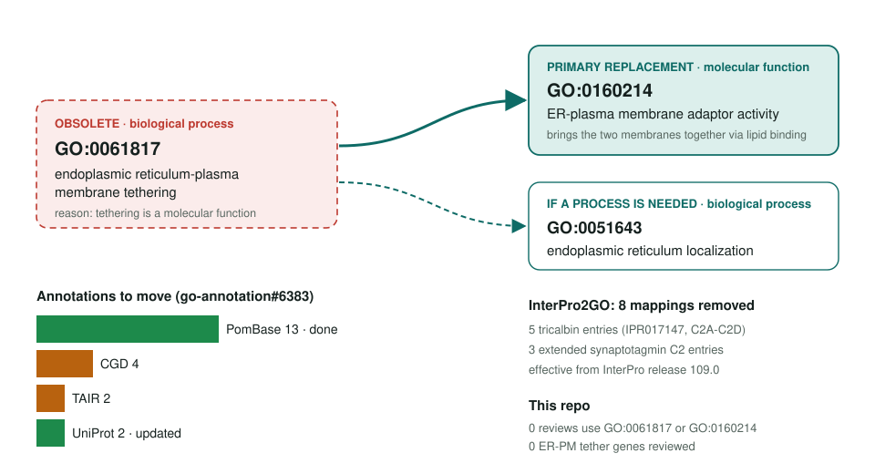
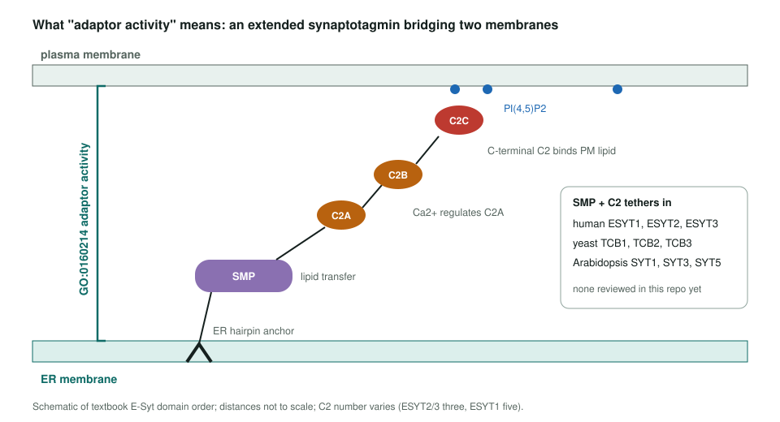

<!-- _class: lead -->

# ER-plasma membrane tethering obsoletion

GO:0061817 (process) → GO:0160214 adaptor activity (function)

AI Gene Review · projects/ER_PM_TETHERING_OBSOLETION · 2026

---

<!-- _class: bluf -->

## Bottom line

- GO **obsoleted GO:0061817** because tethering the ER to the plasma membrane is a **molecular function**, now **GO:0160214**.
- **21 upstream annotations** (PomBase 13 done, CGD 4, TAIR 2, UniProt 2) move; InterPro already dropped **8 mappings**.
- **Scoped, not yet started:** no review YAML uses either term and no dedicated ER-PM tether is reviewed. **VAPA** was assessed for GO:0160214 and **not annotated** (PR #3220): the partner's PH domain, not VAPA, binds the PM lipids. VAPA never had GO:0061817 in GOA; only its cached UniProt DR line lists it.

---

## Old term → replacements

---

## What the new function term describes

---

## Why the change is right

- The old term was a **process** whose definition was the **attachment** itself: a single-step activity.
- GO:0160214 is defined as the **binding activity** that brings the two membranes together via lipid binding.
- A true process consequence, where one exists, goes to **GO:0051643** ER localization.
- The same pattern applies across the three families: E-Syts, tricalbins and plant SYTs.

---

## Next steps

1. ✅ **VAPA**: GO:0160214 not added (PR #3220); the scs2/scs22 and VAPB precedent is a suggested question.
2. Anchor reviews: **ESYT2** (human) and **TCB3** (yeast) via `just fetch-gene`; check the new MF term against the literature.
3. Then the rest as one batch: ESYT1, ESYT3, TCB1, TCB2.
4. Plant SYT1/SYT5 (ARATH) last; separate stress phenotypes from the core contact-site function.

**Upstream:** go-annotation#6383 · go-ontology#31873
**Read more:** `projects/ER_PM_TETHERING_OBSOLETION.md`
