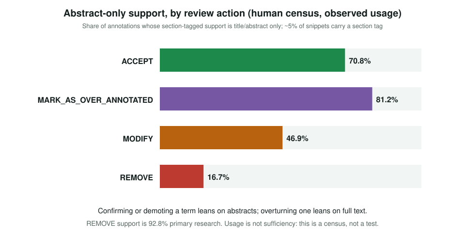
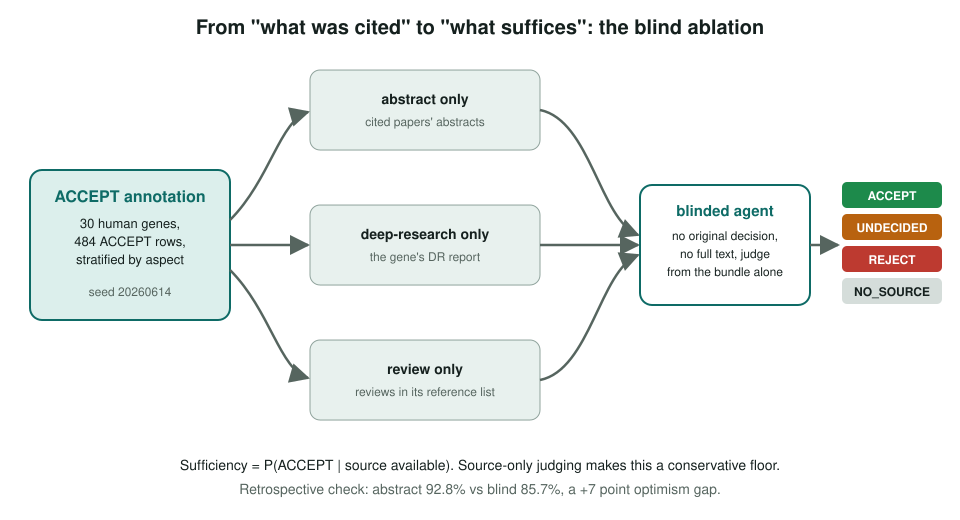
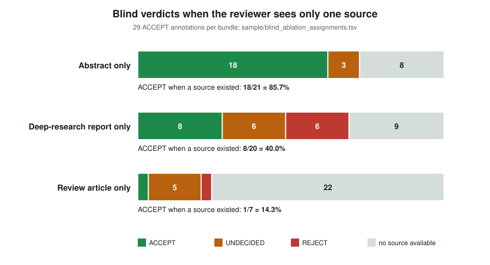

<!-- _class: lead -->

# Evidence-source sufficiency

Which cheap sources are enough to confirm a GO annotation?

AI Gene Review · projects/EVIDENCE_SOURCE_SUFFICIENCY · 2026

---

<!-- _class: bluf -->

## Bottom line

- Review cost is set by **what you must read**. We asked whether an abstract, a review article or a deep-research report suffices for **ACCEPT**.
- Pilot: **30 genes, 484 ACCEPT rows**. For 212 rows citing a full-text-cached paper, the justifying quote was in the **abstract 90.6%** of the time.
- Blind ablation, source available: **abstract 18/21 (86%)** ≫ deep research 8/20 (40%) > review 1/7 (14%). Pilot numbers; full-text pass and larger sample still open.

---

## Four hypotheses, one trap

- **H-a** a review article is usually enough for ACCEPT
- **H-b** the abstract alone is often enough
- **H-c** a deep-research report has enough depth
- **H-d** Introduction and Discussion are an under-used vein
- The trap: **cited ≠ required**. A curator who reads a primary paper first and stops leaves no trace that a review would have served. A census gives a lower bound, never sufficiency.

---

## What the census shows (usage)

---

## The real test: blind ablation

---

## Result

---

## Reading the result

1. **H-b holds**: the abstract confirmed 18 of 21 with no rejections; the retrospective estimate is only +7 points optimistic.
2. **H-c weakened**: deep research is heavily *used* (6,914 annotations in the census) but alone confirmed only 40%, with 6 blind rejections.
3. **H-a weakened**: 22 of 29 annotations had no review to offer, and 1 of 7 was confirmed when one existed.
4. **H-d untested**: narrative sections come out near 0% only because full-text sections are mostly not in the cache.

---

## Status and next steps

- **Done:** `publication_type` field, evidence-source CLI, protocol, sampler, scorer, auto-label pass, blind ablation.
- **Open:** full-text reading pass to test H-d and make "fact in abstract" semantic.
- **Open:** better review detection with MeSH/content heuristics; broader REVIEW_ONLY bundle.
- **Open:** scale past 30 genes to tighten blind CIs; score deep-research depth.

**Read more:** `projects/EVIDENCE_SOURCE_SUFFICIENCY.md` · `…/RESULTS.md` · `…/PROTOCOL.md`
