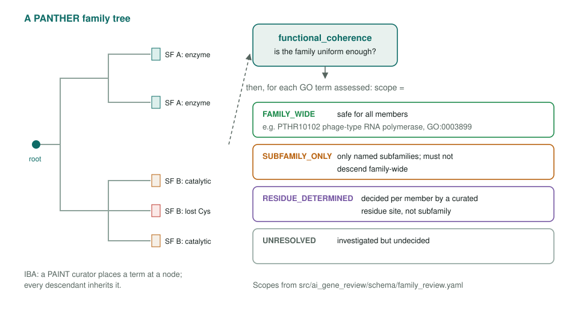
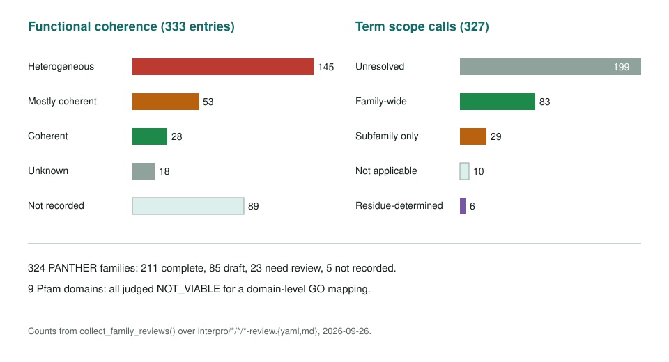
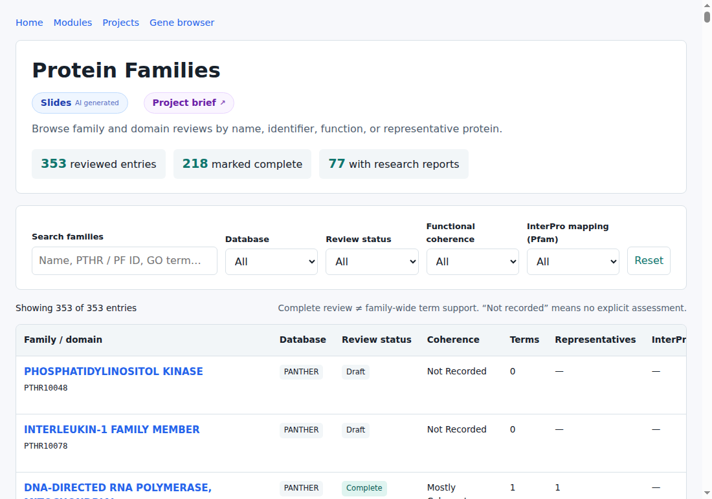

<!-- _class: lead -->

# Protein families

Where family-level annotation holds, and where it does not

AI Gene Review · projects/FAMILIES · 2026

---

<!-- _class: bluf -->

## Bottom line

- GO annotations propagate from reusable sources: **PAINT/IBA** descends from PANTHER tree nodes; **InterPro2GO** fires on InterPro/Pfam signature matches.
- We review **PANTHER family scope** and **Pfam mapping viability**: family-wide, subfamily-only, residue-determined or not at all?
- **353 entries** catalogued (218 complete). **151 families are heterogeneous**; only **98 of 391** term calls are safe family-wide.

---

## Why review families

- Per-gene reviews kept tracing over-propagated rows back to the **same heterogeneous families**.
- An IBA reflects a PAINT curator's node placement; the question is whether the **target sits inside the clade** that inherited the function, and whether it kept the residues.
- Fixing one gene at a time leaves the source in place. A family review records the boundary once, with evidence, for every member.

---

## The question a family review answers

---

## What one entry looks like

`interpro/panther/PTHR10102/PTHR10102-review.yaml`, phage-type RNA polymerase

- `functional_coherence: MOSTLY_COHERENT`: DNA-directed RNA synthesis is conserved; mitochondrial targeting and the Mtf1 partner are lineage-specific.
- `GO:0003899` DNA-directed RNA polymerase activity → **FAMILY_WIDE**, supported by PMID:21357609 (purified *S. pombe* Rpo41 + Mtf1 transcribe in vitro).
- Representative member linked to its gene review: `genes/SCHPO/rpo41/`.

---

## What the catalog holds

---

## The catalog page

pages/projects/FAMILIES.html: searchable and filterable by database, review status, coherence and Pfam mapping viability.

---

## Findings so far

1. **Heterogeneity is the norm**: 151 heterogeneous vs 33 coherent families.
2. **Most term calls are still open**: 211 of 391 unresolved; 98 family-wide, 61 subfamily-only.
3. **Residue-determined** scope (7 calls) handles mixed subfamilies: PTHR10256:SF0 holds both active *E. coli* SelD and the Arg-substituted *Drosophila* Sps1.
4. **Pfam mappings**: all 9 Pfam domains reviewed were judged not viable for a domain-level GO mapping.

---

## Status and next steps

- PANTHER status: 218 complete; 85 draft, 8 in progress, 28 need review, 5 not recorded.
- Open work: 211 unresolved term scopes; 89 entries with no coherence call yet.
- Related: `projects/IBA_REVIEW.md`, `projects/PANTHER_IBA_REVIEW/`, `projects/CASPL_FAMILY.md`, `projects/INTERPRO.md`.

**Read more:** `projects/FAMILIES.md` · `interpro/panther/<PTHR>/` · `just validate-families`
