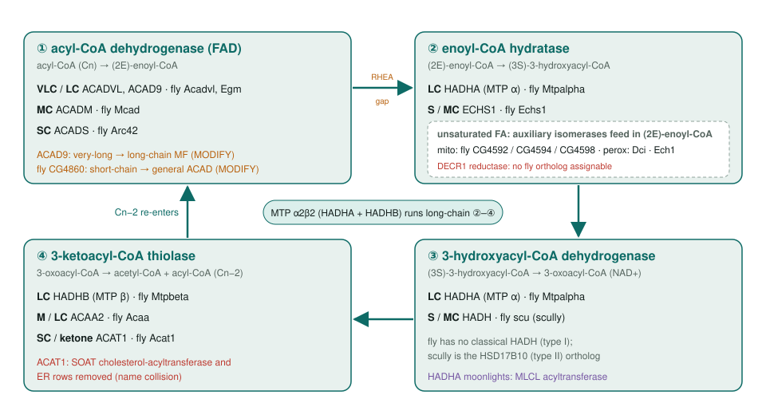
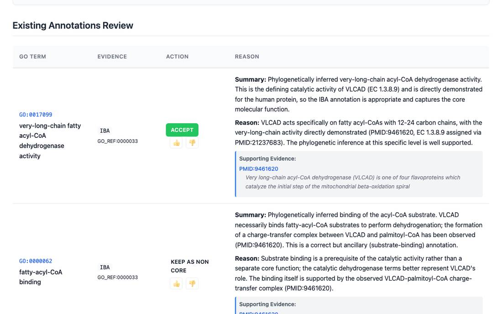
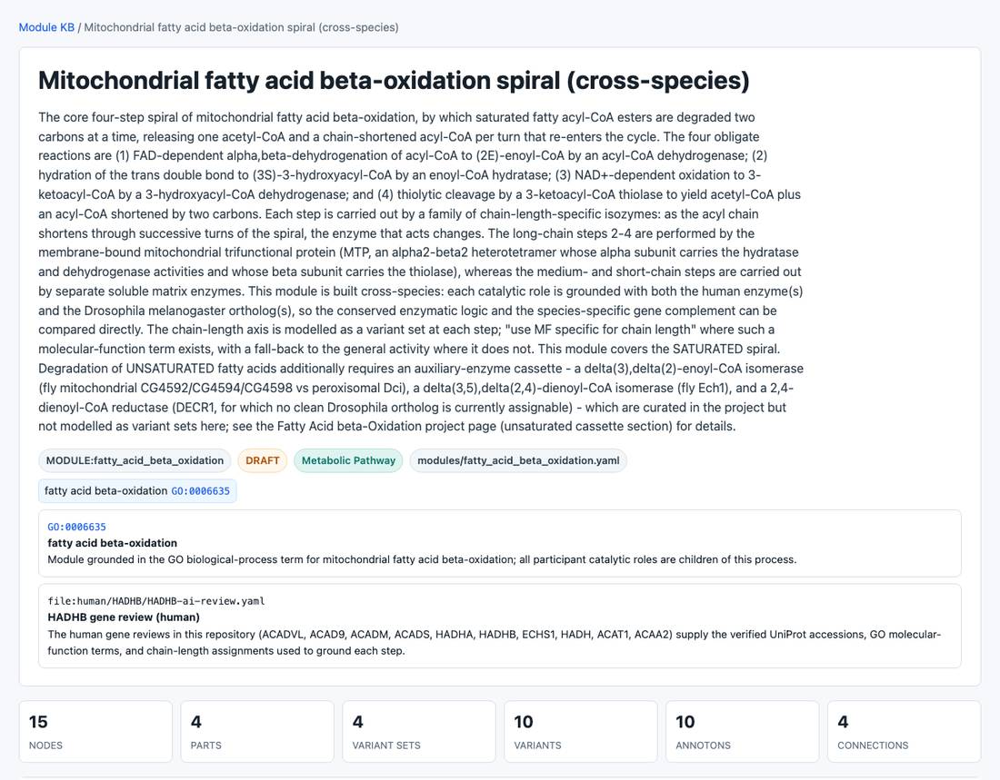

<!-- _class: lead -->

# Mitochondrial fatty acid β-oxidation

Reviewing the GO annotations of the whole enzyme spiral in human, fly and mouse

AI Gene Review · projects/FATTY_ACID_BETA_OXIDATION · 2026

---

<!-- _class: bluf -->

## Bottom line

- β-oxidation strips **two carbons per turn** through four steps, each run by **chain-length-specific** enzymes.
- We reviewed **714 GO annotations on 27 genes** (10 human, 16 fly, mouse LCAD) and built a **cross-species module**.
- **360 accepted, 278 non-core, 43 over-annotated, 13 modified, 18 removed**. Six blinded OpenScientist runs **agreed** with the reviews.

---

## Who runs each step, by chain length

---

## Why this pathway

- One short, well-understood cycle that still concentrates **five recurring curation problems**:
  - **chain-length specificity**: use the specific MF where GO has one (VLCAD `GO:0017099`, MCAD `GO:0070991`, SCAD `GO:0016937`)
  - **paralog cross-transfer**: mouse LCAD rows on ACADVL
  - **moonlighting**: HADH inhibits GLUD1; HADHA remodels cardiolipin
  - **organelle**: mitochondrion vs peroxisome
  - **GO↔RHEA mapping**: `GO:0004300` maps to the (3E) reaction, not the (2E) crotonase

---

## What a review looks like

ACADVL review page. The IBA very-long-chain ACAD activity is accepted; substrate binding is kept as non-core. Eight LCAD-derived IEA/ISS rows on this gene were removed.

---

## Results

| Set | Genes | Ann. | ACCEPT | Non-core | Over-ann. | MODIFY | REMOVE |
|---|---|---|---|---|---|---|---|
| Human core spiral | 10 | 443 | 222 | 165 | 30 | 7 | 18 |
| Fly spiral + scully | 11 | 196 | 92 | 88 | 9 | 6 | 0 |
| Fly auxiliary isomerases | 5 | 33 | 24 | 8 | 1 | 0 | 0 |
| Mouse Acadl (LCAD) | 1 | 42 | 22 | 17 | 3 | 0 | 0 |

Counts from the review YAMLs. One UNDECIDED (fly Egm) and one NEW (ACAD9) not shown.

---

## Blinded checks agree with the reviews

| Question | OpenScientist verdict |
|---|---|
| fly Acat1 peroxisomal? | Refuted: -EKL is not a PTS1; LOPIT says mitochondrion |
| fly Mtpalpha peroxisomal? | Supported: fly-specific SKL PTS1, isoform-dependent targeting |
| ACAD9 very-long-chain? | No: Thr-139/Ala-143 channel fits C16–C18 → long-chain |
| fly CG4860 short-chain? | Over-specific: pocket Leu→Thr → general ACAD |
| fly Echs1, Mcad substrate range | Conserved pockets; human-like range |
| fly step ③ = scully? | Yes: 100% of 11 catalytic residues conserved |

---

## The cross-species module

modules/fatty_acid_beta_oxidation.yaml grounds each step in a human and a fly enzyme; its QC reports every grounded gene reviewed.

---

## Status and next steps

- ✅ Human spiral (10), fly spiral + auxiliary enzymes (16), mouse Acadl; module built; Reactome cross-check done.
- ⬜ Remaining **mouse** orthologs (Acadvl, Acadm, Hadha, …), then rat and worm.
- ⬜ **Fly DECR1**: no ortholog assignable from NCBI, UniProt, Ensembl or OrthoDB.
- ⬜ FlyBase has taken **one** annotation from PMID:40519079; Arc42/CG4860 candidates listed.
- ⬜ Schema: no way to **negate an existing positive** annotation (CG4860 case).

**Read more:** `projects/FATTY_ACID_BETA_OXIDATION.md` · `modules/fatty_acid_beta_oxidation.yaml`
