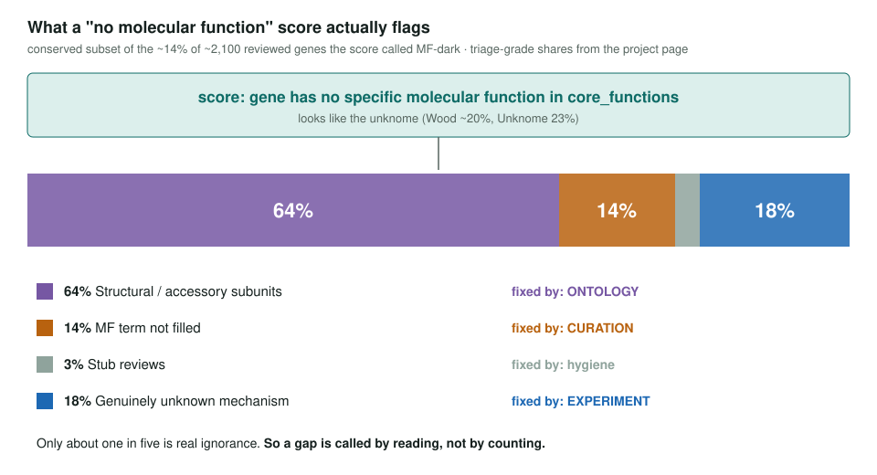
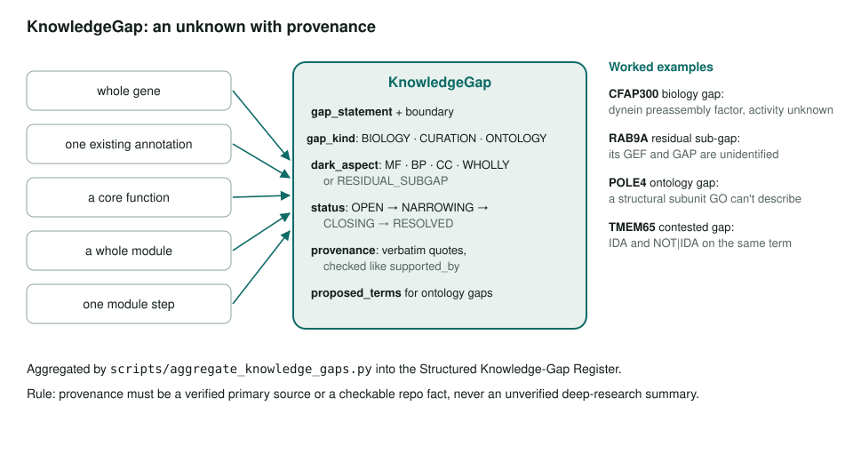
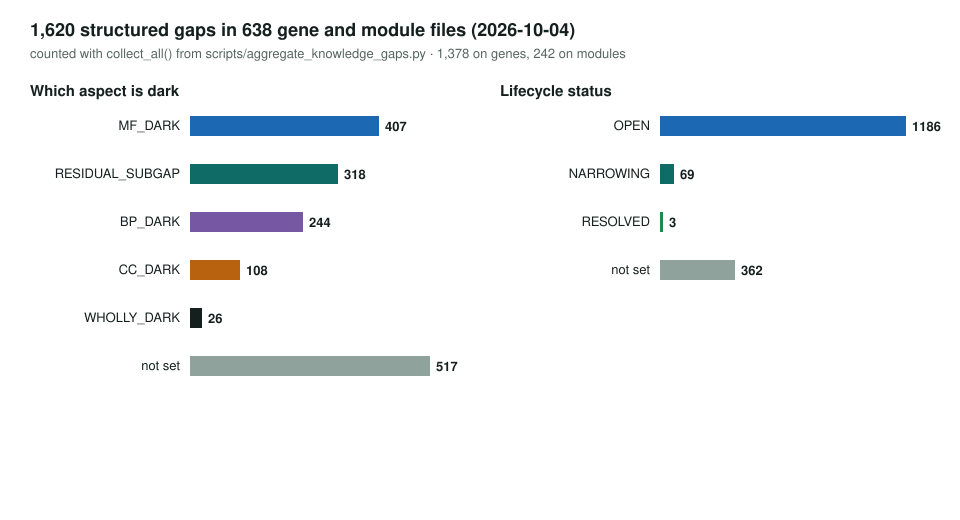

<!-- _class: lead -->

# Function knowledge gaps

Curating what biology does *not* know about a gene, with sources

AI Gene Review · projects/FUNCTION_KNOWLEDGE_GAPS · 2026

---

<!-- _class: bluf -->

## Bottom line

- About **a fifth** of proteins in well-studied organisms still have no informative description; we record each unknown as a **sourced, curated statement**.
- A darkness **metric failed**: most flagged genes were structural subunits or curation gaps. A gap is now a **judgement made by reading**.
- `KnowledgeGap` is a schema class; the YAMLs now hold **1,461 gaps** in **535** gene and module files.

---

## Why: the unknome

- Wood et al. 2019: ~20% of proteins in well-studied organisms lack an informative role; many are conserved yeast → human.
- Unknome database (Rocha et al. 2023): 23% of human clusters still "unknown"; of 260 conserved-unknown fly genes, 62 were essential.
- Genes stay dark for **sociological** reasons (the streetlight effect).
- A funder trying to close the unknome would first need an **honest map** of the real gaps.

---

## A metric can't find gaps

---

## Taxonomy

| Kind | Meaning | Who fixes it | Exemplar |
|---|---|---|---|
| **Biology** | nobody knows | experiment | CFAP300, tam10, P3R3URF |
| **Curation** | known, not annotated | curator | MAP7D1, AP3B2 |
| **Ontology** | known, no GO term for it | GO editors | POLE4 |
| **Contested** | two incompatible experimental answers | both | TMEM65, TMEM175 |
| *Residual sub-gap* | one sharp hole in a solved gene | experiment | RAB9A, RASA1, atg101 |

---

## Anatomy of a gap

---

## The register today

---

## Lessons from curating 23 worked entries

- Deep-research files **invent citations**: KCTD14 and AP3B2 summaries cited PMIDs that resolve to unrelated papers; RASA1's "tandem-SH2" PMID was a stem-cell paper.
- So provenance must be a **verified primary source** or a **checkable repo fact** (GOA evidence codes).
- `file:` quotes are **not** verbatim-checked; prefer PMID quotes.
- Contested gaps are often **already in GOA**, with experimental codes on both sides.

---

## Status and next steps

- ✅ Taxonomy, schema class, 23 worked entries, contested-function survey.
- ✅ Register generator: `just aggregate-knowledge-gaps` → `structured-gaps.md` (last run lists 1,073; YAMLs now hold 1,461).
- ⬜ `validate-deep-research`: PMID resolution + title match.
- ⬜ Read-list batch 4 (PUS3, CFAP418, SOCS4/5, RFT1, pef-1, fshr-1, alo1).
- ⬜ Curate contested candidates: TMEM175; TMEM65 + SLC8B1; MEFV.

**Read more:** `projects/FUNCTION_KNOWLEDGE_GAPS.md`
