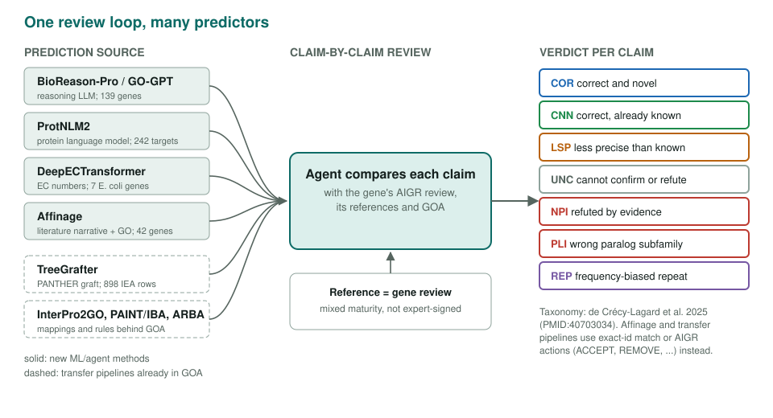
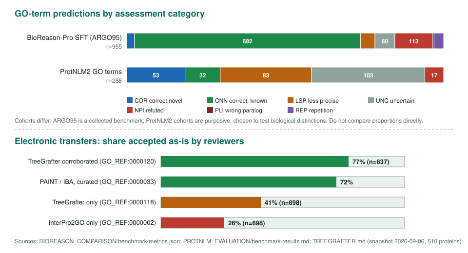

<!-- _class: lead -->

# Function prediction evaluation

Testing protein-function predictors claim by claim against reviewed genes

AI Gene Review · projects/FUNCTION_PREDICTION_EVALUATION · 2026

---

<!-- _class: bluf -->

## Bottom line

- Aggregate benchmarks say a field is improving; a curator needs to know whether **one method's predictions** are safe to import.
- We review predictions **one claim at a time** against agent-adjudicated gene reviews, with the **COR/CNN/LSP/UNC/PLI/NPI/REP** taxonomy.
- Errors concentrate in **specificity, paralogs, pseudoenzymes and organism context**; in the larger benchmarks most correct predictions were **already known**.

---

## One review loop, many predictors

---

## Why claim by claim

- A CAFA-style score averages over thousands of terms and hides *which* terms are wrong.
- Curators import **individual annotations**; a method that is 95% redundant and 5% wrong is a net cost.
- The same seven-category taxonomy (de Crécy-Lagard et al. 2025, PMID:40703034) makes different tools comparable **within** a cohort.
- Caveat: the reference reviews are AI-assisted and of mixed maturity, not expert-signed ground truth.

---

## Results so far

Snapshots: BioReason/ProtNLM2 2026-09-27 `c7551cb3`; TreeGrafter 2026-10-03 `f81b9f300`.

---

## Headlines by project

| Project | Cohort | Headline |
|---|---|---|
| BioReason-Pro | 139 genes | correctness 4.0/5, completeness 2.9/5; 23 of 955 SFT terms correct and novel |
| ProtNLM2 | 186/242 targets assessed | 288 GO terms: 52 COR, 84 LSP, 98 UNC, 20 NPI |
| DeepECTransformer | 7 E. coli genes | one gene per error category; paper found 3/453 correct novel |
| Affinage | 42 GO-layer + 91 PAINT genes | 38/42 core-MF slim bins; non-FA PAINT recall 48% |
| TreeGrafter | 1,074 IEA rows | 43% accepted; 26% down-graded |

Snapshots: BioReason/ProtNLM2 2026-09-27 `c7551cb3`; TreeGrafter 2026-10-03 `f81b9f300`.

---

## Recurring failure modes

- **Less precise:** a true parent instead of the specific activity (Affinage `oxidoreductase activity` for GPX4).
- **Pseudoenzymes:** ancestral catalysis assigned to inactive members (BioReason on Epe1, pmp20).
- **Paralogs:** wrong subfamily or interchangeable summaries (DeepECTF on yciO; BioReason on sigF/sigG/sigK).
- **Organism context ignored:** a mycothiol synthase predicted in *E. coli*, which has no mycothiol pathway (yjhQ).
- **Localization default:** cytoplasm when no transmembrane segment is found.

---

## Status and next steps

- Done: BioReason-Pro, Affinage, TreeGrafter and the E. coli DeepECTF set have results; ProtNLM2 has 186 of 242 targets assessed.
- Next: human anchor subset across BioReason-Pro, ProtNLM2 and TreeGrafter.
- Next: second-pass TreeGrafter mode-0 / keyword-placed rows; per-term Affinage slim precision.

**Read more:** `projects/FUNCTION_PREDICTION_EVALUATION.md` · shared browser `app/predictions/` · each project's own page
