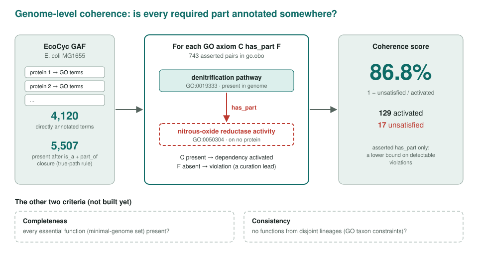
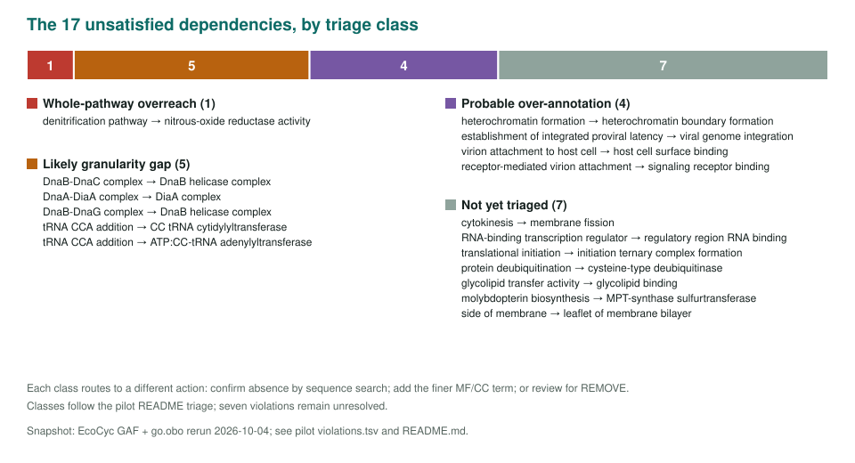

<!-- _class: lead -->

# Genome-wide validation

Scoring a whole genome's annotation set for completeness, coherence and consistency

AI Gene Review · projects/GENOME_WIDE_VALIDATION · E. coli pilot rerun 2026-10-04

---

<!-- _class: bluf -->

## Bottom line

- Per-gene review asks if **one annotation** is right; this asks if the **whole set** could coexist in a living cell.
- **Coherence is built:** the *E. coli* EcoCyc GAF satisfies 112 of 129 activated GO `has_part` dependencies (**86.8%**).
- The **17 violations** are curation leads: likely pathway overreach, missing complex/MF terms, viral or heterochromatin over-annotations, and unresolved cases. Completeness and consistency are **still roadmap items**.

---

## Why genome scale

- Prediction and evaluation score one protein at a time, as if annotations were independent facts.
- A method can be accurate per protein yet yield a genome no organism could have: no DNA replication, a late pathway step with no upstream enzymes, photosynthesis next to neuron development.
- Framework: completeness / coherence / consistency (Tawfiq, Kulmanov & Hoehndorf 2026, *Brief. Bioinform.* bbag336), using constraints **already in GO**.

---

## The coherence check

---

## What the 17 violations are

---

## Limits of the pilot

- **Asserted `has_part` only** (743 pairs); the reference paper reports thousands of additional ELK-inferred pairs, so this is a lower bound.
- **Set-based, not sequence-based:** a violation cannot tell "gene absent" from "gene present but unannotated". Confirm gaps with GapMind or Pathway Tools before any REMOVE.
- The completeness probe in the output (DNA replication, transcription, translation present) is a sanity check, not the metric.

---

## Status and next steps

- Done: *E. coli* coherence pilot, from public data (`pilot-ecoli/coherence_pilot.py`).
- Next: add inferred `has_part` pairs and MetaCyc routes.
- Next: minimal-genome essential-function set for **completeness**; GO taxon constraints for **consistency**.
- Next: predictor sweep (InterPro2GO, DeepGO-family); decide whether to reuse GAEF.

**Read more:** project page · E. coli pilot `RESULTS.md`
