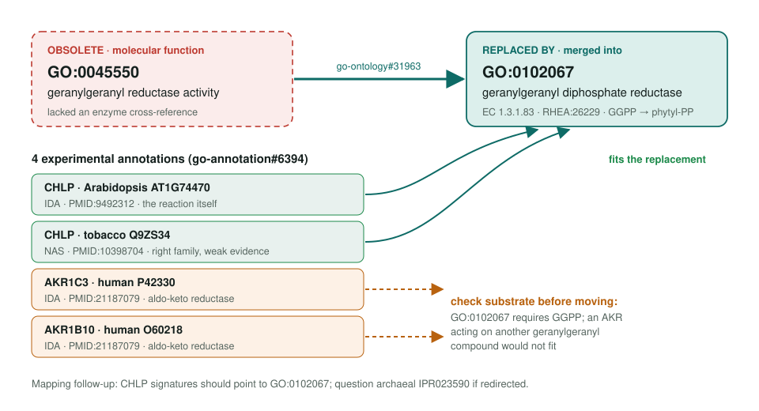
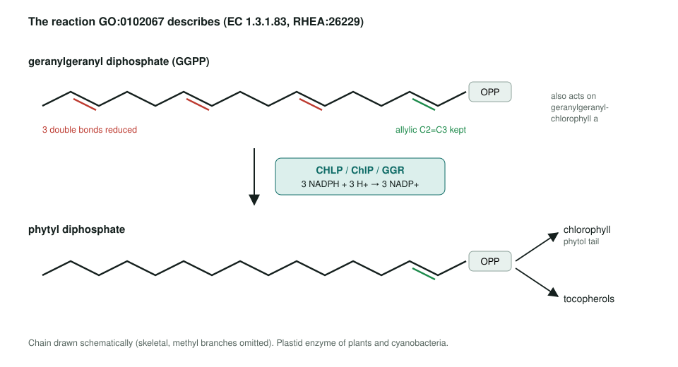

<!-- _class: lead -->

# Geranylgeranyl reductase activity obsoletion

GO:0045550 → GO:0102067 geranylgeranyl diphosphate reductase activity

AI Gene Review · projects/GERANYLGERANYL_REDUCTASE_OBSOLETION · 2026

---

<!-- _class: bluf -->

## Bottom line

- GO **obsoleted GO:0045550**, which lacked an enzyme cross-reference, and merged it into **GO:0102067** (EC 1.3.1.83).
- Of **4 experimental rows**, the two **plant CHLP** rows fit; the two **human AKR** rows (AKR1C3, AKR1B10) need a substrate check before moving.
- **Scoped, not yet started:** none of the four genes has a review in this repo.

---

## Old term → replacement

---

## The reaction the new term names

---

## Why this is not a pure rename

- The old label said "geranylgeranyl"; the new one says **geranylgeranyl diphosphate**.
- GO:0102067 also covers reduction of **geranylgeranyl-chlorophyll a**, the other in vivo substrate.
- An enzyme shown to reduce a different geranylgeranyl compound does **not** automatically fit.
- The archaeal **IPR023590** family reduces a glycerophospholipid, not free GGPP; its mapping deserves the same question.

---

## Next steps

1. Review **AKR1C3** (human, P42330) first, reading PMID:21187079 for the substrate actually tested.
2. Then **AKR1B10** (same paper).
3. Arabidopsis **CHLP** as the positive control for GO:0102067; treat the tobacco NAS row separately.
4. Raise the IPR023590 fit on go-annotation#6394.

**Upstream:** go-annotation#6394 · go-ontology#31963
**Read more:** `projects/GERANYLGERANYL_REDUCTASE_OBSOLETION.md`
