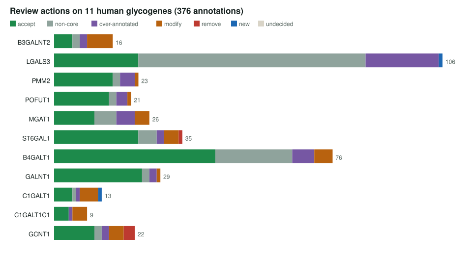
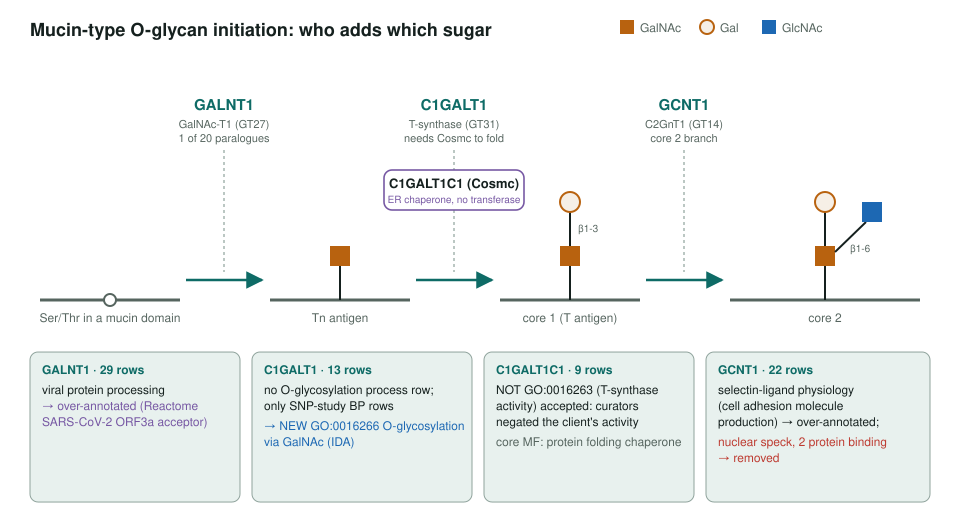
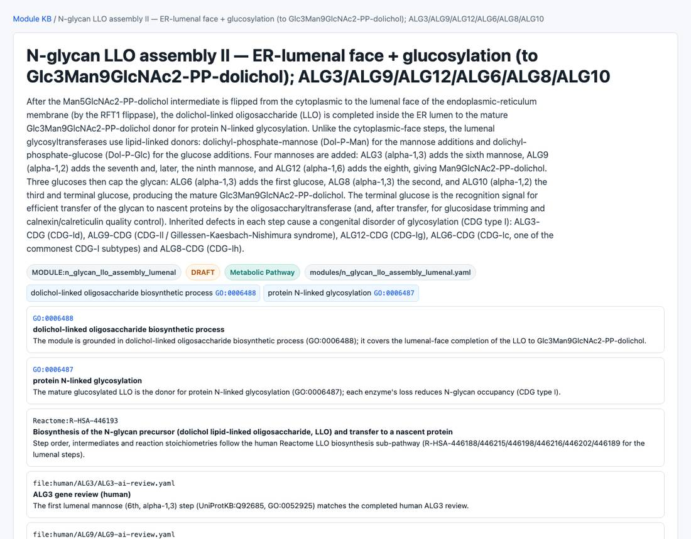

<!-- _class: lead -->

# Glycobiology

Auditing how GO annotates the enzymes and lectins of glycosylation, and mapping CAZy families to GO

AI Gene Review · projects/GLYCOBIOLOGY · reviewed 2026-10-04

---

<!-- _class: bluf -->

## Bottom line

- We reviewed **376 annotations on 11 human glycogenes** and indexed **17 pathway modules** (100 more genes, 2,748 annotations).
- Only **4 removals**: the problem is **altitude and pleiotropy** (generic parent terms, downstream physiology), not wrong functions.
- A **CAZy→GO mapping** (`cazy2go`) yields a **60-row safe propagation set** and **34 hand-endorsed** `interpro2go` gaps.

---

## Why glycogenes

- Glycosylation decorates most secreted and cell-surface proteins; defects cause **>130 congenital disorders of glycosylation**.
- Glycosyltransferase families are **large and sequence-similar**, so propagated annotations can land on the wrong paralog or at the wrong level.
- Specialist resources (**CAZy, GlyGen, GlyConnect, GlyTouCan, GlycoCoO**) hold knowledge GO may lack.
- Question: where does GO **over-annotate** glycogenes, and where does it **under-represent** glycan biology?

---

## Actions per gene

---

## What the reviews found

1. **Generic MF → specific activity** is the dominant fix: MGAT1 → `GO:0003827`, ST6GAL1 → `GO:0003835`, B4GALT1 → `GO:0003831`.
2. The **cellular-component** version: bare `membrane` on Golgi transferases → `GO:0000139` Golgi membrane.
3. **Guilt by substrate**: PMM2 only supplies GDP-mannose, so N-linked glycosylation is non-core.
4. **Pleiotropy is not core**: 62 of LGALS3's 106 rows kept non-core; `lysophagy` added as NEW.
5. **8 new GO terms proposed** across the seven exemplars.

---

## Phase 3: mucin-type O-glycans

---

## The module cohort

One of the 17 indexed glycobiology modules (N-glycan LLO lumenal assembly). The 100-gene module cohort shows the same skew: 0.8% REMOVE, 63.3% ACCEPT, 17.6% non-core, 14.0% over-annotated.

---

## cazy2go: CAZy families → GO MF

| Step | Result (2026-06 snapshot) |
|---|---|
| Families with a GO MF via member ECs | 283 |
| Fully masked by `interpro2go` | 56 (20%) |
| Safe propagation set after filters and hand review | **60 rows** |
| Hand-reviewed true gaps | 34 ENDORSE · 13 CAUTION · 6 REJECT |
| Poly-specific families resolved to subfamily signatures | 66 of 90 |

Rejects were CBM (non-catalytic) families and one GT family carrying a protease EC from another domain; both are now filtered automatically.

---

## Status and next steps

- Done: 11 exemplar reviews; 17 modules indexed; `cazy2go` safe set built.
- Next: run the **GOA closure query** to size the animal glycogene set and its baseline.
- Next: submit the **8 proposed terms** and the **34 endorsed** `interpro2go` gaps after curator sign-off.
- Next: remaining GALNT paralogues, core 3/4 and capping steps; re-review modules for new terms.

**Read more:** `projects/GLYCOBIOLOGY.md` · `projects/GLYCOBIOLOGY/`
