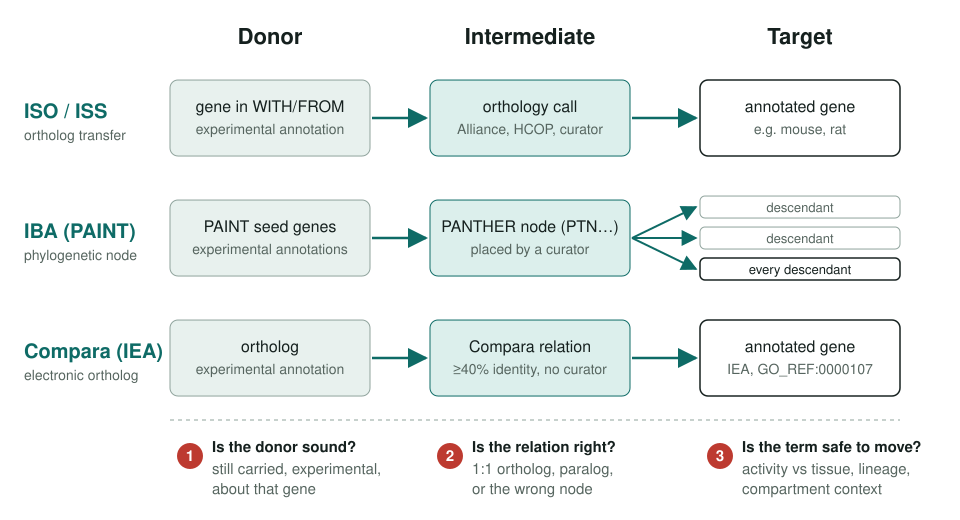
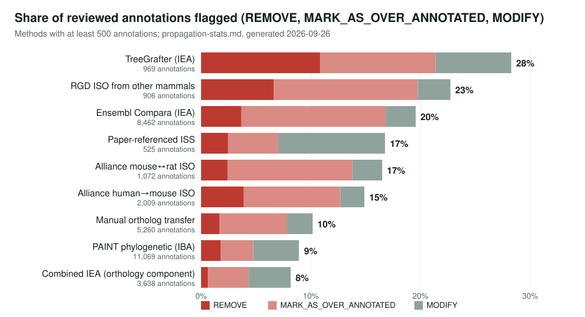
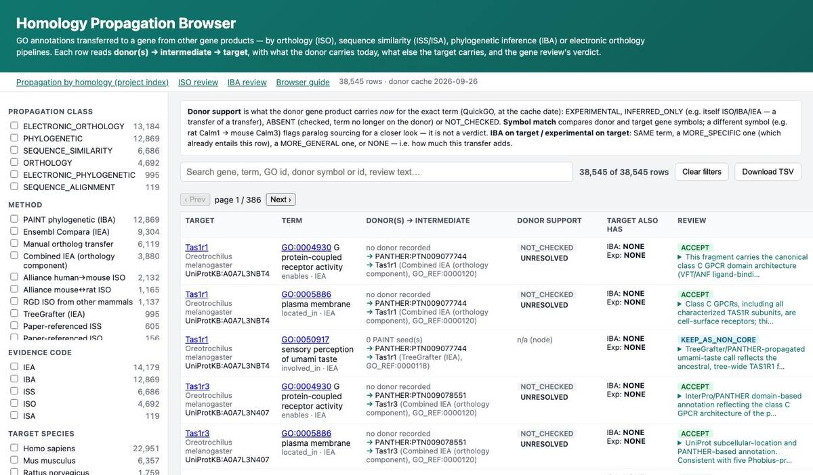

<!-- _class: lead -->

# Propagation by homology

Reviewing GO annotations that a gene received from other gene products: ISO, ISS/ISA, IBA, Ensembl Compara, TreeGrafter, InterPro2GO

AI Gene Review · projects/HOMOLOGY_PROPAGATION · 2026

---

<!-- _class: bluf -->

## Bottom line

- A transferred annotation can fail at the **donor**, at the **orthology or tree relation**, or because the **term does not travel** to the target's context.
- We review these transfers **method by method** (ISO, IBA/PAINT, TreeGrafter, InterPro2GO, NCBIFam) and show every row in one **propagation browser** next to the gene review's verdict.
- As of 2026-09-26, reviewers judged **34,253 of 34,265** propagated annotations and flagged **13%** as REMOVE, MARK_AS_OVER_ANNOTATED or MODIFY: **9%** of PAINT IBA, **20%** of Ensembl Compara, **28%** of TreeGrafter.

---

## Every transfer has three parts

Donor in WITH/FROM, the relation that carries the term, the gene that receives it. A review asks one question of each part.

---

## ISO: orthology transfers between species

- **4,232** ISO annotations in the statistics; reviewers flagged 15% of Alliance human→mouse rows and 23% of RGD rows from other mammals.
- **383** rest on a donor that **no longer carries the term** (stale transfer).
- Rows where the donor has a **different symbol** (paralog or multi-locus sourcing) were flagged **48%** of the time, against 16% for a namesake donor.
- **3,000 (71%)** have no related IBA on the target, so ISO mostly adds assertions PAINT does not make.
- Worked cases: mouse **Calm3** (paralog donors), **Ghr** (stale sources), **Ang2** (41 of 46 ISO rows removed).

projects/ISO.md · propagation-stats.md

---

## IBA and PAINT: one node, every descendant

- **14 recurring failure patterns** plus one positive control: pseudo-enzymes keeping a catalytic term, neo-functionalized subfamilies, wrong-paralog and cross-kingdom transfers.
- The structured `propagation_review` vocabulary is now in use: **3,580 blocks in 691 gene reviews**.
- The gap runs both ways: in 1,015 reviewed human genes, **511 core molecular functions** (423 genes) have no IBA support.
- **PAINT no-IBA genes:** 715 of 7,593 listed human genes have a completed review.
- A corpus-wide **IBA re-review** (3,427 genes, 11,829 annotations) started 2026-09-20; 81 genes reviewed so far.

projects/IBA_REVIEW.md · projects/PAINT.md

---

## Electronic pipelines: no curator in the loop

| Project | Key finding |
|---|---|
| **TreeGrafter** (GO_REF:0000118) | 41% accepted vs 72% for PAINT/IBA (frozen 2026-09-06 snapshot, 898 annotations); 77% accepted when another pipeline reproduces the call |
| **InterPro2GO** (GO_REF:0000002) | 3,652 judged records on 1,706 genes; 36 proposed mapping edits across 15 entries, including 10 removals |
| **NCBIFam / CDD** | NCBIFAM backs 705 (13%) of 5,549 InterPro2GO rows in the repo; a 250-row `ncbifam2go` SSSOM seed |
| **Ortholog conjecture** | Scoped only: literature summary, draft open-world metric, five divergence cases; no metrics computed |

projects/TREEGRAFTER.md · INTERPRO.md · NCBIFam.md · ORTHOLOG_CONJECTURE.md

---

## How often reviewers flag a transfer

---

## Why transfers were flagged

| Failure mode | Annotations |
|---|---:|
| GRANULARITY_MISMATCH | 329 |
| CONTEXT_OR_TISSUE_MISMATCH | 257 |
| FUNCTIONAL_DIVERGENCE | 170 |
| ROLE_CONFLATION | 169 |
| COMPARTMENT_OR_COMPLEX_MISMATCH | 139 |
| WRONG_ORTHOLOG_OR_PARALOG | 118 |

- Most recorded failures are about the **term**: too coarse, the wrong context, or a role the target does not play.
- Wrong orthologs or paralogs are a smaller share.
- Root causes: **433** PROPAGATION_BAD and **407** TERM_SCOPING_PROBLEM, against **43** SOURCE_BAD.

Structured `review.propagation_review` records, all methods; propagation-stats.md

---

## The propagation browser

One row per transfer: donor(s) → intermediate → target, donor support today, and the review verdict. `app/propagation/index.html` · `docs/propagation_browser.md`

---

## Status and next steps

- **In progress:** IBA corpus re-review (`projects/IBA_REVIEW/rereview-2026-09-20/`); PAINT no-IBA reviews.
- **Proposals for InterPro curators, not adopted:** InterPro2GO mapping edits (`projects/INTERPRO/interpro2go.sssom.yaml`); the worklist past the first dozen entries is not yet assessed.
- **Not started:** the ortholog-conjecture analysis.
- **Rebuild** the browser and statistics offline from the committed donor cache:
  - `just refresh-propagation-sources` (network)
  - `just deploy-propagation-browser` → `app/propagation/`
  - `just propagation-stats` → `projects/HOMOLOGY_PROPAGATION/propagation-stats.md`
