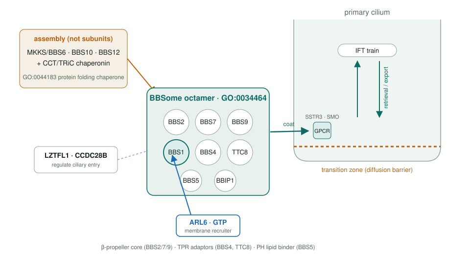
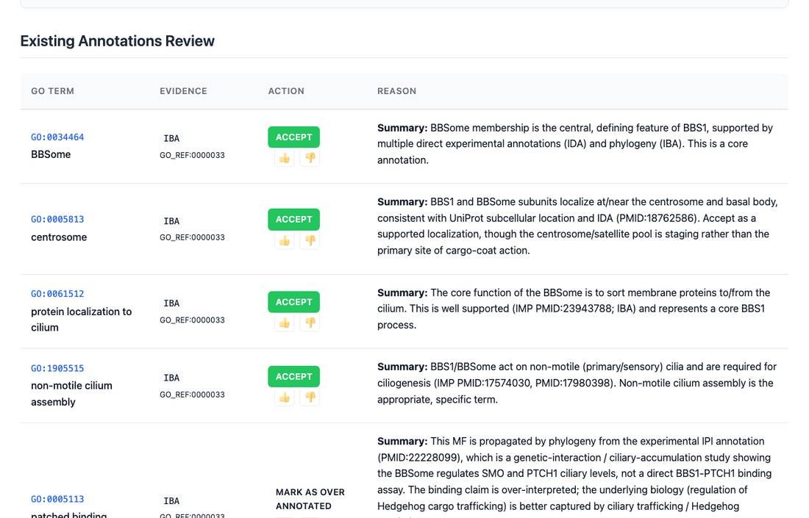
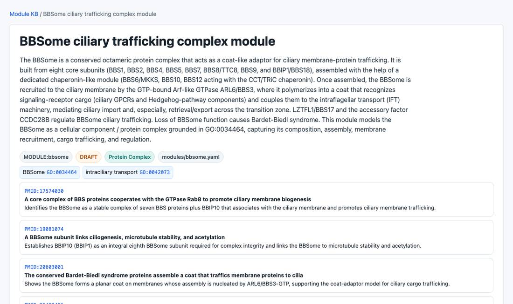

<!-- _class: lead -->

# The human BBSome

Reviewing GO annotations for the 14 genes of a ciliary coat complex

AI Gene Review · projects/HUMAN_BBSOME · 2026

---

<!-- _class: bluf -->

## Bottom line

- The **BBSome** is an 8-subunit coat that sorts GPCRs and Hedgehog components **into and out of the primary cilium**; its loss causes **Bardet–Biedl syndrome**.
- We reviewed **every GO annotation** on **14 genes** (8 subunits, ARL6 recruiter, 2 regulators, 3 assembly chaperonins) and built a reusable **BBSome module**.
- **Main corrections:** `protein binding` → BBSome membership or specific MF; chaperonins are **assembly factors, not subunits**; two over-propagated BBS2 IEA localizations **removed**.

---

## Who does what inside the complex

---

## Why this complex

- **Well bounded**: one complex, cryo-EM structures (2020), a clear disease.
- A test of whether per-gene review recovers the **division of labour**:
  - cargo recognition and ARL6 binding: **BBS1**
  - membrane recruitment: **ARL6-GTP**
  - assembly: **MKKS / BBS10 / BBS12 + CCT/TRiC**
- The failure mode to avoid: copying one generic "cilium" story onto every subunit.

---

## What a review looks like

BBS1 review page: each GOA row gets an action and a reason. BBSome membership is accepted; a propagated "patched binding" row is marked over-annotated.

---

## Results across 14 genes

| Gene | Ann. | ACCEPT | Non-core | Over-ann. | MODIFY | REMOVE |
|---|---|---|---|---|---|---|
| BBS1 | 60 | 30 | 18 | 7 | 5 | 0 |
| BBS2 | 67 | 16 | 24 | 25 | 0 | 2 |
| BBS4 | 110 | 42 | 37 | 31 | 0 | 0 |
| MKKS | 61 | 5 | 23 | 30 | 2 | 0 |
| TTC8 | 47 | 23 | 10 | 14 | 0 | 0 |
| BBIP1 | 24 | 13 | 8 | 3 | 0 | 0 |

Six of 14 shown; full table in projects/HUMAN_BBSOME.md.

---

## Cross-cutting findings

1. **`protein binding` (GO:0005515)** IPI rows flagged throughout; biology captured by **GO:0034464 BBSome** or specific MF (BBS1 → *small GTPase binding* for ARL6).
2. **Chaperonins are not subunits**: MKKS, BBS10, BBS12 get GO:0044183 *protein folding chaperone*, replacing obsolete GO:0051082.
3. A **GO:0061629** *RNA Pol II TF binding* row from a BBS7-centric study (PMID:22302990) was flagged as miscited across the scaffold subunits.
4. **BBS2** `microvillus` / `stereocilium` IEA rows **removed** as unsupported.

---

## The BBSome module

modules/bbsome.yaml: composition, assembly, ARL6 recruitment and cargo trafficking, grounded in GO:0034464.

---

## Status and next steps

- ✅ 14/14 gene reviews validate; module validates.
- ⬜ Pathway/summary integration (optional).
- Out of scope, candidates for their own modules: **IFT** (IFT27/BBS19, IFT172/BBS20) and the **transition zone** (MKS1, CEP290).

**Read more:** `projects/HUMAN_BBSOME.md` · `modules/bbsome.yaml` · `genes/human/<GENE>/`
