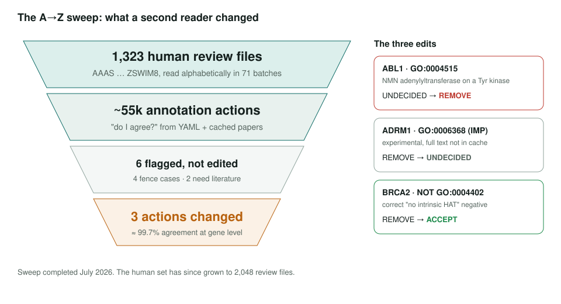
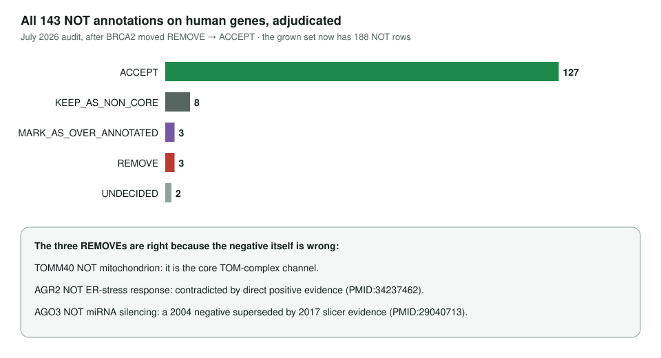

<!-- _class: lead -->

# Human genes re-review

A second reader for every curation action in 1,323 human reviews

AI Gene Review · projects/HUMAN_GENES_RE_REVIEW · reviewed 2026-10-04

---

<!-- _class: bluf -->

## Bottom line

- We re-read the action on every existing annotation in **1,323 human reviews** (AAAS → ZSWIM8, ~55k actions) and asked "do I agree?"
- **~99.7% agreement**: only **3 actions changed** (ABL1, ADRM1, BRCA2); all 143 **NOT** annotations adjudicated.
- Sweep **complete** (July 2026). The human set has since grown to **2,812** files, so 1,489 newer reviews have not had a second pass.

---

## Why a second pass

- Actions (ACCEPT, REMOVE, MODIFY …) are what summaries and modules are built on.
- A single reviewer can be wrong in systematic ways: over-removal, removing experimental rows it cannot see, mishandling NOT rows.
- Rules: judge from the YAML and cached papers only; **edit only on confident disagreement**; log everything else as a fence case or literature question.

---

## What changed

---

## The NOT audit

---

## What the first pass got right

- **Pseudo-enzymes**: ancestral activity removed when catalytic residues are lost (CRMP1, ILK, ROR1, UBAC2).
- **Wrong enzyme or direction**: phosphatase ≠ kinase (CDC25B, PTPN6); TXN vs TXNRD; CPS1 vs CPS2.
- **Name collisions**: HAP1 (huntingtin-associated ≠ APE1), GNAS locus, AARSD1 vs AARS1.
- **Legacy TF labels** removed from ESCRT/Golgi machinery: TSG101, TMF1, USO1.

---

## Flagged for a curator, not edited

| Case | Tension |
|---|---|
| **GAPDH** | ~43 REMOVEs include documented moonlighting (GAIT complex) |
| **HSPA1B** | removes own IDA chaperone rows that twin HSPA1A keeps |
| **ATP23** | DSB-repair rows from its former KUB3 identity removed |
| **AGO3 / AGR2** | NOT rows removed as superseded |
| **ASCL1, ATF3** | REMOVE on IDA; need the source papers |

---

## Status and next steps

- Done: A→Z sweep over 1,323 files; 3 edits, all present in the current YAMLs.
- Done: TRA2B, flagged as never reviewed, has since been reviewed with no PENDING rows.
- Next: resolve the fence cases and the ASCL1 / ATF3 literature questions.
- Next: second pass for the 1,489 human reviews added after July 2026.
- Tracker: #4097.

**Read more:** `projects/HUMAN_GENES_RE_REVIEW.md`
