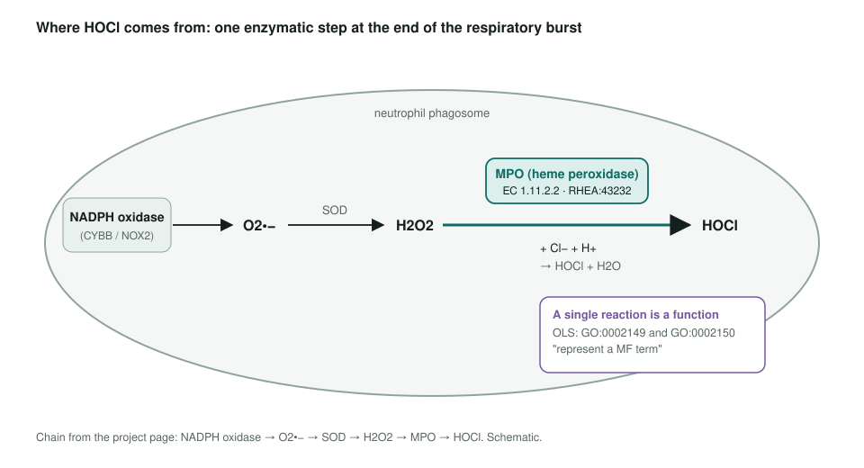
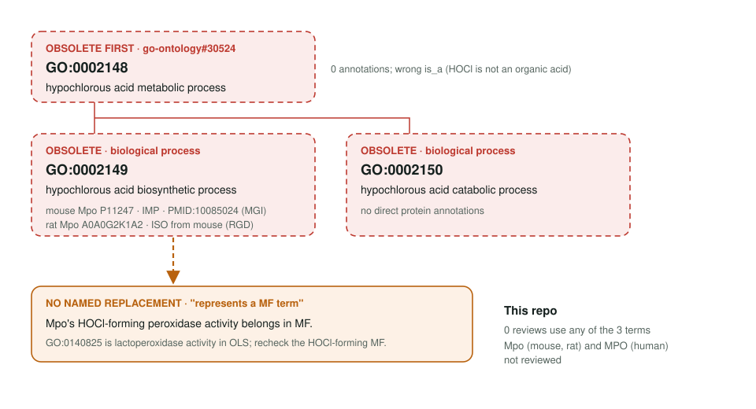

<!-- _class: lead -->

# Hypochlorous acid process term obsoletion

GO:0002148, GO:0002149, GO:0002150: all three now obsolete

AI Gene Review · projects/HYPOCHLOROUS_ACID_OBSOLETION · 2026

---

<!-- _class: bluf -->

## Bottom line

- GO **obsoleted all three HOCl process terms**; the two children because each "represents a MF term".
- Only **one experimental row** is affected: mouse **Mpo** IMP (PMID:10085024), plus a rat ISO copy.
- **Scoped, not yet started:** Mpo is not reviewed here, and the MF anchor an earlier draft proposed (**GO:0140825**) is *lactoperoxidase activity* in OLS, so it must not be used; the right MF is still to be found.

---

## Where HOCl comes from

---

## The three terms

---

## Why the terms went

- **GO:0002148** sat under *organic acid metabolic process*; HOCl has no carbon (go-ontology#22891).
- HOCl formation is **one reaction** by one enzyme, so a process term only restates the activity.
- The catabolic term had **no direct protein annotations**.
- No replacement term is named; the Mpo row needs an **MF** decision.

---

## Next steps

1. `just fetch-gene mouse Mpo` and a full review (peroxidase MF, granule CC, defense BP).
2. Find the GO MF term for HOCl-forming peroxidase activity (RHEA:43232) with OLS; do not reuse GO:0140825 without checking.
3. The rat ISO row follows the mouse row; human MPO is optional.

**Upstream:** go-annotation#6404 · go-ontology#22891 · go-ontology#30524
**Read more:** `projects/HYPOCHLOROUS_ACID_OBSOLETION.md`
