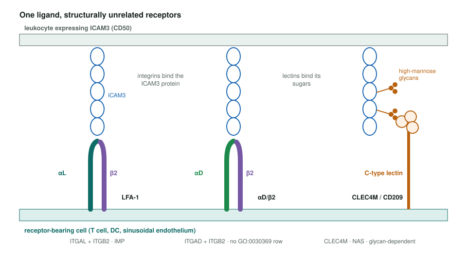
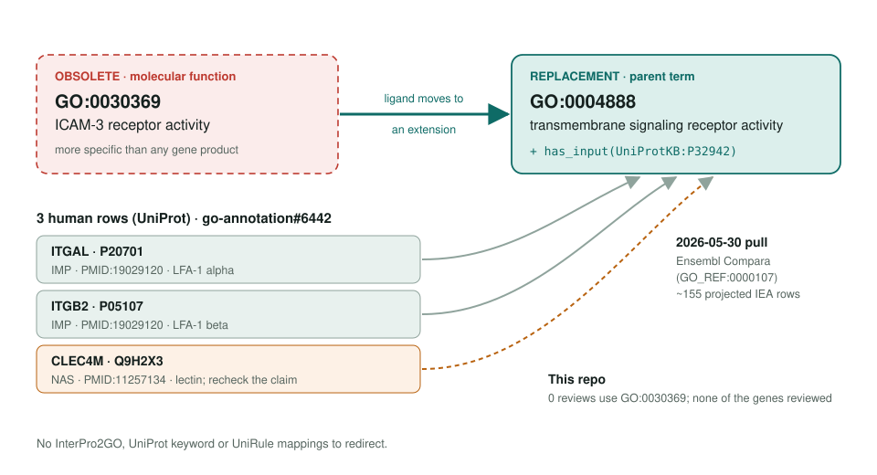

<!-- _class: lead -->

# ICAM-3 receptor activity obsoletion

GO:0030369 → GO:0004888 + `has_input` ICAM3

AI Gene Review · projects/ICAM3_RECEPTOR_ACTIVITY_OBSOLETION · 2026

---

<!-- _class: bluf -->

## Bottom line

- GO **obsoleted GO:0030369** because ICAM3 binds several unrelated receptors; one ligand-named term fits none of them precisely.
- **3 human rows** move to **GO:0004888** with the ligand as an extension: ITGAL, ITGB2 (IMP) and CLEC4M (NAS); ~155 IEA rows follow.
- **Scoped, not yet started:** none of these genes is reviewed here; CLEC4M's NAS row is the one to question.

---

## One ligand, unrelated receptors

---

## Old term → proposed home

---

## Why a ligand-named term fails

- Integrins **LFA-1** (ITGAL:ITGB2) and **αD/β2** bind the ICAM3 protein.
- C-type lectins **CLEC4M** and **CD209** bind its high-mannose **glycans**.
- OLS obsoletion note: the term is "more specific than the specificity of any known gene product".
- The receptor activity stays in GO:0004888; `has_input` records the ligand, as in GO-CAM.

---

## Next steps

1. Review **ITGAL** and **ITGB2** together (shared PMID:19029120); LFA-1's core MF is adhesion-molecule binding.
2. Then **CLEC4M**: check whether PMID:11257134 supports an ICAM3 receptor claim; D-mannose binding (GO:0005537) is the likely core.
3. Optional: CD209, ITGAD, ICAM3 itself.

**Upstream:** go-annotation#6442 · go-ontology#30560
**Read more:** `projects/ICAM3_RECEPTOR_ACTIVITY_OBSOLETION.md`
