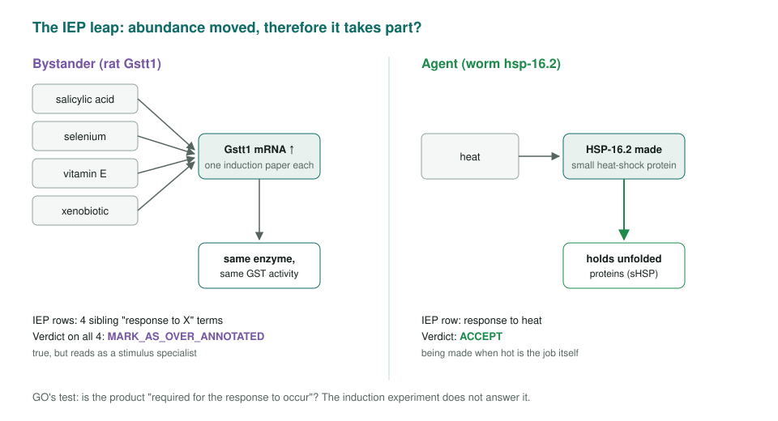
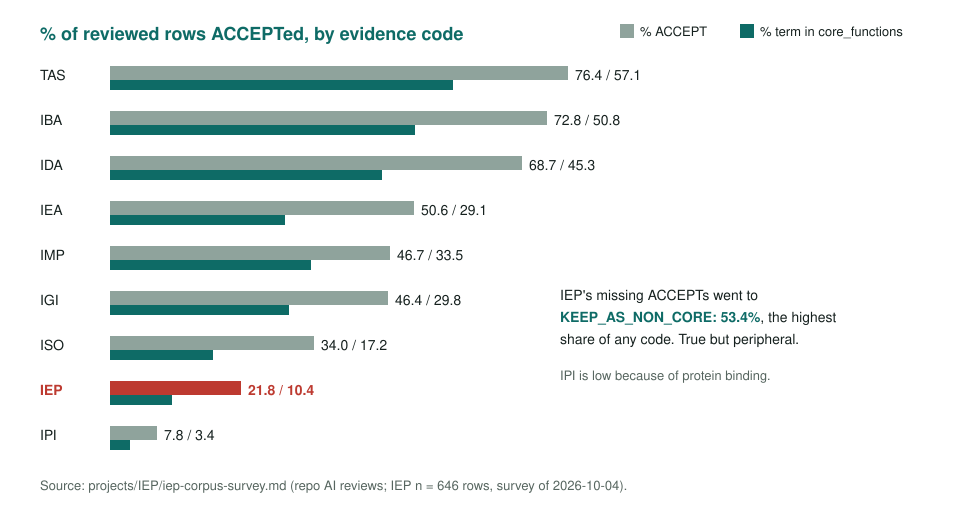
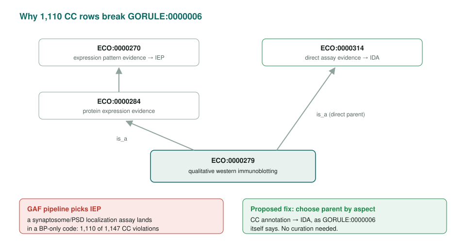

<!-- _class: lead -->

# IEP: expression read as function

Reviewing the Inferred from Expression Pattern evidence code

AI Gene Review · projects/IEP · 2026

---

<!-- _class: bluf -->

## Bottom line

- IEP infers a role in a process from a change in the gene's **own expression**. The 2026-07-27 QuickGO snapshot has **25,401** IEP rows; this repo has reviewed **646**.
- The typical IEP row is **true but peripheral**: 21.8% accepted, **53.4% kept as non-core**, 20.9% flagged.
- In the global snapshot, **1,110 of 1,147** CC rows breaking GORULE:0000006 come from **one ECO class** and could be fixed by one mapping change.

---

## The question for every IEP row

---

## IEP has the lowest ACCEPT rate after IPI

---

## Seven failure patterns

| Pattern | Example |
|---|---|
| Inducible bystander ("response to X" cloud) | rat Gstt1, Gsta4, Qdpr |
| Developmental time-course → tissue term | rat Ckmt2 `heart development` |
| One screen, one term, N genes | PMID:21492153 → 8 genes |
| Hub inversion: regulator annotated as responder | ARATH PIF3 |
| Regulon membership ≠ function | ECOLI arnF, yeast THI22 |
| Marker-gene circularity | DICDI cotB, mhcA |
| Wrong granularity, both directions | ARATH CRY1/CRY2, SOC1 |

---

## A batch tested by its own tiers

PMID:25858512: 372 miRNAs detected, 12 changed in LTP, 3 validated. MGI annotated **130** to `long-term synaptic potentiation`.

| Tier | miRNA | Action |
|---|---|---|
| Validated | Mir26a-1, Mir384 | ACCEPT |
| Changed, untested | Mir30e | MARK_AS_OVER_ANNOTATED |
| Detected only | Mir100, Mir127 | REMOVE |

The tier predicts the verdict. The batch also **omits let-7a**, one of the three validated miRNAs.

---

## Aspect violations are an ECO-mapping artifact

---

## Caveat: who judged

- Dispositions come from this repo's **AI reviews**, primed to look for over-annotation.
- So rates measure one reviewer population; the **cross-code ordering** is more trustworthy than any single rate.
- The **worked examples** carry the argument. The current developmental-vs-stimulus flag gap is gone (22.7% vs 22.5%; Fisher p = 1.00).

---

## Status and next steps

- Done: two-view survey, global atlas, failure-pattern catalogue, ECO diagnosis, miRNA cohort.
- Open: a developmental-branch cohort; the *E. coli* PMID:11967071 batch (152 genes → DNA damage response); independent disposition data; HEP.

**Read more:** `projects/IEP.md` · `projects/IEP/iep-corpus-survey.md` · `projects/IEP/iep-global-atlas.md`
