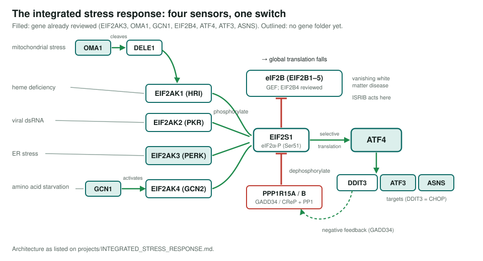
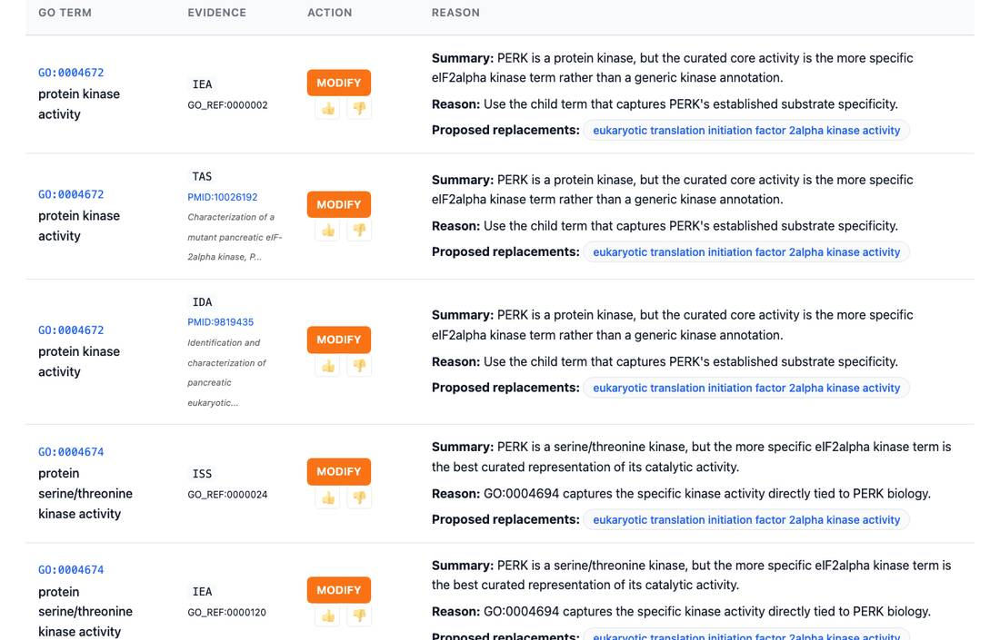

<!-- _class: lead -->

# The integrated stress response

A scoped project: 19 candidate genes, seven already reviewed

AI Gene Review · projects/INTEGRATED_STRESS_RESPONSE · 2026

---

<!-- _class: bluf -->

## Bottom line

- Four kinases (**HRI, PKR, PERK, GCN2**) each sense a different stress and phosphorylate **eIF2α**, which blocks **eIF2B**, dampens translation and lets **ATF4** through.
- **Scoped, not yet started**: no project-specific review work has been done.
- **7 of 19** candidates already have local reviews from other work, covering 545 current annotation rows.
- **12 genes** still have no gene folder, including **EIF2S1**, three kinases, **DELE1**, **DDIT3**, both PPP1R15 regulators and four eIF2B subunits.

---

## Four sensors, one switch

---

## Why this pathway

- A drug target: **ISRIB** binds a cleft in the eIF2B decamer (cryo-EM structure cited in the EIF2B4 review).
- **eIF2B mutations** cause vanishing white matter disease.
- The **DELE1-HRI** route from mitochondrial stress was described only in 2020, so GO may not yet reflect it.
- Clear convergence: four kinases → one substrate → one exchange factor → one transcription factor.

---

## An existing review: EIF2AK3 (PERK)

Generic kinase rows are <b>MODIFY</b>'d to <em>eukaryotic translation initiation factor 2alpha kinase activity</em>; ISR involvement is carried by the accepted <em>PERK-mediated unfolded protein response</em> (GO:0036499); a NEW <em>integrated stress response signaling</em> (GO:0140467) row, its ancestor, was dropped in PR #3219.

---

## Status and next steps

| Genes | State |
|---|---|
| EIF2AK3, GCN1, ATF4, ATF3, EIF2B4, ASNS (491 rows) | COMPLETE reviews |
| OMA1 (54 rows, no PENDING) | In-progress review |
| EIF2AK1, EIF2AK2, EIF2AK4, EIF2S1, DELE1, DDIT3, PPP1R15A, PPP1R15B, EIF2B1/2/3/5 | No gene folder |

- ⬜ `just fetch-gene human <GENE>`, starting with **EIF2S1**, the other three kinases and **DELE1**.
- ⬜ A local ISR module once the core is reviewed.

**Read more:** `projects/INTEGRATED_STRESS_RESPONSE.md`
