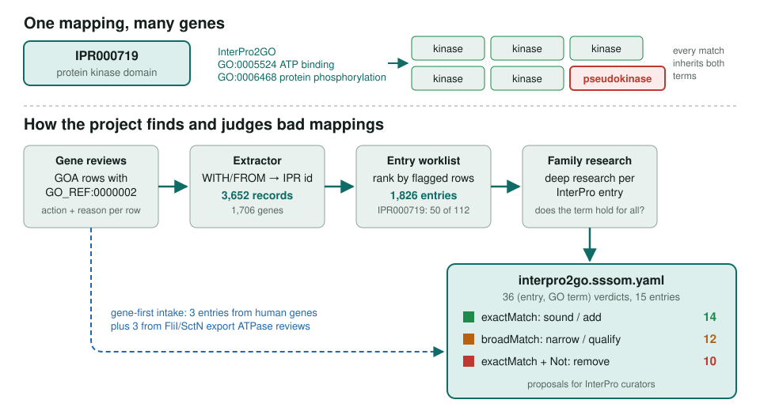
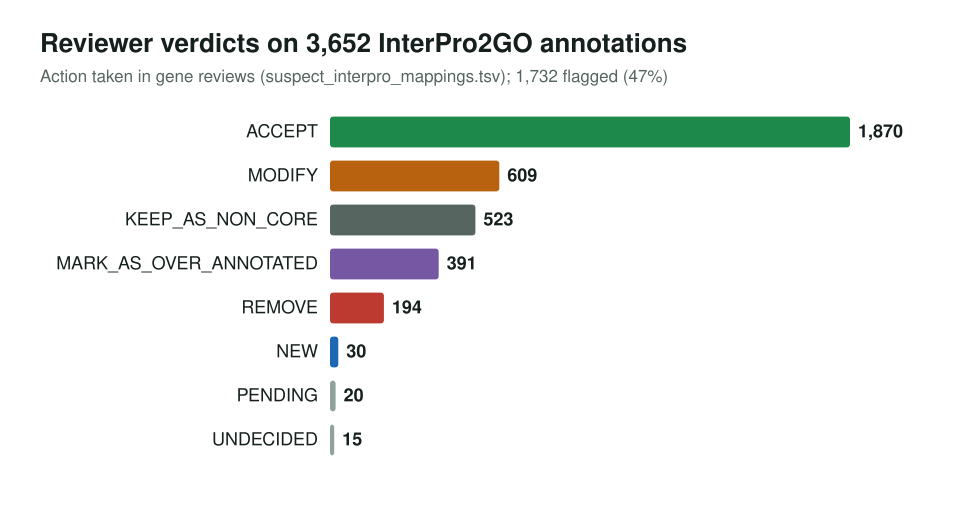

<!-- _class: lead -->

# InterPro2GO mapping review

Finding the family-level mappings that put wrong GO terms on many genes at once

AI Gene Review · projects/INTERPRO · 2026

---

<!-- _class: bluf -->

## Bottom line

- **InterPro2GO** copies each mapped GO term onto every protein that matches the entry, including members that lack the function.
- We mined **3,652** InterPro2GO rows already judged in gene reviews, ranked **1,826** entries by flagged rows, and deep-researched the top families.
- Output: **36 proposed mapping edits on 15 entries**: 10 remove, 12 narrow, 14 endorse or add. Proposals only; InterPro has not adopted them.

---

## The mechanism and the pipeline

---

## Why mappings, not genes

- A bad mapping is **one error repeated on every matched gene**; fixing it once fixes all of them.
- Typical failure: **fold is not function**. A domain shared by enzymes and non-enzymes (pseudokinases, copper chaperones, RIG-I-like sensors) carries the enzyme's term.
- A second pattern: **name collision**. IPR045122 "calcium *permeable*" channel mapped to GO:0005227 calcium-*activated* channel.

---

## What reviewers already said about these rows

1,732 rows (47%) flagged. This is a priority signal, not a mapping error rate: it includes valid non-core rows and specificity refinements.

---

## Proposed removals (10 mappings)

| Entry | GO term | Reason |
|---|---|---|
| IPR000719 kinase domain | GO:0005524, GO:0006468 | pseudokinases |
| IPR001424 Cu/Zn SOD | GO:0006801 superoxide metabolism | copper chaperones |
| IPR012724 DnaJ | GO:0005524 ATP binding | ATP belongs to Hsp70 partner |
| IPR045122 CSC1-like | GO:0005227 Ca-activated channel | calcium-permeable, not activated |
| IPR042371 Z-binding | GO:0003726 dsRNA deaminase | deaminase is a separate domain |
| IPR006935 Helicase/UvrB N | GO:0003677 DNA binding | IFIH1 (MDA5) is an RNA sensor |
| IPR013380 SctN | GO:0046961, GO:0006754 | export ATPase, not ATP synthase |
| IPR005714 FliI/YscN | GO:0009058 biosynthetic process | ATP-synthase ancestry remnant |

---

## Two intake paths

- **Ranked worklist**: entries with many flagged rows. IPR000719 has 50 flagged of 112; IPR008271 34 of 55; IPR001128 26 of 44.
- **Human gene-first**: three entries (IPR045122, IPR042371, IPR006935) came from reading ~60 human genes one at a time.
- **Export-ATPase audit**: FliI/SctN reviews added IPR013380, IPR004100 and IPR005714 from the rotary-ATPase leak.
- The worklist is blind to wrong mappings that are rarely reviewed; IPR045122 has three human members.

---

## Status and next steps

- ✅ Extractor, worklist, 36-row SSSOM set; `just validate-interpro-mappings`
- ⬜ Deferred family research: sigma-54, pseudouridine synthase, GAPDH
- ⬜ Continue down the worklist; check accepted rows on exception members
- ⬜ Summarize per-entry recommendations for InterPro2GO curators

**Read more:** `projects/INTERPRO.md` · `projects/INTERPRO/interpro2go.sssom.yaml` · `projects/INTERPRO/interpro_family_priorities.tsv`
