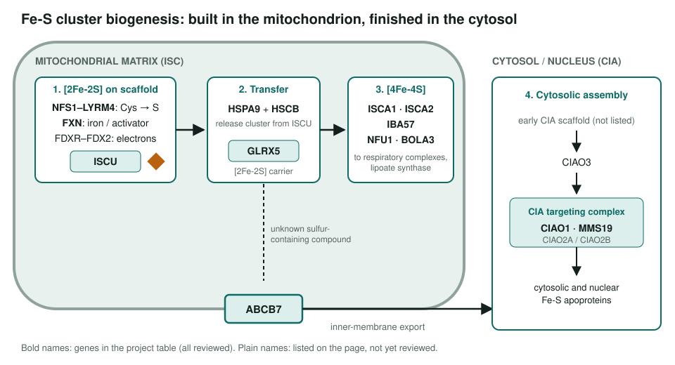
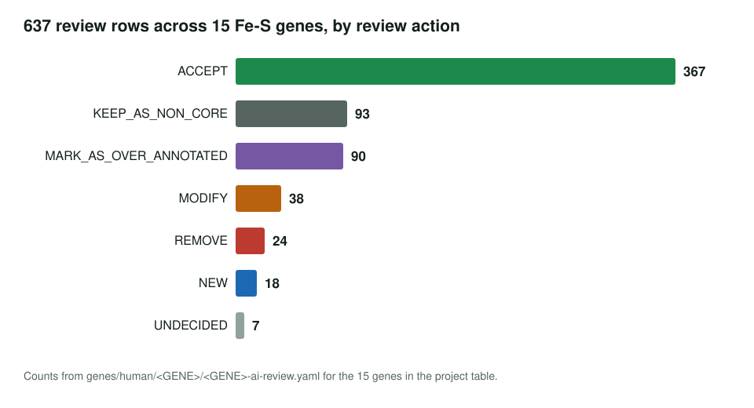
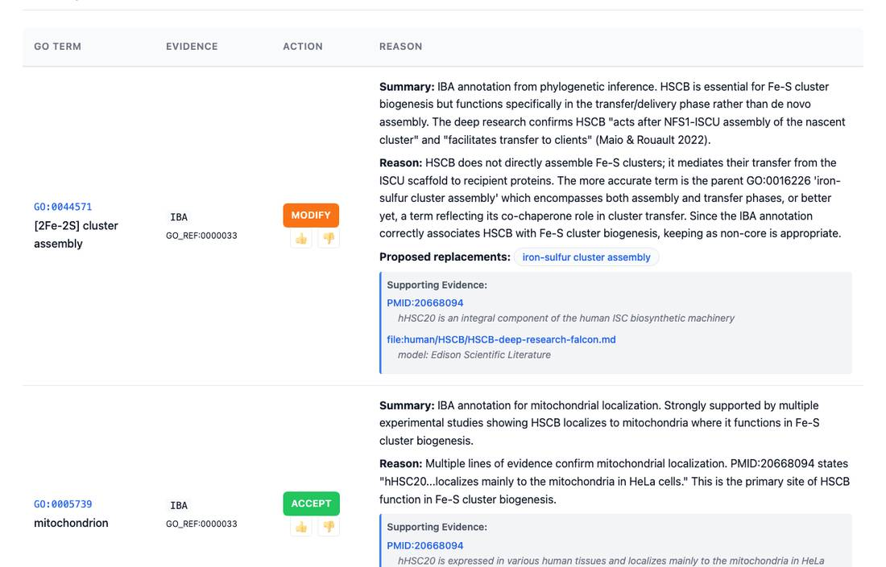

<!-- _class: lead -->

# Iron-sulfur cluster biogenesis

GO annotation review of 15 human genes of the mitochondrial ISC and cytosolic CIA machinery

AI Gene Review · projects/IRON_SULFUR_CLUSTER_BIOGENESIS · IN_PROGRESS · 2026

---

<!-- _class: bluf -->

## Bottom line

- **All 15 genes** in the project table are reviewed (the page's status list still says only HSCB).
- **638 GOA rows**: 366 ACCEPT, 92 non-core, 92 over-annotated, 42 MODIFY, 24 REMOVE, 19 NEW.
- Main corrections: `protein binding` **removed** on HSCB and GLRX5, heme transport **removed** from ABCB7, **NEW** Fe-S-specific chaperone and [4Fe-4S] assembly terms.

---

## The pathway

---

## Why this system

- Fe-S clusters are **essential cofactors** for respiration, DNA metabolism and lipoate synthesis; defects cause Friedreich's ataxia (FXN), sideroblastic anemia (GLRX5, ABCB7) and multiple mitochondrial dysfunction syndromes (NFU1, BOLA3, IBA57).
- The machinery is a **relay**: sulfur donor → scaffold → chaperones → carriers → targeting. Generic terms like `iron-sulfur cluster assembly` hide who does which step.
- GO has **step-specific terms** (`iron-sulfur cluster chaperone activity`, `[4Fe-4S] cluster assembly`) that were missing from several genes.

---

## Results by action

---

## What a review looks like

HSCB: an IBA `[2Fe-2S] cluster assembly` row is modified, because HSCB transfers clusters from ISCU rather than building them.

---

## Key changes

| Gene | Change |
|---|---|
| HSCB | 8 `protein binding` rows REMOVE; NEW `enzyme-substrate adaptor activity`, `Hsp70 protein binding`, `iron-sulfur cluster transfer complex` |
| GLRX5 | 5 `protein binding` rows REMOVE; NEW `iron-sulfur cluster chaperone activity` (GO:0140132) |
| ISCA1 | NEW GO:0140132, `[4Fe-4S] cluster assembly` (GO:0044572), 4Fe-4S binding; IBA `cytoplasm` REMOVE |
| IBA57 | NEW GO:0044572 and `mitochondrial [4Fe-4S] assembly complex`; heme biosynthesis (IEA) REMOVE |
| ABCB7 | heme transporter activity and heme transport REMOVE (3 rows) |
| MMS19 | TFIIH holo complex and signaling-receptor adaptor (NAS) REMOVE |

---

## Status and next steps

- ✅ 15/15 genes in the project table reviewed.
- ⬜ Review **FDXR, FDX2, CIAO2A, CIAO2B, CIAO3** (listed in the pathway, not in the table).
- ⬜ Build an Fe-S biogenesis module (ISC core → transfer → [4Fe-4S] → export → CIA).
- ⬜ Update the stale status list on the project page.

**Read more:** `projects/IRON_SULFUR_CLUSTER_BIOGENESIS.md` · `genes/human/HSCB/` · `genes/human/GLRX5/`
