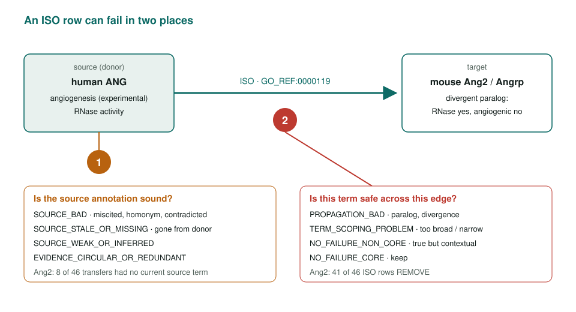
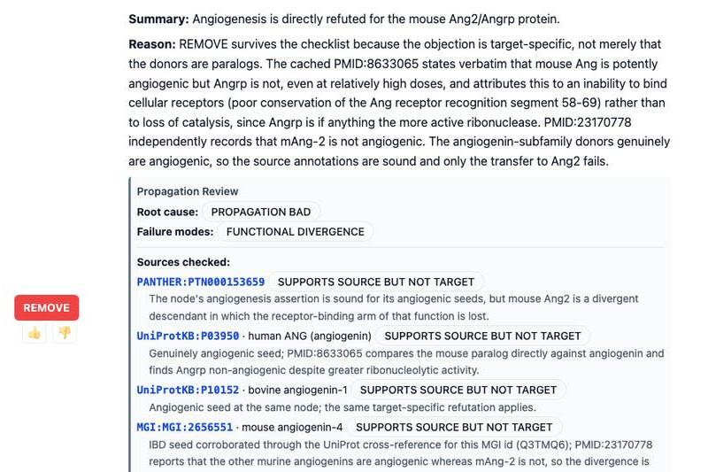
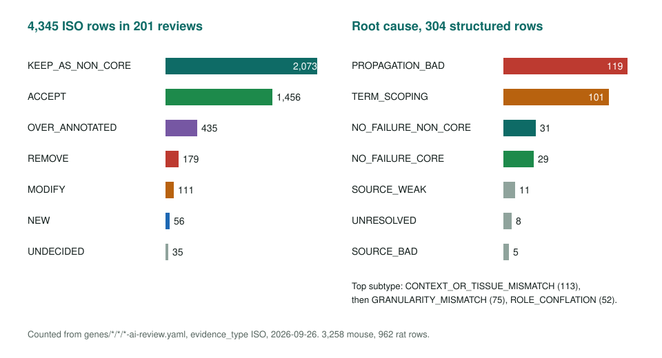

<!-- _class: lead -->

# ISO: annotation by orthology

Separating source defects from propagation defects

AI Gene Review · projects/ISO · 2026

---

<!-- _class: bluf -->

## Bottom line

- ISO copies a GO annotation to an ortholog. It can fail at the **source** or at the **orthology edge**.
- **4,416 ISO-tagged rows** in 209 reviews: **2,094 kept as non-core**, 1,502 accepted, only **180 removed**.
- A failure taxonomy, now the structured `propagation_review` field, says **where** each defect lives.

---

## Two questions for every ISO row

---

## Three worked cases

| Gene | Pattern | ISO outcome |
|---|---|---|
| **Calm3** (mouse) | Positive control: Calm1/2/3 encode the same protein | 16 ACCEPT, 25 non-core, 3 over-annotated |
| **Ghr** (mouse) | Direct donor support mixed with circular and stale transfers; GH-binding-protein isoform trap | 18 ACCEPT, 11 REMOVE |
| **Ang2** (mouse) | Divergent angiogenin paralog: RNase kept, angiogenesis lost | 41 of 46 REMOVE |

---

## What the structured review looks like

Ang2 angiogenesis (IBA row shown; the ISO row gets the same REMOVE): `PROPAGATION_BAD` + `FUNCTIONAL_DIVERGENCE`, each source marked "supports source but not target".

---

## Results across the corpus

---

## Findings

1. **ISO is not mostly garbage.** The risk is a cloud of true-but-contextual rows hiding a few real defects.
2. **Where it breaks:** paralogs and diverged members (Ang2), stale or circular donor chains (Ghr), isoform context (Ghr GH-binding protein).
3. **Most structured failures are propagation or scoping**, not bad sources: 120 `PROPAGATION_BAD` and 102 `TERM_SCOPING_PROBLEM` vs 5 `SOURCE_BAD`.

---

## Status and next steps

- Done: case reviews, taxonomy, reviewer checklist, `propagation_review`, donor-trace browser.
- Open: donor `source_entities` for 16 structured ISO rows and featured Ang2/Ghr/Calm3 examples.
- Open: source-status suggestions from donor support; one-to-one vs one-to-many orthology calls.
- Related: `projects/IBA_REVIEW.md` (same taxonomy), `projects/IEP.md`.

**Read more:** `projects/ISO.md` · `genes/mouse/Ang2/Ang2-bioinformatics/RESULTS.md` · `genes/mouse/Ghr/Ghr-iso-donor-trace.md`
