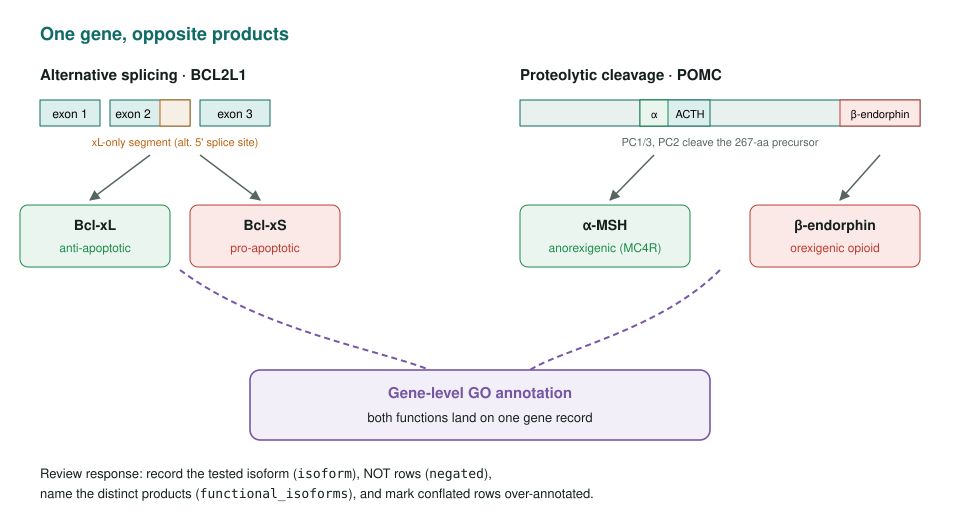
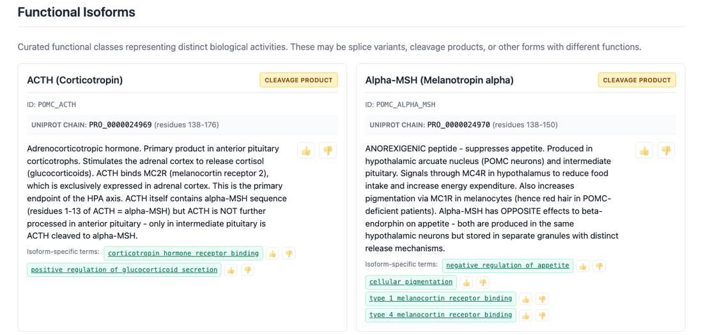
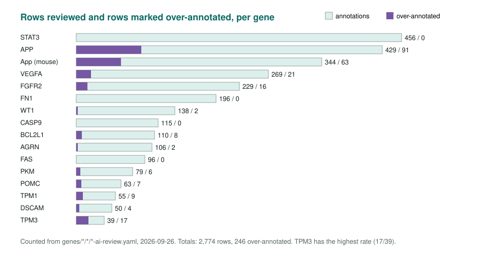

<!-- _class: lead -->

# ISOFORMS

Genes whose splice isoforms or cleavage products do different, sometimes opposite, things

AI Gene Review · projects/ISOFORMS · 2026

---

<!-- _class: bluf -->

## Bottom line

- Most GO annotation is **gene-level**, but Bcl-xL/Bcl-xS and α-MSH/β-endorphin come from one gene with **opposite effects**.
- We reviewed **2,786 annotations on 16 paradigm genes** and added `isoform`, `negated` and `functional_isoforms` to the data model.
- Conflation is common: **258 rows marked over-annotated**, e.g. 8 in BCL2L1, 21 in VEGFA, 63 in mouse App.

---

## The problem

---

## The gene set

| Tier | Genes | Contrast |
|---|---|---|
| 1 · paradigms | AGRN, WT1, BCL2L1, FAS, VEGFA, CASP9 | antagonistic or dominant-negative isoforms |
| 2 · tissue / development | FN1, TPM1, TPM3, DSCAM | EDA/EDB, muscle vs cytoskeletal |
| 3 · further cases | FGFR2, PKM, STAT3 | IIIb/IIIc ligands, PKM1/PKM2, STAT3α/β |
| Polyproteins | POMC, APP (human), App (mouse) | cleavage products |

DSCAM caveat: human DSCAM has 2 isoforms, not the 38,016 of fly Dscam1.

---

## Recording distinct products: POMC

`functional_isoforms` on the POMC review: each cleavage product with its UniProt chain (PRO_…, not the PRO ontology) and its own terms. Two of five products shown.

---

## Over-annotation by gene

---

## Findings

1. **BCL2L1**: pro-apoptotic Bcl-xS function attached to the gene whose main product is anti-apoptotic.
2. **FAS**: GOA carries both positive and negative regulation of apoptosis; membrane vs soluble decoy isoforms explain it.
3. **VEGFA**: VEGF165B is anti-angiogenic while canonical isoforms are pro-angiogenic.
4. **App/APP**: splicing (KPI domain) *and* cleavage (sAPPα vs Aβ) in one gene.
5. An `isoform` tag records **what was tested**, not necessarily what is unique to that isoform.

---

## Status and next steps

- 12/16 paradigm reviews COMPLETE.
- Finish **WT1**, **VEGFA**, **AGRN** and **DSCAM**.
- Decide whether to review PTBP1, PTBP2 and MST1R.
- 16 reviews repo-wide use `functional_isoforms` so far.

**Read more:** `projects/ISOFORMS.md` · `projects/ISOFORMS/genes.csv` · `src/ai_gene_review/schema/gene_review.yaml`
