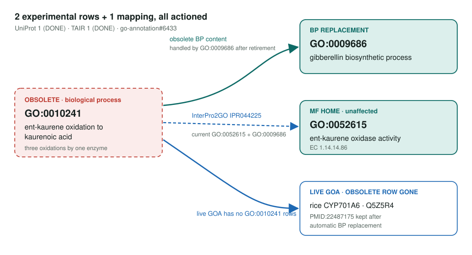
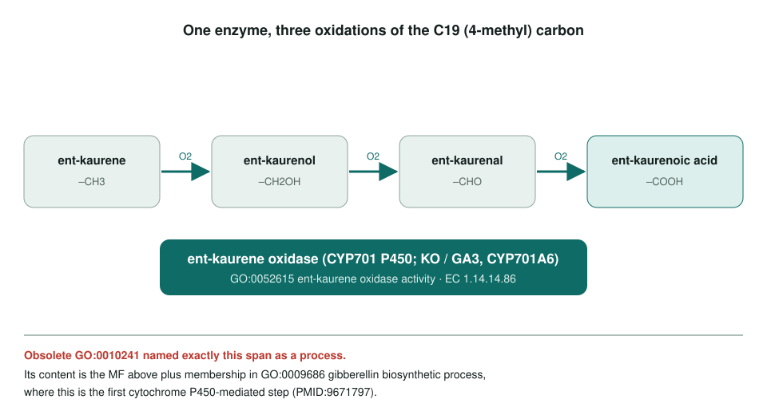

<!-- _class: lead -->

# Ent-kaurene oxidation to kaurenoic acid: obsoletion

GO:0010241 → GO:0009686 gibberellin biosynthetic process (BP) · GO:0052615 ent-kaurene oxidase activity (MF)

AI Gene Review · projects/KAURENE_OXIDATION_OBSOLETION · 2026

---

<!-- _class: bluf -->

## Bottom line

- GO **obsoleted GO:0010241**, a process term that restated what one enzyme, ent-kaurene oxidase, does.
- **2 experimental rows** were affected: Arabidopsis KO (IMP) remaps to **GO:0009686**; rice CYP701A6 (IDA, enzyme assay) is removed. UniProt and TAIR have both done this upstream.
- **Scoped, not yet started:** no repo review exists for either gene; the open item is the **IPR044225** InterPro2GO mapping.

---

## Old term → replacements

---

## What the term described

---

## Why the term went

- The definition covers **three oxidations** that "may be carried out entirely by the enzyme ent-kaurene oxidase".
- That catalytic content already has an MF: **GO:0052615** (EC 1.14.14.86), untouched by the obsoletion.
- The process context is **GO:0009686** gibberellin biosynthetic process.
- SJM on go-annotation#6433: the rice paper (PMID:22487175) has **only enzyme assays**, so its BP row should simply go.

---

## Affected annotations

| Gene | Species | Evidence | PMID | Upstream plan | Repo review |
|---|---|---|---|---|---|
| KO / GA3 (Q93ZB2) | *A. thaliana* | IMP | 9671797 | remap to GO:0009686 | none |
| CYP701A6 (Q5Z5R4) | *O. sativa* Japonica | IDA | 22487175 | remove | none |

**Mapping:** InterPro2GO `IPR044225` (Ent-kaurene oxidase, chloroplastic) → GO:0010241. Proposed redirect: **GO:0052615**, since the family is defined by catalytic activity; GO:0009686 would also be defensible.

---

## Status and next steps

- **2026-05-27:** project created; UniProt and TAIR marked DONE upstream.
- **2026-09-26:** OLS lists GO:0010241 as **obsolete**.
- Next: comment on the IPR044225 redirect; optionally review Arabidopsis **KO** as a positive control for the GO:0009686 + GO:0052615 pairing.

**Upstream:** go-annotation#6433 · go-ontology#32078
**Read more:** `projects/KAURENE_OXIDATION_OBSOLETION.md`
