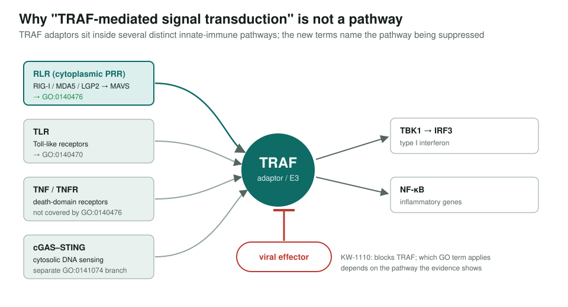
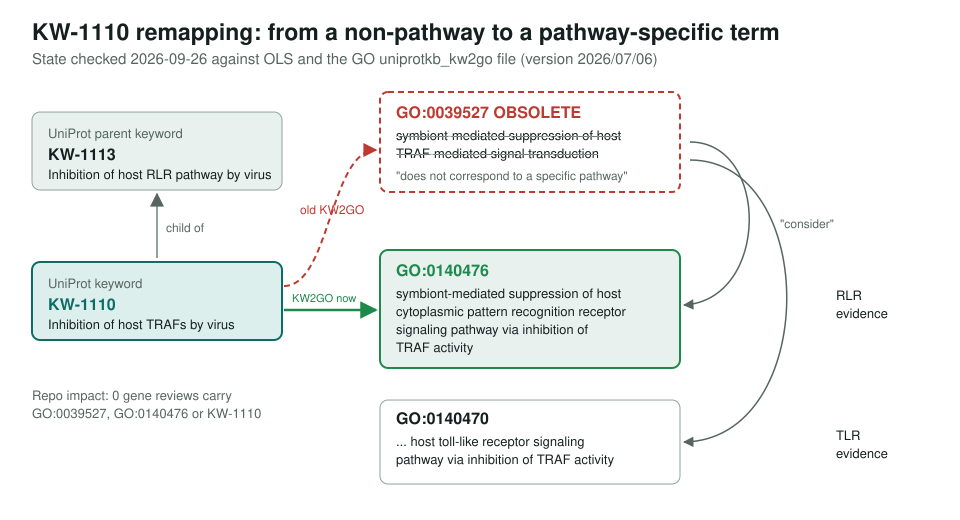

<!-- _class: lead -->

# KW-1110 → GO remapping

"Inhibition of host TRAFs by virus": tracking an upstream keyword-to-GO change

AI Gene Review · projects/KW_1110_TRAF_KW2GO · 2026

---

<!-- _class: bluf -->

## Bottom line

- KW-1110 was mapped to **GO:0039527**, now **obsolete**: "TRAF-mediated signal transduction" is not one pathway.
- The mapping now points to **GO:0140476** (suppression of host cytoplasmic PRR signaling via TRAF inhibition), matching parent keyword **KW-1113**.
- **Zero** gene reviews in this repo carry either term or the keyword. Upstream has shipped; nothing to rework.

---

## Why the old term went

---

## Old term → new terms

---

## Status

- Created 2026-07-04 as a **watch-list** entry (blocker: GO:0140476 not yet minted).
- 2026-09-26: OLS resolves GO:0140476; GO:0039527 obsolete; `uniprotkb_kw2go` (2026/07/06) maps KW-1110 → GO:0140476.
- Re-ran `grep` for GO:0039527, GO:0140476, KW-1110 in `genes/`: **no matches**.
- If a TRAF-interfering effector is reviewed later: use GO:0140476 for RLR evidence, GO:0140470 for TLR evidence.

**Upstream:** go-annotation#6470 · go-ontology#29238 · **Read more:** `projects/KW_1110_TRAF_KW2GO.md`
